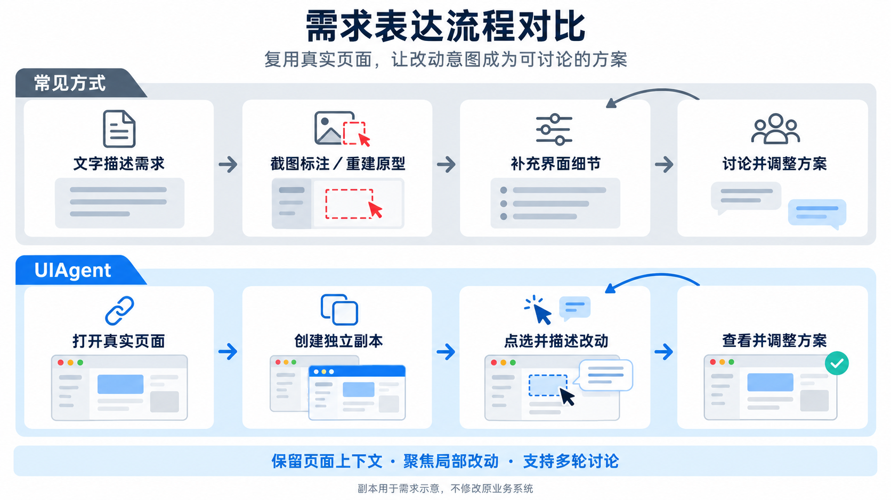
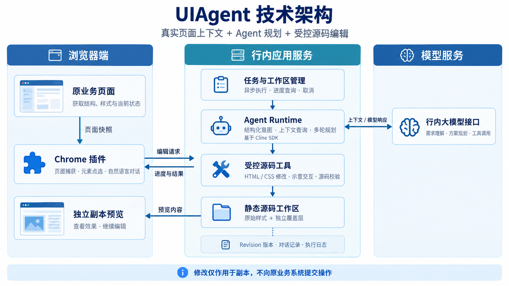

# UIAgent：基于真实业务页面的 AI 需求可视化与协同创新实践

> 技术创新荣誉评选材料｜更新日期：2026-09-11  
> 申报单位：【待补充】｜申报人／团队：【待补充】  
> 当前阶段：已完成行内部署与真实场景试点验证，持续完善编辑效果和交付体验。

## 一、项目简介

UIAgent 是一款通过对话制作页面改动方案的浏览器插件，面向产品、需求分析、交互设计与研发人员。用户打开已有业务页面，创建一个用于演示、不影响原系统的页面副本，选中需要调整的位置，再用自然语言描述需求，即可查看修改效果并继续调整。

产品人员可以直接提出“在这里增加筛选项”“把图标按钮改成文字按钮”“调整这块区域的展示方式”等需求，在已有页面上形成修改方案。产品、设计与研发能够围绕具体效果讨论，减少重新搭建原型和反复解释界面细节的工作。

目前，插件配合部署在行内的服务端使用。用户可以连续修改方案、撤销或重做操作，并保存页面和对话记录；遇到不明确的需求时，系统会向用户询问。项目用于需求演示和方案沟通，生成结果不直接发布到原业务系统。

【图片占位 1：产品全景】  
建议内容：左侧为真实业务页面副本，右侧为插件中的自然语言指令及结果说明。  
图注：在熟悉的业务页面上直接表达需求，让文字描述成为可讨论的页面方案。

## 二、业务背景与建设目标

存量系统的界面需求通常围绕已有页面展开，例如新增字段、调整筛选区、改变按钮形态或补充展示状态。这类需求需要同时说明位置、尺寸、风格、默认状态以及与周边内容的关系，仅用文字和标注截图容易遗漏细节；手工重建完整原型，又需要投入与局部改动不相称的工作量。

项目聚焦需求提出到方案确认之间的环节，主要实现三个目标：

1. **降低表达门槛。** 使用页面点选和自然语言描述，让不熟悉前端代码或专业原型工具的人员也能制作改动示意。
2. **减少原型制作工作。** 沿用现有页面的结构和样式，将精力集中在需要变化的部分。
3. **便于讨论和确认。** 保留修改前后结果、对话和版本，让评审人员能够查看方案及其调整过程。

图注：把页面细节的确认前移到需求沟通阶段。

## 三、技术创新与实现特色

### 1. 无需接入原系统源码，直接基于真实页面制作方案

系统从浏览器当前显示的页面获取结构、状态和样式，生成可单独编辑的 HTML、CSS 等页面文件。用户可以沿用正在查看的列表、工具栏、侧栏等内容制作方案，不需要获取原系统的前端代码仓库。

样式处理采用“保留原样式、单独保存修改”的方式：尽量沿用可获取的原页面样式，将新增的样式调整写入独立 CSS 文件。这样既能延续原页面的设计风格，也便于后续查找和继续修改。图片、字体及部分样式仍可能需要访问原网站的资源。

用户不必从空白画布重新搭建原型，可以直接在熟悉的页面副本上讨论改动。副本仅用于展示方案，不向原系统提交业务操作。

### 2. 结合选中区域和页面结构，让 AI 理解修改对象

系统为页面元素分配标识，并记录元素之间的关系。用户点选后，AI 编辑助手（Agent）可以读取选中的元素、它所在的容器、周边元素，以及创建副本时记录的布局信息，并按需查询对应源码和样式。

修改前，模型需要按规定格式明确“改哪里、改什么、哪些内容不能变”；遇到会影响结果的歧义时，先向用户询问。对于能够识别的常见组件，系统提供组件规范和页面实际样式，帮助模型选择合适的修改方式。

模型不是仅凭一句话猜测页面，而是结合选区、结构和样式制定修改计划。模型负责理解需求和规划改动，程序负责限制可修改的文件、检查工具参数，以及管理任务状态和版本。

### 3. 通过限定工具执行修改，并保留可恢复的版本

Agent 通过系统提供的工具修改文字、属性和样式，或插入、删除、移动、复制页面元素。修改通过检查后保存为一个新版本（Revision）；本轮失败或被取消时，恢复到本轮修改前的状态。

对于下拉展开、单选、复选和面板切换等演示交互，模型按规定格式描述操作，由程序统一执行，而不是自由编写业务脚本。这些交互用于展示方案中的操作状态，不连接真实业务提交接口。

系统检查修改是否符合工具规则、是否发生在允许的区域，并将发现的问题反馈给模型。每轮修改有记录、可恢复；这些检查不能代替视觉验收，页面是否美观、位置是否正确，仍需在浏览器中确认。

### 4. 保存页面、对话和版本，支持持续调整方案

系统将页面副本、对话和修改版本一起保存，支持连续修改、撤销重做、重新打开和备份恢复。编辑任务在服务端执行，插件持续查询进度，用户可以主动停止任务。执行日志记录模型调用、工具操作、错误和耗时，便于排查问题。

生成的方案不只是一张图片：用户可以重新打开页面继续调整，也能查看相关对话和历史版本。

图注：插件提供页面信息和用户需求，服务端调用模型规划改动，通过限定工具修改副本并保存版本。

## 四、当前落地进展

| 建设方向 | 当前成果 | 面向使用者的价值 |
| --- | --- | --- |
| 页面获取与副本 | 默认沿用原页面样式创建副本，已对多个真实页面进行人工对照 | 从已有业务页面直接开始制作方案 |
| 自然语言编辑 | 支持文案、样式、结构等调整，以及问答、澄清和多轮修改 | 用业务语言表达局部界面诉求 |
| 版本与对话 | 服务端保存副本内对话，支持撤销、重做和历史恢复 | 继续处理已有方案，保留讨论上下文 |
| 任务与日志 | 支持查看进度、主动停止、模型请求重试及调用日志 | 了解执行状态，排查失败和耗时原因 |
| 副本资产管理 | 支持副本管理、回收站、批量导出及导入备份 | 汇总、保留和恢复阶段性方案 |
| 行内交付 | 服务端已在行内云平台部署，插件具备版本提示和 ZIP 下载更新流程 | 支撑试点使用和后续版本交付 |

## 五、真实需求案例与应用效果

以下将试点中的六项任务整理为三个业务案例，展示需求文档搜索、检测问题列表和常见局部改动。案例展示的是副本中的页面方案，不涉及原系统上线或真实业务数据操作。实际耗时与评审采纳情况尚待补充。

> 配图说明（提交前删除）：当前引用的是原始验证截图，仅供内部编稿。正式申报前须完成脱敏，补齐原页面对照图及人工验收信息。不可直接对外分发本稿中的原始截图。

### 案例一：将需求文档搜索诉求转化为页面方案

**业务背景与实际诉求**  
在需求管理页面中，用户希望增加需求文档搜索入口：通过顶部的灰色搜索区域打开气泡，在气泡内输入关键词，展示需求文档搜索结果及“参考新建”“预览”操作。该需求同时涉及入口位置、浮层结构、结果字段、占位提示和列表高度，需要通过具体页面表达各部分之间的关系。

**使用过程**  
用户用一段自然语言描述整体方案，明确搜索入口外观、气泡标题、输入框占位文字、提示信息，以及五条示例结果的字段。系统在已有页面副本中生成对应区域，无需用户先手工搭建完整页面原型。

**可见结果**  
效果图展示了顶部搜索入口，以及包含标题、关键词输入框、提示和结果卡片的搜索面板；结果区带有滚动条。用户可以查看完整的搜索界面方案，而不只是单个控件。点击展开、滚动等交互待补充操作验证。

**应用价值**  
把较长的文字需求转换为具体页面，便于产品、设计和研发一起确认搜索入口放在哪里、结果展示哪些信息、操作按钮如何排列。

图注：在现有需求页面中形成搜索入口、搜索气泡与示例结果的组合方案。

【待补充：同一视口下的修改前截图；验证日期、确认人、交互验收结果及是否用于需求评审。】

### 案例二：形成 AI／SQL 检测问题的分类与列表展示方案

**业务背景与实际诉求**  
围绕同一条检测问题展示需求（P2608-1807），用户分别提出新增分类标签、调整问题列表字段、补充示例数据三项任务。这类需求不仅要说明“增加一个入口”，还需要呈现进入后看什么、字段如何排列以及有数据时的效果。

**具体任务与结果**

| 任务 | 用户诉求 | 截图呈现的结果 |
| --- | --- | --- |
| 新增分类入口 | 新增“AI&SQL检测问题”标签，置于“检视问题”与“自动化检测问题”之间，并设为选中 | 标签顺序与选中下划线在页面中可见 |
| 组织问题列表 | 按需求组织检测问题的展示字段 | 生成包含问题描述、等级、状态、代码位置及操作等信息的 12 列列表，并展示“暂无数据”状态 |
| 补充示例内容 | “给这个表格加5条mock数据” | 列表中呈现五条示例记录，包含不同问题描述、等级、状态及关联信息 |

这三项任务分别展示了同一需求中的分类入口、字段结构和示例内容。

图注：在现有分类导航中增加 AI／SQL 检测问题入口，并展示选中状态。

图注：将字段要求转化为具体的列表结构，明确展示信息及排列方式。

图注：补充五条示例记录，让需求讨论同时覆盖字段结构和有数据时的展示效果。

**应用价值**  
在已有页面中呈现分类入口、列表字段和示例内容，便于讨论字段是否齐全、每行信息是否过多，以及排列方式是否合适。示例数据用于展示效果，不是实际检测结果。

【待补充：对应原页面截图；列表字段的原始需求文字；各任务验证日期、人工确认结果及评审使用情况。】

### 案例三：在已有页面中新增按钮和筛选项

**业务背景与实际诉求**  
日常需求中存在大量范围较小、但需要明确位置和风格的界面调整。本案例选取两个不同页面中的真实任务，展示用户如何沿用既有界面提出局部改动。

**任务一：新增“进入新码云”入口**  
用户要求在选中模块右侧新增“进入新码云”按钮，并保持与当前模块一致的样式。效果图中，该按钮位于“深色皮肤”按钮右侧，沿用蓝色工具栏上的圆角描边外观，展示了新增入口的位置和样式。

【图片占位：新增入口按钮——脱敏前后对比】  
现有素材：`img/场景1.png`。原图包含数据库连接配置及密码字段，暂不直接嵌入正文；请遮挡敏感区域及地址栏访问凭据后替换，并补充修改前截图。  
图注：通过选区和自然语言说明，在既有工具栏中表达新增入口方案。

**任务二：新增“仅看待立项的需求”筛选项**  
用户要求在需求池筛选区首位增加该复选框，默认不勾选。效果图中，筛选项位于“状态”条件之前，呈未勾选状态。本次展示范围为筛选项的位置、文案和默认状态。

图注：把新增筛选条件的位置、文案及默认状态直接呈现在需求池页面中。

**应用价值**  
对于新增入口、补充筛选条件等高频小需求，用户可以围绕已有页面表达变化，不必为一个局部调整重建整页原型。位置、文案和周边关系可在具体页面上讨论。

【待补充：修改前截图；验证日期、确认人；如有同类任务的人工制作耗时记录，可补充对照。】

## 六、应用价值与推广潜力

**对产品和需求人员：** 将抽象描述变成具体页面方案，降低局部改动的表达成本，便于补充位置、内容和状态细节。

**对设计和研发人员：** 围绕熟悉的业务页面讨论方案，提前确认哪些地方需要改、需要展示哪些状态，以及哪些内容需要进一步明确。

**对团队：** 保存方案版本和沟通过程，后续可以重新打开、继续修改，也能了解方案为什么这样调整。

项目适合优先推广到存量系统的局部改版需求，例如筛选区、表单、按钮、工具栏、列表和展示状态调整。不同系统的资源访问、页面结构及样式复杂度存在差异，推广应以真实样本验收为依据。

**量化成果补充表**

| 指标 | 本次申报填写内容 | 建议统计口径 |
| --- | --- | --- |
| 试点覆盖 | 【待补充：系统数、团队数、实际使用人数】 | 明确时间范围，使用人数去重 |
| 有效场景 | 【待补充：已验收需求数及代表案例】 | 以用户确认可用于沟通的结果为准 |
| 示意制作耗时 | 【待补充：传统方式与 UIAgent 的对照】 | 同类需求，包含描述、等待、修正和人工确认时间 |
| 一次通过率 | 【待补充：样本数及比例】 | 首次结果无需继续修改且用户验收通过 |
| 沟通效果 | 【待补充：评审采纳情况或使用者反馈】 | 关联具体需求，避免将主观预期当成实测收益 |

【图片占位 7：试点效果数据或用户反馈】  
建议内容：有记录的耗时对照、已采纳的需求示意或脱敏用户评价。没有完整统计时可省略此图。

## 七、后续建设方向

1. **扩大真实需求验证。** 在更多业务系统中收集实际任务，统计成功率、从提出需求到确认结果的总耗时，以及方案被评审采纳的情况。
2. **完善页面效果检查。** 探索在浏览器中自动检查元素遮挡、内容裁切和超出容器等问题，并辅助修正；该能力目前仍处于实验阶段。
3. **提高编辑效率与稳定性。** 为模型提供更准确的页面结构和样式信息，减少反复查找样式和修改失败后的重试。
4. **完善协作与交付。** 优化插件更新和备份恢复体验，根据试点需求推进统一身份、权限及与需求平台的关联。

## 八、申报总结

UIAgent 让需求人员直接在已有业务页面的副本上，通过对话制作修改方案，无需从头重画原型。页面、对话和修改版本可以一起保存，便于产品、设计与研发查看、讨论和继续调整。项目已完成行内部署，并提供了需求搜索、检测问题展示和局部界面调整等真实场景的效果素材。

项目将真实页面信息、大模型规划和限定工具修改结合起来：既利用 AI 降低页面方案的制作门槛，也通过修改检查和版本恢复，让结果能够持续完善。其核心价值是帮助团队把“想怎么改”更直接地变成“看得见、能讨论的方案”。

---

## 附录：提交前核对清单（不纳入正式申报正文）

- 补齐申报单位、团队、参与人及各自贡献。
- 将图片占位替换为真实截图，对业务信息、账号和访问凭据脱敏。
- 本文案例对应《场景验证》中的任务：案例一对应场景六，案例二对应场景三、四、五，案例三对应场景一、二。六项任务不等于六条独立业务需求或六次已验收上线。
- 案例二的三项任务按业务需求归类，不认定为同一副本中的连续操作。案例三的按钮和复选框截图不作为真实跳转、业务筛选或本地记忆功能的验证证据。
- 原始截图中的地址栏含预览访问凭据；场景一包含数据库连接配置和密码字段。正式交付前必须脱敏，不能直接分发原图。
- 场景二存在非目标区域图标加载失败，场景三顶部按钮有换行现象。建议重新采集页面效果正常的截图；不通过修图掩盖产品问题，不宣称整页完美还原。
- 《场景验证》中场景二、三、四的需求描述图片尚缺失，需补齐或转录为文字；当前正文仅采用可读任务描述和效果图中的信息。
- 每个案例保留可核对的需求描述、验证日期、人工确认结果和截图；日志仅作为执行过程证据，不替代视觉效果验收。
- 区分副本示意完成、需求评审采纳与业务系统正式上线，不能将三个阶段混为一谈。
- 最新交互与样式查询改动尚待真实场景回归，不将其描述为已验证的成功率或性能提升。
- 内部开发备注：近期补充了组件样式信息、交互规则说明、逐元素检查反馈和完整样式规则查询，完成类型检查；不将开发检查结果当作用户效果验证。
- 当前不承诺任意网页完整还原、完全离线使用、真实业务接口执行或自动视觉验收全面覆盖。
- 服务端保存不等于具备跨部署的持久化保障；数据保留仍取决于部署存储与备份方案。
- 旧申报稿中的“4 小时到 10 分钟、24 倍提升”未在本稿沿用，只有补齐对照记录和统计口径后方可引用。
- 本文描述当前工作区和既有试点进展，不代表所有最新代码已发布到行内环境。
