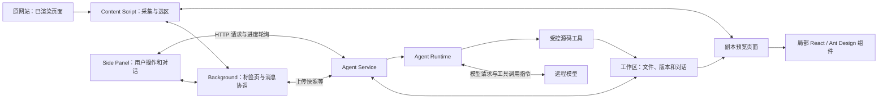
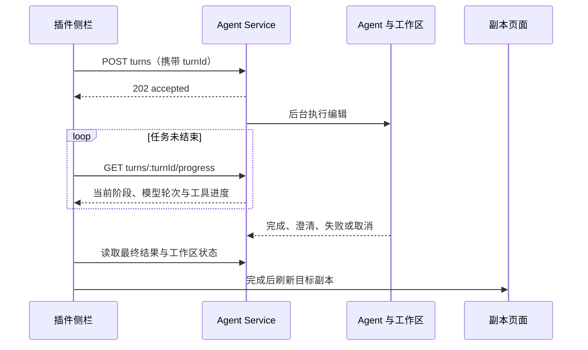

# UIAgent 插件系统底层原理详解

> 面向希望理解整套系统的项目开发者。根据 2026-09-17 工作区代码编写。本文讲解当前实现，实验能力单独标注；不把设计目标当作已经完成的能力。

## 1. 先用一句话理解它

UIAgent 把浏览器里已经展示出来的网页转换为一份独立的 HTML/CSS 副本，再让 AI 通过指定工具修改这份副本；需要新增交互时，在副本局部挂载 React 和 Ant Design 组件。

例如你在一个需求页面上选中加号，说“改成添加按钮，点击后显示三个选项”，系统会经历这些动作：

1. 浏览器插件读取原页面当前的结构和样式，创建服务端工作区。
2. 浏览器打开工作区提供的预览页面。
3. 插件把选中的元素编号和需求发给服务端。
4. 服务端让模型判断需求、读取必要上下文，再调用工具修改文件。
5. 服务端校验并保存新版本，插件刷新预览。
6. 你在浏览器里看到、点击和验证新按钮。

这里有三个重要边界：

- 副本保 存的是网页运行后的结果，不是原系统的 React/Vue 工程。
- 修改落在副本工作区中，不会回写原系统代码仓库。
- 副本中的新增交互用于需求演示，不代表已经接通真实业务接口。

## 2. 整套系统由谁组成



### 2.1 浏览器插件：用户入口与网页读取能力

插件基于 WXT 构建，使用 Chrome Manifest V3，主要有三部分。

| 部分 | 工作位置 | 负责什么 |
| --- | --- | --- |
| Side Panel | 浏览器侧栏中的插件页面 | 输入需求、展示对话、澄清选项、进度、停止和版本操作 |
| Background | 扩展后台 Service Worker | 协调标签页、注入脚本、转发页面命令、创建副本、截图等 |
| Content Script | 被操作的网页中 | 读取 DOM、捕获快照、显示选区，以及实验性渲染测量 |

侧栏不直接读取任意网页的 DOM。它通过扩展消息通知后台，后台把命令送到对应标签页的 Content Script。服务端请求有些由侧栏发送，有些由后台发送，不是所有操作都经过同一个入口。

Content Script 能看到网页的 DOM，但这不等于拿到了原网站的组件源码、React state 或服务端业务逻辑。DOM 可以理解为“浏览器此刻画页面时使用的结构”。

### 2.2 Agent Service：执行与存储中心

服务端是 Node.js + Hono 的 HTTP 服务。它接收快照和修改请求，管理工作区，调用 Agent，提供预览、日志、对话和版本接口。

模型凭证配置在服务端，普通插件用户不需要填写模型 API Key。插件知道的是 Agent Service 的地址，而不是直接调用模型。

### 2.3 Agent Runtime：组织模型工作

模型本身负责理解需求并决定下一步操作；Runtime 负责把请求发给模型、执行模型请求的工具、把工具结果送回去，直到任务完成。

当前适配器名称仍是 `cline-sdk`，但实际运行的是 `packages/agent-runtime/vendor/ui-agent-runtime/` 中项目维护的实现。它沿用部分 Cline Agent API 形式，底层通过 `ai` 和 `@ai-sdk/openai-compatible` 请求模型。

因此，看到 `cline-sdk` 不应理解为项目运行了完整的 Cline 产品。这个本地 Runtime 不包含完整 Cline Core，也没有因为名称相同就自动具备 MCP 或通用 Skill 加载能力。

### 2.4 共享协议：保证双方说的是同一种数据

`packages/contracts` 使用 Zod 定义请求和响应结构。例如：快照、修改请求、任务进度、澄清回复、工作区信息。

TypeScript 类型帮助开发阶段发现错误；Zod 在运行时检查真正收到的数据。HTTP 返回一段 JSON，不代表这段 JSON 一定满足插件需要的字段，协议校验就在这里发挥作用。

## 3. 点击“进入副本编辑”时发生了什么

### 3.1 采集的是当前页面状态

当前入口调用后台的 `createWorkspaceFromViewport`。它先读取服务配置，再要求页面脚本捕获快照，补充可读取的作者样式，最后上传到 `POST /v1/workspaces`。

快照采集主要做这些事：

- 复制当前已经存在的 DOM。
- 将输入框值、checkbox 勾选状态、选项状态等尽可能写入可保存的 HTML。
- 为元素分配 `data-ui-source-id`。
- 记录元素当时的位置、尺寸及布局属性。
- 收集作者 CSS 与资源引用。
- 去掉原页面脚本、事件属性和表单提交等不应直接带进副本的内容。

所以，登录后才能看到的页面也可能被采集，因为用户的浏览器已经展示了它。但只存在于原应用内部、尚未渲染出来的数据，不会凭空进入快照。虚拟列表中没有挂载的行、依赖原脚本生成的后续内容等，不能保证被完整保存。

### 3.2 sourceId 是页面元素与源码之间的地址

例如：

```html
<button data-ui-source-id="source-1571">添加</button>
```

用户点击这个按钮后，插件可以告诉服务端“目标是 source-1571”。服务端据此在 HTML 和结构索引里定位元素，无需只靠“那个按钮”猜位置。

几个 ID 各有不同用途：

| 标识 | 表示什么 |
| --- | --- |
| `workspaceId` | 哪一份副本项目 |
| `sourceId` | 副本源码里的哪一个元素 |
| `turnId` | 哪一次编辑任务，用于查询进度和停止 |
| `traceId` | 关联这一轮的排查日志 |
| `revision` | 副本已经保存到第几个源码版本 |
| `editSessionId` | 编辑会话标识，不等于工作区或源码版本 |

sourceId 不是永久业务主键。完整替换或克隆元素时，系统会生成新 ID，模型必须使用工具返回的新 ID 继续操作。

### 3.3 捕获布局是参考证据

`data-ui-agent-captured-layout`、矩形信息以及保存的布局索引，让模型知道原页面中某个容器是 flex 还是 grid、宽高是多少、是否可能裁切子元素。

这些是**采集当时的事实**。例如原容器宽 300px，增加按钮后是否仍有足够空间，必须结合新页面判断，不能把旧尺寸当成修改后的测量结果。

### 3.4 目前在当前标签页打开副本

创建工作区成功后，后台通过 `browser.tabs.update` 将原标签页导航到副本预览地址。这样能保持侧栏操作链路连续。

这是当前实现。历史文档里出现“创建后自动新开标签页”的描述，不能作为当前行为依据。标签页显示内容切换了，但原系统服务端数据并没有被修改。

## 4. 为什么还原样式是最复杂的一环

网页最终样式来自多种因素叠加：外部 CSS、页面内 style、行内样式、继承、媒体查询、伪元素，以及运行时插入的规则。同一个 `background` 或 `width`，可能由多处共同决定。

### 4.1 当前默认：保留作者 CSS，再叠加修改

作者 CSS 指网站原本使用的样式规则。默认 B 方案保留它们的顺序和必要属性，并在后面加载 `author-overrides.css`，存放副本自己的调整。

预览阶段主要分为三种情况：

| 采集到的样式 | 预览时怎么使用 |
| --- | --- |
| 可读取的页面内 style | 写回预览中的 style，减少额外请求 |
| 已捕获内容的外部样式表 | 由服务端的 `author-sheets/:index` 提供 |
| 无法读取内容的样式表 | 保留原 URL，让浏览器尝试直接加载 |

浏览器有时可以加载并应用一张跨域样式表，却不允许脚本读取其中的规则。后台会对未读到的样式地址尝试补取；仍失败时，保留外链供渲染使用。

这解释了一个重要差别：**浏览器能展示某个样式，不代表 AI 一定能读到它的源码。** 因此工作区会记录不可读样式来源，而不是声称上下文完整。

`author-overrides.css` 位于后面，也不保证每条规则自动胜出；还要考虑选择器优先级、行内样式和 `!important`。

### 4.2 冻结计算样式：保留作诊断的 A 方案

冻结方案读取每个元素的 `getComputedStyle`，把浏览器算好的属性保存下来。好处是可以保留部分作者样式难以获取的结果，代价是大量元素会携带大量属性，文件容易膨胀，而且捕获时的尺寸可能限制后续响应式布局。

当前默认 `REPLICA_A_ENABLED=false`，正常创建直接使用 B 方案。

注意：预览 URL 的 `candidate=B` 表示样式方案 B；后面讲的“候选草稿 candidate”是修改验证流程中的概念，两者不是一回事。

### 4.3 图片和字体不一定打包在副本里

当前预览会把捕获的图片标记恢复为原资源 URL；CSS 内的资源地址也尽量变为正确的绝对地址。预览并不等于把所有图片、字体和 CSS 依赖完整下载后离线运行。

因此图片显示是否正常，还依赖资源地址、网络、浏览器凭证规则和源站响应。浏览器访问和服务端访问走的是不同环境：浏览器能显示图片，不保证 Node.js 也能拉到；本机能访问，也不保证部署容器能访问。

服务端仍有资源代理接口，但不能据此推断每张图片当前都通过服务端代理。

## 5. 服务端的一份“副本项目”长什么样

默认根目录由 `SOURCE_WORKSPACE_DIR` 控制，未配置时是相对路径 `.snapshots/source-workspaces`，实际位置取决于服务启动目录。

下面是工作区的主要文件示意，按快照内容和启用能力还会有其他文件：

```text
source-workspaces/
└── <workspaceId>/
    ├── workspace.json          # 元信息、版本指针、对话等
    ├── index.html              # 当前页面结构和模块宿主
    ├── author-overrides.css    # 作者样式模式下的编辑增量
    ├── snapshot.css            # 冻结样式模式使用的 CSS
    ├── module.jsx              # 新增局部 React 模块源码
    ├── module.js               # 服务端编译产物
    ├── outline.json            # 页面结构索引
    ├── source-map.json         # sourceId 对应的源码索引
    ├── layout-index.json       # 捕获时的布局事实
    └── revisions/
        ├── 000/               # 初始源码版本
        └── 001/               # 第一次完成的源码修改
```

这里的 `source-map.json` 用于页面元素和源码定位，不是常见的压缩 JavaScript 调试 sourcemap。

当前服务端职责已经拆分：

| 文件 | 职责 |
| --- | --- |
| `store.ts` | 工作区操作的统一入口，协调创建、所有权、对话和编辑 |
| `file-storage.ts` | 文件读取、写入、工作区清单保存 |
| `editing-session.ts` | 一轮编辑的内存工作副本与源码工具实现 |
| `revision-history.ts` | 提交、撤销、重做和恢复版本 |
| `source-document.ts` | 元素定位、HTML 片段、结构和样式上下文处理 |
| `preview.ts` | 将保存的源码和资源组合成浏览器预览页面 |
| `module-compiler.ts` | JSX 编译、JavaScript 语法及模块绑定检查 |

服务端主要使用文件系统保存工作区；不是把副本存进插件本地存储，也不是把它交给模型保存。部署时如果这些目录位于临时容器文件系统，服务重建后仍可能丢失。

## 6. 用户发一句话，怎么决定聊天还是修改页面

侧栏把用户消息和最近对话发给 assistant 接口。路由 Agent 根据语义选择：

- `chat`：交给普通聊天 Agent 回答。
- `edit_page`：形成完整的修改指令，交给源码编辑链路。
- `clarify`：关键意图不明确时先追问。

路由 Agent 没有源码修改工具，因此判断“应该修改页面”本身不会立刻改文件。

用户回复澄清时，系统带上对话和澄清关联信息，恢复完整需求。例如“第一个”必须结合前一个问题理解，不能当成一个独立编辑指令。

普通问答通过流式事件展示回答增量。源码编辑则通过独立任务和进度轮询展示阶段，两种体验背后的协议不同。

## 7. AI 到底如何修改源码

### 7.1 模型调用、工具调用和用户对话不是同一个轮数

一次用户需求可能触发多次模型请求：

```text
模型请求 1 → 请求 inspect_elements → 工具返回布局和结构
模型请求 2 → 请求 declare_intent → 工具记录方案
模型请求 3 → 请求 apply_patch → 写入 module.jsx
模型请求 4 → 请求 replace_element → 替换模块宿主
模型请求 5 → 请求 validate_spatial_scope → 检查结构归属
模型请求 6 → 请求 finish → 校验并提交
```

这叫一次用户编辑任务中的六轮模型决策，不是用户与插件聊了六次。一轮模型请求也可能返回多个工具调用；Runtime 将实际工具执行串行化，避免同时修改同一份源码产生冲突。

模型返回的是结构化的工具名称与参数。项目代码执行工具，再把结果或错误送回模型。模型没有因为接入了 Runtime 就获得任意文件系统或终端权限。

### 7.2 模型如何获得上下文

开始时会提供文件摘要、用户指令、最近的编辑对话，以及选中元素的紧凑上下文。需要更多信息时，再通过工具查找：

| 工具类别 | 提供或执行什么 |
| --- | --- |
| `query_workspace_structure` | 按语义查询结构索引、父子和同级关系 |
| `inspect_elements` | 检查一个或多个目标，分别提供有预算的结构摘要、布局和样式证据 |
| `query_style_symbols` | 统一查询原始与覆盖样式，可指定目标元素、来源和关注属性；未命中正常返回 |
| `read_file` | 按需要读取工作区文件内容 |
| `set_element_text`、属性工具 | 修改已定位的文本或属性 |
| 插入、复制、移动、替换工具 | 修改结构并维护 sourceId |
| `apply_patch` | 对允许编辑的文件应用补丁 |

系统不会默认把几 MB 的全部 CSS 填入每次模型请求。结构索引和按需读取是在减少模型必须处理的信息量。读取仍有开销，所以也设置了重复读取拦截和读取预算。

当前编辑 Agent 注册 22 个工具。单个和批量元素检查合并为 `inspect_elements`，样式查询统一为 `query_style_symbols`，文件精确替换使用 `apply_patch`。元素摘要省略 SVG 路径和内联资源数据，精确源码仍通过 `read_file` 获取。样式查询保留完整候选规则和条件，不能替代浏览器计算样式或几何验证。插入、移动和复制统一以显式 `targetSourceId` 为目标：`insideStart/insideEnd` 表示目标内部，`before/after` 表示目标外部前后；复制还可以使用 `replace`。历史 `parentStart/parentEnd` 仅在内部兼容接口保留，不再提供给模型选择。

### 7.3 declare_intent 为什么存在

源码写入前，模型先声明目标、影响范围、保持约束和需要验证的事实。交互变更还要说明初始状态、触发动作、结果、是否占据布局空间、结束状态以及节点身份策略。

当前简单任务可以使用 `interactionPlan.mode=none` 或 `preserve-existing`；新增、改变本地演示交互时使用 `local-demo` 并描述完整行为。

这样做可以把“点击后新增一个占空间的选择框”和“点击后打开不挤压布局的浮层”提前区分开。方案形成后，提示词要求沿着方案执行，发现新的冲突证据时再调整。

这里要区分两种约束：代码可以强制“声明意图之后才能写入”，但“不要反复推敲”主要依赖模型遵循指令，不能保证每次都花相同的时间。

### 7.4 replace_element 为什么能减少绕路

完整替换一个带 SVG 的按钮，如果使用字符串替换，模型需要读出并准确复制原按钮的大段 HTML。

`replace_element` 只需要目标 sourceId 和新片段。服务端负责定位并在原位置替换、分配新 ID、维护索引。模型仍决定替换为什么以及如何布局，工具负责确定性的源码操作。

“保留按钮语义”也不必等于保留原来的 DOM 节点：局部 React 模块最终渲染出正确的 button，同样可以保留按钮的用户行为和可访问语义。

### 7.5 finish 是完成协议

模型说“已经完成”不是提交指令。它必须调用 `finish` 或 `clarify` 等明确的终止工具。

默认编辑路径下，`finish` 执行工作区校验并提交新版本。修改过程中的文件先在编辑会话内保存；失败或取消时会走回滚，避免把未完成的中间修改作为正式结果发布。

## 8. 普通 HTML 页面为什么能用真正的 Ant Design

系统没有把整个副本重写成 React，而是在需要交互的局部放一个宿主：

```html
<ui-agent-module module="example-actions"></ui-agent-module>
```

对应 `module.jsx` 注册一个组件工厂：

```jsx
UIAgent.define("example-actions", function ({ React, antd }) {
  return function ExampleActions() {
    const [count, setCount] = React.useState(0);
    return <antd.Button onClick={() => setCount(count + 1)}>点击 {count}</antd.Button>;
  };
});
```

这段示例说明机制，不是所有任务的固定模板。

完整执行过程是：

1. 模型编辑 `module.jsx`。
2. 服务端使用 esbuild 将 JSX 转为浏览器可执行的 `module.js`。
3. 预览发现页面包含 `ui-agent-module` 后，加载共享 `replica-runtime.js`，再加载 `module.js`。
4. 共享运行时提供 React、ReactDOM、Ant Design，以及 `UIAgent.define`。
5. 自定义元素找到注册的模块，在宿主内部调用 React `createRoot` 挂载。
6. 用户点击后的状态由 React 在浏览器内管理。

共享运行时打包产物名为 `ui-agent-module.js`，服务端通过 `replica-runtime.js` 路由提供。这个包包含组件库和 React，所以可能远大于某次生成的几百字节 `module.js`。每个模块不需要重复安装、下载或编译一套 npm 依赖。

当前模块直接挂载在副本文档中，不是 iframe，也没有 Shadow DOM 样式隔离。它与原页面共享文档环境，因此仍要考虑原站 CSS、父容器尺寸以及浮层挂载位置。

### 为什么有时只能选中整个模块

Ant Design 在浏览器里生成的子 DOM，不一定是保存于 `index.html` 的独立源码元素。当前选区逻辑遇到模块内部元素时，会优先选中 `ui-agent-module` 宿主。

因此，“只改模块里的重置按钮”需要模型根据 `module.jsx` 和用户描述定位组件，不能直接把运行时子节点当作可长期保存的 sourceId。这也是复杂模块局部修改比普通 HTML 文案修改更困难的原因之一。

### 为什么刷新后选中状态可能消失

文件和 Revision 保存的是实现代码。React `useState` 中的临时选择、展开状态没有因此自动持久化。刷新会重新执行组件初始化；源码版本仍在，但运行中的临时状态通常重置。

## 9. 为什么编辑采用后台任务加轮询

模型编辑可能持续一分钟甚至更久。如果 HTTP 请求一直等待最终结果，中间网关可能先超时，浏览器收到 504，但服务端模型任务仍在继续。

当前流程是：



停止按钮发送 cancel 请求，服务端通过 `AbortController` 中止执行链路。取消也是一种状态变化，不是简单把侧栏上的加载动画隐藏。

对于 HTTP 433 且错误码为 `LAILGW0433` 的输出配额限制，Runtime 会在尚未产生输出或执行工具时重试，间隔至少 10 秒，最多连续重试 10 次，并尊重更长的服务端等待要求。一次模型请求成功后会重置连续计数，等待期间允许取消。这个策略不能泛化为“所有错误都重试十次”。

后台任务、进度和控制器目前在服务进程内维护，不是持久化任务队列。服务重启后，不能假设未完成任务自动接着跑。多实例部署也需要考虑请求是否落到拥有任务状态的实例，以及工作区文件是否共享。

## 10. 对话、版本、撤销和备份如何配合

### 10.1 一份工作区里有两类对话

工作区清单区分用户看见的 `chat`，以及给编辑 Agent 使用的精简 `conversation`。前者用于恢复聊天界面，后者用于理解多轮需求；送给模型时也会限制最近历史范围，不是无限累积整段对话。

插件本地还会缓存当前工作区、标签页、编辑会话和安装凭证。这些缓存用于恢复操作上下文，不能替代服务端的工作区文件与历史记录。

### 10.2 撤销恢复的是一个源码版本

成功修改会生成下一个 Revision。撤销读取前一版文件，重做读取后一版文件，并更新清单中的当前版本指针。可见对话也依据关联版本处理；“一次澄清回复”不一定单独产生源码版本。

例如从 Revision 2 撤回到 Revision 1，再做新修改，后续旧分支会被替换。当前历史是线性历史，不是支持任意合并的 Git 分支系统。

### 10.3 导出 ZIP 的职责

副本管理页的备份链路从服务端取得未在回收站中的副本快照，插件组织 ZIP。导入把备份内容交回服务端创建工作区，并重新生成所需执行产物。

这是应用层备份，不应直接等同于对整个服务端目录的完整镜像；例如运行中的任务状态就不在这类备份语义里。

## 11. “校验通过”到底证明了什么

当前需要区分三层证据：

| 层次 | 能证明什么 | 不能直接证明什么 |
| --- | --- | --- |
| 源码与编译校验 | HTML/CSS 满足规则、JSX 可编译、模块宿主与定义对应 | 用户看到的视觉效果正确 |
| 结构空间校验 | 新元素属于声明的容器与范围 | 实际没有重叠、遮挡、裁切 |
| 浏览器实际验证 | 给定页面状态下的尺寸、位置、可见性及实际交互表现 | 所有分辨率和所有交互状态都正确 |

默认 `CANDIDATE_RENDER_VALIDATION_ENABLED=false`，正常路径是源码校验后直接提交，实际效果需要用户验证。最近日志中的 `submissionMode=direct` 就表示这个路径。

实验性候选流程会先保存候选版本，再通过浏览器任务采集观察数据，提交验证结果，并可进入修正和发布流程。后台包含对应渲染任务轮询能力，但“代码存在”不等于当前每次编辑都执行了它。

因此，模型给出成功文案、源码编译成功和用户实际点击成功，是三个不同的判断，日志与材料应分别说明。

## 12. 身份和访问为什么会影响副本记录

当前有开发身份与安装身份等认证路径。安装身份为插件安装生成访问凭证，服务端据此识别用户和租户；它不是正式的员工账号登录。

- 插件 API 请求使用 Bearer Token。
- 独立预览页和样式、脚本请求通过限定工作区用途的 `preview_token` 访问。
- `WORKSPACE_IDENTITY_ISOLATION` 决定是否启用工作区身份隔离。

卸载扩展后，本地凭证可能丢失。重新安装拿到新身份，在启用身份隔离时可能看不到原身份的副本，但这不直接说明服务端文件已删除。

反过来，保留了安装凭证也不能拯救已经随容器销毁的数据文件。身份延续和文件持久化是两件要分别处理的事。

## 13. 插件、服务端和副本运行时分别怎么更新

| 改动位置 | 一般需要交付什么 |
| --- | --- |
| 插件侧栏、选区、采集和消息处理 | 重新构建并更新 Chrome 扩展 |
| Agent 指令、源码工具、任务状态和存储 | 重新部署 Agent Service |
| React / Ant Design 共享运行时 | 重新构建运行时产物，再随服务部署 |
| 某个副本的 HTML、CSS、module.jsx | 保存工作区版本并刷新该副本 |

当前插件页面仍随扩展打包，不是全部由服务端直出。服务端可以通过 `/v1/extension/latest` 告知新版本，并通过 `/v1/extension/download` 提供 ZIP；这解决更新发现和包下载，用户安装更新仍需手动操作。

`release:extension` 增加插件版本并构建交付文件。`export:internal-service` 会先构建副本共享运行时，再导出服务端所需源码和产物；导出使用行内确认的专用锁文件，不重新解析依赖版本。

代码导出不等于 npm 安装。部署阶段仍需要使用锁文件安装服务端依赖，副本 JSX 则使用服务端已有的 esbuild 编译，不为每份副本再安装一套依赖。

## 14. 为什么一个简单修改也可能花一两分钟

可以把耗时拆成：

```text
用户等待时间
≈ 意图路由 + 编辑各轮模型请求 + 工具执行
  + 限流等待（若发生）+ 提交与刷新
```

某份源码编辑日志的 `durationMs` 不一定包含用户从点击发送开始经历的全部环节，例如前面的 assistant 路由可能属于另一条请求。

耗时经常集中在模型决定下一步，而非文件写入。模型即使最终只调用一次读取工具，也可能在发出工具调用前比较了多个实现方案。

当前已有的应对包括紧凑选中上下文、按需读取、重复读取拦截、结构化交互方案、原子替换工具和输出预算。它们有助于收敛流程，但不能保证相同需求每次都耗时一致。

排查时建议按这个顺序看：

1. `runtimeRevision`：是不是预期版本。
2. `durationMs`、`modelCalls`：慢在整体还是某一轮。
3. `timeToFirstMutationMs`：是否长时间停留在写入前。
4. `calls[].durationMs` 与工具耗时：模型请求慢，还是实际工具慢。
5. `sourceSteps`：是否反复读取、缺参、修正同一个错误。
6. `rateLimitRetries`、`outputBudgetReached`：有没有等待配额或触达输出预算。
7. `submissionMode` 和验证记录：究竟执行了哪些校验。

模型请求耗时包含生成、网络和该轮工具处理等因素，不能把整轮耗时全部标成纯思考时间。`outputBudgetReached=true` 也只是实际输出量达到预算的证据，是否截断还要结合结束原因和工具参数判断。

## 15. 按什么顺序读代码最容易理解

以下路径以仓库根目录为基准。建议先读入口，再跟踪一条真实任务，不必一开始就通读最大的文件。

| 顺序 | 代码入口 | 阅读时要回答的问题 |
| --- | --- | --- |
| 1 | `apps/extension/wxt.config.ts` | 扩展有哪些权限，服务地址怎么确定？ |
| 2 | `apps/extension/src/sidepanel/SidePanelApp.tsx` | 用户消息如何路由，编辑进度如何展示？ |
| 3 | `apps/extension/entrypoints/background.ts` | 如何定位标签页、创建和刷新副本？ |
| 4 | `apps/extension/entrypoints/content.ts`、`src/content/` | DOM 怎么采集，选区怎么转换成 sourceId？ |
| 5 | `apps/agent-service/src/app.ts` | 哪些 HTTP 接口把各模块串起来？ |
| 6 | `packages/agent-runtime/src/adapters/cline-coding-agent-adapter.ts` | 模型收到什么上下文，可以调用哪些工具？ |
| 7 | `packages/agent-runtime/vendor/ui-agent-runtime/index.js` | 模型请求、工具结果、重试和结束如何循环？ |
| 8 | `apps/agent-service/src/workspace/editing-session.ts` | 模型的工具参数如何变成真实文件修改？ |
| 9 | `apps/agent-service/src/workspace/preview.ts` | 工作区文件如何重新变成可打开的页面？ |
| 10 | `packages/replica-component-runtime/src/index.tsx` | React 模块如何在普通 HTML 中运行？ |

继续深入可阅读：[网页转静态副本技术详解](./网页转静态副本技术详解.md)、[服务端职责划分](./服务端职责划分.md)、[Agent 日志排查说明](./Agent日志排查说明.md)。

## 16. 最后串起来理解

整套系统的关键连接是：

**浏览器把页面变成可编辑文件 → sourceId 把用户选区映射到文件 → 模型通过工具修改文件 → 服务端保存版本 → 浏览器重新渲染文件。**

React / Ant Design 解决副本局部交互的实现问题；任务轮询解决长任务反馈问题；版本和对话存储解决连续编辑问题；日志帮助解释一次任务到底做了什么。

理解这些连接后，遇到问题可以先判断它属于采集还原、需求理解、工具执行、浏览器渲染还是状态保存，再去相应模块排查。
