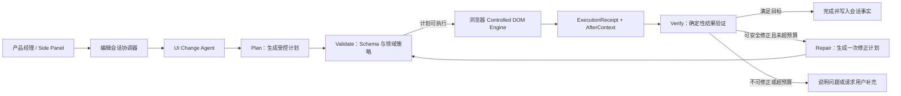

# UI 辅助需求编写插件 V1.1 技术方案

## 1. 阶段目标

V1.0 已验证核心链路可行：产品经理可以选择页面区域，通过多轮自然语言生成受控 DOM 修改，并完成撤销、重做和截图导出。

V1.1 不以继续堆叠业务操作类型为目标，而是把 Demo 提升为可稳定试用、可回归验证、可定位失败原因的版本。核心目标是：

1. 在列表页、详情页、表单页三类固定测试页面上形成 20 条典型任务。
2. Agent 不只生成计划，还能接收浏览器执行结果、重新观察页面并判断目标是否实现。
3. 对可恢复的问题最多自动修正一次；无法安全修正时停止修改并向用户说明。
4. 导出的需求交付物同时包含页面截图和基于实际执行记录生成的变更说明。
5. 插件生命周期、消息通信和错误日志能够支持连续演示与问题定位。

建议验收指标：

| 指标 | 目标 |
| --- | --- |
| 20 条场景首次生成成功率 | 不低于 70% |
| 一次补充或自动修正后的成功率 | 不低于 90% |
| 越权操作阻断率 | 100% |
| 一轮 Agent 自动修正次数 | 最多 1 次 |
| 正常网络下单轮响应时间 | P90 不超过 15 秒，最终以实测校准 |
| 端到端核心流程 | 全部自动化回归通过 |

## 2. 当前基线与主要缺口

### 2.1 已具备能力

- WXT + Chrome MV3 + Side Panel 插件骨架。
- `activeTab` 临时授权与普通 HTTP/HTTPS 页面动态注入。
- 局部 DOM、可复用结构、相邻元素和可见样式采集。
- 结构化 `ChangePlan`、Zod 校验和 DOM 侧二次策略校验。
- `cloneSubtree`、`addComponent`、内容、样式、移动、删除和静态状态等原子操作。
- 按用户轮次撤销、重做、恢复初始状态。
- DeepSeek 与 OpenAI-compatible 模型适配。
- 基于 LangGraph `MemorySaver` 的同一编辑会话最近对话记忆。
- JSONL Agent 请求日志和本地日志查看页。
- 截取当前浏览器可视区域。

### 2.2 当前实现与原技术目标的差距

| 领域 | 当前实现 | V1.1 目标 |
| --- | --- | --- |
| Agent Graph | 单个 `plan` 节点 | 规划、验证、修复、完成的可恢复状态图 |
| 执行闭环 | Agent 返回计划后结束 | 浏览器回传执行回执和最新页面观察，Agent 再判断结果 |
| 记忆 | 最近 8 条原始对话 | 近期对话 + 结构化会话摘要 + 已执行变更事实 |
| 校验 | Schema 与执行前策略校验 | 增加执行后确定性断言和结果状态 |
| 错误 | 主要返回统一 Agent 错误 | 分层错误码、失败节点、是否可重试 |
| 可观测性 | Turn 级请求和响应日志 | Step 级日志、执行回执、验证结果和修复链路 |
| 测试 | 单元测试为主 | 三类页面、20 条场景数据集和 Chrome 端到端测试 |
| 交付物 | PNG 截图 | PNG + Markdown 变更说明 + 可选操作记录 JSON |

## 3. 总体架构增量

V1.1 延续现有分层，不引入第二套 Agent 框架，也不让模型直接执行 DOM。主要增量是把浏览器执行结果恢复到 Agent Thread，形成受控的“规划—执行—观察—验证”闭环。



浏览器 DOM 始终是页面事实来源。Conversation Memory 中的文字描述不能证明页面修改已经成功。

## 4. 分层设计

### 4.1 接入与展示层：`apps/extension`

职责：

- 展示当前选区、对话、执行状态、确认弹窗和错误。
- 发起 Turn，执行服务端返回的计划，并提交执行回执。
- 在一次自动修正发生时展示“正在检查并修正”，不伪装成新的用户消息。
- 导出截图和变更说明。
- 管理 Side Panel、标签页和 Content Script 生命周期。

不负责：

- 自行判断模型结果是否符合用户意图。
- 绕过领域层执行模型生成的任意 DOM、HTML 或脚本。
- 把浏览器页面状态长期保存在 Agent 对话文本里。

建议把现有 `session-machine.ts` 扩展为以下主要状态：

```text
idle
selecting
planning
awaitingConfirmation
executing
verifying
repairing
completed
needsClarification
failed
```

页面关闭、Side Panel 关闭或标签页切换时，结束选择模式并隐藏辅助浮层，但不主动撤销已经生成的页面示意。

### 4.2 应用编排层

新增 `EditSessionCoordinator` 概念，负责把一次用户操作跨越浏览器和 Agent Service 的多个步骤串起来。

核心用例：

- `StartTurn`：提交用户指令与最新页面上下文。
- `ExecutePendingPlan`：在 Content Script 中事务执行计划。
- `ResumeWithExecutionResult`：将执行回执和执行后页面上下文恢复到原 Agent Thread。
- `ConfirmRemoval`：携带计划版本和页面版本恢复待确认 Turn。
- `ExportRequirementArtifact`：汇总截图、实际执行记录和用户指令。
- `CancelTurn`：取消尚未进入 DOM 原子事务的 Turn。

同一 `tabId + editSessionId` 同时只允许一个活动 Turn。重复提交相同 `turnId` 时返回已有状态，不能再次插入 DOM。

### 4.3 UI Change Agent 业务层

Agent Graph 负责领域流程和决策，不拥有浏览器执行能力。

建议节点：

1. `assembleContext`：组装当前指令、会话摘要、最近对话和最新页面快照。
2. `plan`：生成 `Clarification` 或 `ChangePlan`。
3. `validatePlan`：执行 Schema 和领域策略校验。
4. `awaitExecution`：持久化待执行状态，等待浏览器回执。
5. `verifyExecution`：根据计划预期、执行回执和最新 DOM 上下文验证结果。
6. `repairPlan`：只针对明确失败项生成一次增量修正计划。
7. `commitMemory`：将实际完成的修改写入结构化会话事实。
8. `complete` / `clarify` / `fail`：进入明确终态。

V1.1 不采用开放式 ReAct，也不向 Agent 注册点击、输入、导航、请求接口或执行 JavaScript 的工具。

### 4.4 通用 Agent Runtime：`packages/agent-runtime`

通用层继续使用 LangGraph.js，新增能力保持与 UI 业务解耦：

- `ThreadRuntime`：启动、恢复、取消和查询 Thread。
- `InterruptAdapter`：等待浏览器执行或用户确认。
- `LoopBudget`：规划 1 次、Schema 修复 1 次、页面修正 1 次、总超时限制。
- `ContextBudget`：消息数量、字符数和 DOM 节点预算。
- `RuntimeError`：统一错误分类及 `retryable` 标记。
- `StepObserver`：记录节点开始、结束、耗时、输入摘要和输出摘要。

通用层只知道“外部执行结果”和“状态恢复”，不知道 DOM、CSS、选区或组件类型。

### 4.5 UI 变更领域层：`packages/ui-change-domain`

领域层增加执行后验证模型，但不增加“订单行”“筛选栏”等业务操作。

建议新增：

- `PlanExpectation`：计划预期产生的可验证结果。
- `ExecutionObservation`：执行后的局部页面快照。
- `VerificationResult`：`passed`、`repairable` 或 `failed`。
- `ChangeFact`：已经由执行回执证明成功的修改事实。
- `ErrorCode`：稳定错误码及分层归属。

确定性验证优先覆盖：

- 所有 `operationId` 是否执行成功。
- 预期新增节点是否仍连接在页面中。
- 文案、属性和白名单样式是否达到目标值。
- 新节点与锚点的相对位置是否正确。
- 删除目标是否已移除。
- 页面版本是否与回执一致。

模型只处理确定性规则无法判断的视觉或语义问题。V1.1 不做像素级截图比较。

#### 4.5.1 GoalSpec 目标驱动链路

Planner 不再直接把自然语言映射成一组可以自证成功的 DOM 操作，而是输出两部分：

```text
UIIntent / GoalSpec
├── action：create / update / remove / move / present
├── role：基础组件角色或结构角色
├── content：label / text / placeholder / options / variant
├── placement：anchor / relation / strict / sameRow
├── state：open / selected / disabled
└── preserveTexts：必须保持的页面内容

ChangePlan
└── 实现上述 GoalSpec 的受控原子操作
```

领域层的能力编译器只读取 GoalSpec、页面结构事实和组件能力注册表，不读取用户指令中的中文关键词，也不识别订单、筛选栏等业务实体。它负责：

- 将 Goal 的组件角色映射到基础组件能力。
- 用 Goal 内容统一校准组件 props，避免 label、placeholder、variant 和 options 丢失。
- 将 Goal 的状态约束补充为 `setVisualState`。
- 根据布局事实把 `sameRow` 等约束编译为显式布局操作。
- 校验每个创建目标都对应一个可追踪的 `resultRef`。

执行器为创建操作返回真实 `resultElementId`。执行后上下文包含局部元素事实：

- 父子关系和兄弟索引。
- 局部矩形位置。
- Grid、Flex 等布局事实。
- 推断后的基础组件角色。
- 安全范围内的局部可见文本。

验证器根据原始 GoalSpec 检查最终页面，而不是只验证操作是否执行：

- 结果元素是否存在。
- 组件角色是否保持。
- 内容、占位文案、选项和语义变体是否正确。
- 严格相对位置和同行约束是否满足。
- 展开、选中和禁用状态是否落实到具体控件或选项。
- 保持约束是否仍然成立。

Goal 未满足时，即使所有 DOM 操作都返回 `applied`，Turn 也不能判定为成功。

### 4.6 页面与 DOM 基础设施层

继续保留自研 `ControlledDomEngine`，原因是它承载本项目最关键的安全边界、事务和逆操作。

需要增强：

- 每个原子操作返回结构化 `OperationReceipt`，包含目标、结果引用和失败原因。
- `addComponent` 使用可扩展的基础组件目录；首批包含输入、选择、按钮、文字、链接、单/多选、标签和提示条，组件可携带受控语义变体，但不增加订单行等业务操作类型。
- 组件宏负责模板复用后的 label、placeholder、选项和语义样式同步；`setVisualState` 必须落实到具体控件或选项。
- 执行完成后按预算重新采集 `AfterContext`，而不是返回整页 DOM。
- 元素引用失效时返回 `STALE_ELEMENT`，不静默改用模糊 CSS Selector。
- 对重复消息维护会话级幂等集合。
- 将浮层显示状态与选中元素状态分离，避免插件关闭后被滚动事件重新唤醒。

PageAgent 在 V1.1 只做隔离技术验证：用相同页面输入比较其 DOM 简化、可见性判断和元素映射结果。验证通过前不替换现有选区和执行链路。

### 4.7 可观测性与评测层

现有 JSONL 日志升级为 Turn + Step 结构：

```text
Turn
├── request/contextDigest
├── plan
├── policyValidation
├── executionReceipt
├── afterContextDigest
├── verification
├── repairPlan（可选）
└── finalStatus/duration/model
```

日志页增加：

- 按会话、状态、模型和错误码筛选。
- 展示每个 Agent 节点的耗时与输入输出摘要。
- 对比执行前后局部 DOM 摘要。
- 一键复制脱敏后的问题包。

V1.1 继续使用本地 JSONL，不引入远程观测平台。出现多人共享调试需求后再评估 OpenTelemetry 后端或 Langfuse。

## 5. 协议演进

### 5.1 两阶段 Turn

当前 `POST /v1/turns` 只负责生成计划。V1.1 将一次 Turn 拆为可恢复的两个阶段：

1. `POST /v1/turns`：创建 Turn，返回澄清、待确认或待执行计划。
2. `POST /v1/turns/{turnId}/execution`：提交执行回执与执行后页面上下文，恢复 Agent Graph 并返回完成、修正计划或失败。

如返回修正计划，浏览器仍要经过同一套策略校验和事务执行，然后再次提交执行结果。服务端通过 `repairCount` 保证最多修正一次。

### 5.2 核心 DTO

建议在 `packages/ui-change-contracts` 中新增：

```text
AgentTurnResponse
  kind: clarification | confirmation | execution | completed | failed

ExecutionSubmission
  protocolVersion
  editSessionId
  turnId
  traceId
  planId
  selectionVersion
  beforePageRevision
  afterPageRevision
  receipt
  observation

OperationReceipt
  operationId
  status
  targetRef
  resultRef?
  errorCode?
  errorMessage?

VerificationResult
  status: passed | repairable | failed
  checks[]
  summary
```

所有写操作继续在浏览器端使用 Zod 重新校验。服务端返回成功不能替代 DOM Engine 的安全校验。

### 5.3 错误分类

| 类别 | 示例 | 默认处理 |
| --- | --- | --- |
| `MODEL_ERROR` | 超时、限流、供应商错误 | 展示错误，可由用户重试 |
| `SCHEMA_ERROR` | 模型 JSON 不符合契约 | 服务端自动修复一次 |
| `POLICY_ERROR` | 越权目标、不安全样式 | 不执行，向用户说明 |
| `STALE_CONTEXT` | 页面或选区版本已变化 | 刷新上下文后重新规划一次 |
| `STALE_ELEMENT` | 元素已被框架重建 | 停止写入，要求重新选择 |
| `EXECUTION_ERROR` | DOM 原子事务失败 | 自动回滚，进入验证或失败 |
| `VERIFICATION_ERROR` | 执行完成但结果不符合预期 | 有明确修复项时修正一次 |
| `CANCELLED` | 用户取消或页面关闭 | 结束 Turn，不继续调用模型 |

## 6. 上下文与记忆设计

V1.1 将状态拆为三类，禁止混用：

| 状态 | 保存位置 | 内容 |
| --- | --- | --- |
| 页面事实 | Content Script | 当前 DOM、元素引用、历史事务、页面版本 |
| Agent 工作状态 | LangGraph Checkpointer | 当前节点、计划、回执、验证结果、循环计数 |
| 会话记忆 | Agent Thread | 用户目标、已确认偏好、已完成变更事实、近期对话 |

建议的 `SessionMemory`：

```text
goal                 当前选区的总体修改目标
confirmedPreferences 用户明确确认的选项与约束
appliedChangeFacts   由 ExecutionReceipt 证明成功的修改摘要
recentTurns          最近 6～8 轮原始对话
conversationSummary  更早对话的结构化摘要
selectionVersion     当前选区版本
```

上下文组装优先级：

1. 当前用户指令。
2. 最新页面事实。
3. 安全策略和输出 Schema。
4. 已执行变更事实。
5. 用户确认的偏好。
6. 近期对话。
7. 历史摘要。

页面刷新、标签页关闭或用户重新选择区域后结束原选区记忆，不做跨页面长期记忆。

## 7. 执行后验证与自动修正

### 7.1 验证顺序

1. 检查事务是否成功以及是否发生自动回滚。
2. 逐项匹配 `OperationReceipt` 与原计划。
3. 在 `AfterContext` 中验证文案、样式、位置、存在性和删除结果。
4. 如果确定性验证全部通过，直接完成，不再调用模型。
5. 如果存在确定性失败且可以用已有原子操作修复，生成一次增量修正计划。
6. 如果失败原因不明确、需要越权或元素已失效，停止并向用户说明。

### 7.2 修正边界

- 修正只能作用于当前选中元素和本 Turn 新增元素。
- 不得扩大原计划目标范围。
- 删除已有元素仍需用户确认，修正不能继承不匹配的新确认。
- 修正计划最多 6 个原子操作，最多执行一次。
- 修正失败后不继续循环。
- 修正前后都写入同一个 `traceId`，但使用新的 `planId`。

## 8. 场景数据集与测试体系

### 8.1 三类固定测试页面

- 列表页：筛选区、操作区、数据表格、状态和分页。
- 详情页：信息区块、状态标签、说明文字和操作按钮。
- 表单页：输入框、选择器、单选、多选和分组布局。

每个测试页面提供稳定的 `data-testid`，仅用于自动化断言，不发送给模型作为业务捷径。

### 8.2 场景用例格式

每条场景使用版本化 JSON/YAML 保存：

```text
id
page
selectionFixture
instructionTurns[]
expectedOutcome
allowedOperations
requiresClarification
requiresConfirmation
forbiddenEffects[]
tags[]
```

场景分为：

- 正向修改：添加、复制、改文案、改样式、移动、显示状态。
- 多轮修改：先新增，再补充选项、改位置或删除新增内容。
- 安全边界：脚本、网络请求、页面导航和越区修改。
- 异常恢复：元素失效、页面版本变化、消息重复和模型格式错误。

### 8.3 测试金字塔

- Vitest：Schema、领域策略、上下文裁剪、验证器、循环预算和 DOM 事务。
- 契约测试：Agent Service、插件和 Content Script 使用相同 DTO fixture。
- Playwright：在真实 Chrome 扩展上下文覆盖选区、对话、确认、撤销、关闭插件和截图。
- 模型评测：固定上下文下比较 Mock、DeepSeek 和提示词版本的计划成功率。

模型评测结果不能直接更新黄金答案，失败用例必须人工判断是预期变化还是回归。

## 9. 需求交付物

V1.1 新增“导出需求包”，默认包含：

- 当前可视区域 PNG。
- Markdown 变更说明。
- 可选的结构化操作记录 JSON，默认不面向产品经理展示。

变更说明必须从用户指令、成功的 `ExecutionReceipt` 和 `ChangeFact` 生成，不直接采用模型计划作为最终事实。建议结构：

```text
页面与时间
选中区域
修改目标
已完成变更
展示的静态交互状态
未实现或需要研发确认的事项
截图文件名
```

V1.1 不导出生产代码，不生成可直接合并的 React/Vue 组件。

## 10. 开源复用与新增依赖原则

| 能力 | 方案 |
| --- | --- |
| Agent 状态图、Checkpointer、Interrupt | 继续使用 LangGraph.js |
| 模型调用与供应商适配 | 继续使用 Vercel AI SDK |
| 浏览器会话状态 | 继续使用 XState |
| DTO 与输出校验 | 继续使用 Zod |
| 插件框架和消息通信 | 继续使用 WXT、`@webext-core/messaging` |
| HTTP 服务 | 继续使用 Hono |
| 单元测试 | 继续使用 Vitest |
| Chrome 端到端测试 | 引入 Playwright |
| 模型数据集评测 | 先实现轻量本地 Runner，规模扩大后接 Promptfoo |
| 页面理解 | 对 PageAgent 做隔离 POC，不直接替换现有实现 |
| 日志 | 延续 JSONL，暂不部署外部平台 |

新增依赖必须满足三个条件：现有依赖无法清晰覆盖、引入后有独立适配边界、能通过具体场景证明收益。

## 11. 实施计划

### M1：稳定性和测试基线

- 补齐插件生命周期、标签页隔离、重复注入和错误码。
- 建立列表页、详情页、表单页。
- 加入 Chrome 扩展 Playwright 测试骨架。
- 整理首批 10 条确定性场景。

完成标准：核心链路可以连续运行，关闭或切换插件不会残留辅助 UI，关键异常有明确错误信息。

### M2：两阶段协议和 Agent 闭环

- 扩展 contracts 和 Agent Thread 状态。
- 实现执行回执与 `AfterContext`。
- 将 Agent Graph 扩展为规划、等待执行、验证和完成。
- 完成幂等、超时和一次修正预算。

完成标准：日志中可以完整看到一轮任务从用户指令到验证完成的链路。

### M3：场景评测和提示词收敛

- 扩充到 20 条场景。
- 建立确定性断言与模型计划评分。
- 根据失败分布调整上下文、提示词和原子操作组合能力。
- 单独完成 PageAgent 页面理解 POC 和采用决策记录。

完成标准：达到阶段成功率目标，且安全边界用例全部阻断。

### M4：需求包导出和小范围试用

- 导出 PNG + Markdown 变更说明。
- 日志页支持失败筛选和问题包复制。
- 邀请 2～3 位产品经理使用真实需求进行试用。

完成标准：研发仅查看需求包即可理解主要 UI 改动，试用问题能够从日志中定位到具体层级。

## 12. 暂不包含

- 真实业务接口调用、数据提交和页面导航。
- 任意 JavaScript、任意 HTML 或任意 CSS 执行。
- 跨页面流程原型和修改持久化。
- React/Vue 源码生成与提交。
- 页面刷新或业务框架重新渲染后自动恢复 DOM 修改。
- 多 Agent 协作。
- 全站长期权限和对任意网站兼容性的承诺。
- 像素级视觉理解与截图自动评分。
- 多人在线协作、云端会话和完整需求管理平台。

## 13. 需要确认的方案决策

以下均给出推荐默认值，确认后再进入实现：

1. V1.1 是否以三个固定测试页面、20 条任务作为验收基线：推荐确认。
2. 自动修正是否最多一次：推荐确认，避免不可控循环和模型费用增长。
3. 执行后验证是否优先采用确定性规则，只有规则无法判断时才调用模型：推荐确认。
4. Agent Checkpointer 是否继续使用进程内存：推荐 V1.1 保持内存实现，服务重启后不恢复活动 Turn；JSONL 仅用于调试追踪。
5. 需求包是否采用 PNG + Markdown，JSON 操作记录作为可选调试附件：推荐确认。
6. PageAgent 是否只做隔离 POC，验证收益后再决定集成：推荐确认。

## 14. 实施状态

### 2026-07-22：M1 第一批完成

- 固定测试页已扩展为订单列表、订单详情和新建订单表单三个页面。
- 建立首批 10 条场景数据，覆盖多轮修改、删除确认和安全拒绝。
- Side Panel 使用唯一客户端标识绑定打开时的标签页；切换活动标签时拒绝误操作。
- 标签页关闭和 Side Panel 断连时释放会话绑定并清理页面辅助浮层。
- 插件消息失败响应增加稳定错误码，并在 Side Panel 中展示错误码。
- 增加标签页注册表、场景集和 URL 策略单元测试。
- 使用 Playwright 真实浏览器验证三个测试页面的渲染和导航，无页面运行错误。

### 2026-07-23：M2 Agent 执行闭环完成

- 新增独立 `packages/ui-change-agent` 业务包，通用 Agent Runtime 不依赖 DOM 领域语义。
- `POST /v1/turns` 返回待执行计划；`POST /v1/turns/{turnId}/execution` 接收浏览器执行结果并恢复原 Turn。
- DOM Engine 为每个原子操作返回 `applied`、`failed` 或 `rolledBack` 状态及后置条件验证结果。
- 页面事务失败时自动回滚，回执包含失败操作和错误原因，不把部分修改留在页面中。
- 浏览器执行后重新采集局部上下文，并与计划 ID、选区版本和页面版本共同提交验证。
- UI Change Agent 确定性验证操作覆盖、事务状态、DOM 后置条件和页面版本。
- 仅当事务失败且计划身份、选区仍安全时允许生成一次最小修正计划；第二次失败直接终止。
- Side Panel 增加执行、验证和修正状态，最终明确显示“通过执行后验证”。
- 本地日志页新增“执行、观察与验证”详情，记录完整两阶段链路。

当前验证属于结构和事务级验证，不包含截图像素评分或开放式视觉模型判断；这两项仍按 V1.1 范围暂不实现。

下一步进入 M3：扩充场景数据、建立模型计划评分和提示词回归。

### 2026-07-23：M3 场景集第一批完成

- 模型能力场景由 10 条扩充到 20 条，覆盖三个固定页面、四条多轮任务、组件样式复用、静态交互状态和两类安全拒绝。
- 新增《UI 辅助需求编写插件 V1.1 测试用例》，包含 20 条模型能力回归和 12 条插件与 Agent 工程回归。
- 统一通过、部分通过、失败、阻塞的记录口径，并定义首次成功率、最终成功率、安全阻断率、样式复用成功率和多轮上下文成功率。

M3 后续仍需实现模型计划自动评分、Promptfoo 回归配置和失败分布统计；当前用例集已经可以用于人工基线测试。

### 2026-07-23：M3 C 组挑战评测基础完成

- 新增 `packages/ui-change-eval`，与 Agent Runtime、业务 Agent 和浏览器 DOM Engine 解耦。
- 建立 12 条能力上限挑战场景，其中 C01～C08 为开发集，C09～C12 为隐藏验证集。
- 场景覆盖多原子操作组合、精确相对位置、结构复用、三轮纠错、新增元素引用、约束保持、模糊需求、混合安全意图和精确删除。
- 评分器按照响应决策、语义结果、执行验证、安全边界和规划效率五个维度评分，不绑定唯一原子操作序列。
- 提供可替换 `ChallengeDriver` 以及单场景、整套场景顺序运行器，为接入 Mock、DeepSeek 和 Chrome Driver 提供统一边界。
- 新增《C 组挑战测试方案》，定义 85 分通过线、开发集/隐藏集隔离规则和防过拟合迭代流程。

实验性 Chrome Driver 已完成代码接入，但因 Playwright Chromium 下载成本，当前不作为验证前置条件。现阶段先按《C 组挑战测试方案》人工执行并沉淀失败分布，后续需要批量重复运行时再启用自动化。

### 2026-07-23：C 组第一轮通用能力修复

- 根据 C01、C02、C03、C04、C05、C07 的人工失败记录，确认根因是缺少“原始需求目标到最终页面事实”的独立验证，而不是六个独立组件 Bug。
- 新增通用 `UIIntent / GoalSpec`，覆盖组件角色、内容、语义变体、严格位置、同行、状态和保持约束。
- 新增组件能力注册表与目标编译器；编译过程不读取自然语言关键词或业务场景名称。
- 移除基于“提示、标签、危险”等中文关键词改写计划的逻辑。
- DOM Engine 不再静默修正非法结构位置；无法按计划插入时回滚并要求重新规划合法锚点。
- 创建操作回传真实结果元素 ID，执行后上下文补充父子索引、局部坐标、布局和组件角色事实。
- Agent 直接根据 GoalSpec 验证最终语义；操作成功但角色、内容、位置、状态或保持约束失败时不能通过。
- 基础组件目录仍包含 `tag`、`alert` 和语义变体，但它们通过能力注册表接入，不与 C 组用例绑定。
