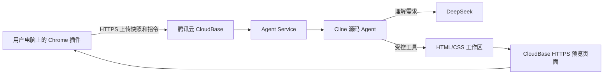
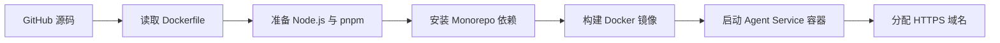
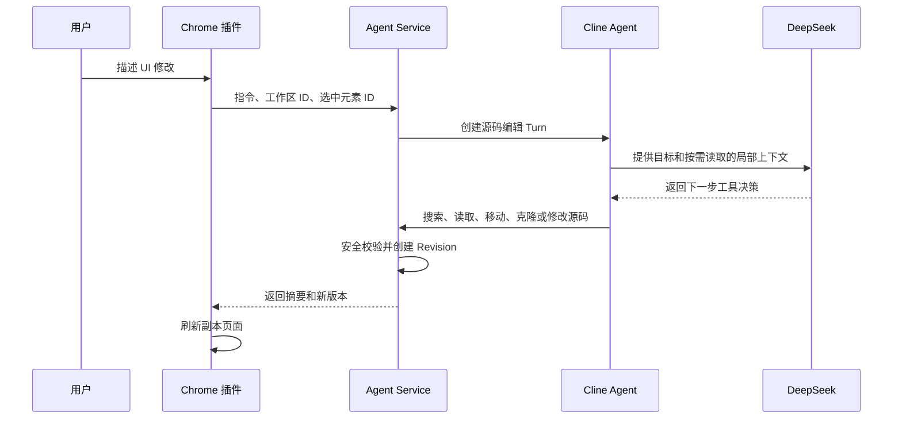

# UI 需求示意助手：云端架构科普教程

## 1. 一句话理解整个系统

Chrome 插件负责采集页面和提供交互界面；CloudBase 负责运行 Agent、调用 DeepSeek、修改快照源码并提供预览页面。

可以把几个组件类比成：

| 组件 | 类比 | 职责 |
|---|---|---|
| Chrome 插件 | 摄像头和遥控器 | 采集页面、选择元素、提交需求、展示结果 |
| CloudBase | 云端工作室 | 提供持续运行的计算、网络和容器环境 |
| GitHub | 图纸仓库 | 保存项目源码和版本历史 |
| Dockerfile | 装配说明书 | 描述如何安装并启动 Agent Service |
| Cline | 执行项目的工程师 | 管理上下文、循环、工具调用和源码修改 |
| DeepSeek | 负责理解的设计搭档 | 理解自然语言和页面结构，决定修改策略 |
| HTML/CSS 工作区 | 工作台 | 保存当前静态副本和每轮修改结果 |

## 2. 为什么插件不能独自完成全部工作

Chrome 插件擅长浏览器侧能力：

- 读取当前页面 DOM 和可见样式；
- 冻结表单、弹窗和展开状态；
- 选择页面区域并高亮元素；
- 打开 Side Panel 和静态副本页面；
- 导出当前可视区域截图。

但源码 Agent 还需要：

- Node.js 运行环境；
- Cline Agent SDK 和模型适配层；
- 创建、读取和修改 HTML/CSS 文件；
- 保存多轮 Revision、对话和日志；
- 执行源码检查和结构校验；
- 持续几十秒甚至更久的模型与工具循环。

这些能力不适合全部塞进 Chrome 插件：

1. Chrome MV3 后台进程可能在空闲时被挂起；
2. 浏览器扩展没有普通 Node.js 服务的文件系统环境；
3. 把 DeepSeek Key 放进插件，任何安装者都能提取；
4. Cline 和模型依赖体积较大；
5. 长时间 Agent Turn 在独立服务端运行更加稳定、可观测。

因此系统拆成浏览器插件和 Agent Service 两部分。

## 3. 整体架构



部署到 CloudBase 后，所有用户安装的插件都连接同一个 HTTPS 服务地址。用户电脑不再需要运行项目源码或本地服务。

## 4. 为什么选择 CloudBase

如果没有云端服务，每台测试电脑都需要安装：

```text
Node.js + pnpm + UIAgent 源码 + Agent Service + DeepSeek 配置
```

这不符合“安装插件即可使用”的产品目标。

CloudBase 为当前 Demo 提供：

- 国内可访问的云端运行环境；
- Docker 容器构建和运行；
- 固定的公网 HTTPS 域名；
- 环境变量和模型 Key 管理；
- 构建日志、实例日志和运行监控；
- GitHub 自动部署；
- 实例重启和基础流量管理。

它帮助我们省去了购买和维护 Linux 服务器、手工安装 Node.js、配置反向代理、申请 HTTPS 证书以及编写部署脚本等工作。

## 5. 云函数和云托管有什么区别

腾讯云把它们放在“云函数 / 托管”菜单下，因为二者都是云端计算能力，但运行模型不同。

### 云函数

云函数更像“收到事件后临时执行一段函数”：

- 适合短小接口、Webhook、图片处理和定时任务；
- 通常强调无状态和快速结束；
- 实例可能随请求创建和回收；
- 不适合依赖本地工作区的长时间 Agent 循环。

### 云托管

云托管更像“在云上持续运行一个完整 Docker 应用”：

- 可以运行完整 Node.js Web 服务；
- 可以安装 Cline 和大量 npm 依赖；
- 可以处理较长的模型请求；
- 可以创建临时 HTML/CSS 文件；
- 同时提供 API、预览页、健康检查和日志页。

因此 UIAgent 使用 CloudBase Run 云托管，而不是把 Agent 拆成许多云函数。

## 6. 为什么绑定 GitHub 就能部署

GitHub 保存项目源码，仓库根目录的 Dockerfile 则描述如何把源码变成可运行服务。



CloudBase 并不是自动理解了 UIAgent 的业务代码，而是按 Dockerfile 这份装配说明执行：

1. 选择 Node.js 基础环境；
2. 安装 pnpm；
3. 复制依赖清单并安装依赖；
4. 复制 Agent Service 和公共包源码；
5. 准备工作区目录；
6. 执行启动命令。

开启 GitHub 自动部署后，每次向指定分支推送代码，CloudBase 会自动拉取新提交、重新构建镜像、创建版本并发布。这是一条简化的 CI/CD 流水线。

## 7. Docker 在这里解决了什么

Docker 把运行环境和应用封装在一起：

```text
操作系统基础环境
Node.js 版本
pnpm
npm 依赖
UIAgent 源码
启动命令
```

这样本地、CloudBase 或其他容器平台都遵循同一份运行说明，减少“本机能跑、服务器不能跑”的环境差异。

Dockerfile 也让未来迁移到腾讯云轻量服务器、阿里云 SAE、Kubernetes 或其他容器平台更容易。

## 8. 端口映射为什么是 80 到 8787

Agent Service 在容器内部监听：

```text
0.0.0.0:8787
```

用户访问的是 CloudBase 的 HTTPS 域名：

```text
浏览器 HTTPS 请求
       ↓
CloudBase 公网网关
       ↓ 访问端口 80
Agent Service 容器端口 8787
```

CloudBase 负责公网 HTTPS 和入口流量转发，Node.js 只需监听容器内部端口。

`HOST=0.0.0.0` 表示接受来自容器外部网关的连接。如果只监听 `127.0.0.1`，就只有容器自身能访问服务。

## 9. 环境变量为什么不写进代码

环境变量把“程序”和“部署配置”分离：

- 源码描述系统如何工作；
- 环境变量决定当前部署连接哪个模型、使用什么 Key、监听什么端口。

DeepSeek Key 必须保存在服务端环境变量中，因为写入 GitHub 会形成永久泄露记录，写入 Chrome 插件则会被安装者提取。

`PUBLIC_BASE_URL` 也属于部署配置。Agent Service 需要它生成可供浏览器访问的完整副本地址，但本地开发和腾讯云部署使用的域名不同，因此不应硬编码在业务源码中。

## 10. 一次“进入副本编辑”发生了什么

1. 插件读取当前页面已经渲染出来的 DOM；
2. 冻结输入值、勾选状态、弹窗和展开状态；
3. 读取主要可见样式；
4. 移除脚本、事件、接口、iframe 和远程资源；
5. 通过 HTTPS 把静态快照发送到 Agent Service；
6. 服务把快照编译为 `index.html`、`snapshot.css`、`outline.json` 和 `source-map.json`；
7. 服务返回 CloudBase 下的预览地址；
8. 插件在新标签页打开静态副本；
9. 用户在副本页选择需要修改的元素。

此时展示的是一个安全、可编辑的静态副本，不会修改原始业务页面，也不会执行原页面接口。

## 11. 一次自然语言修改发生了什么



模型不会直接操作用户的真实浏览器页面。它只能通过我们提供的受控源码工具修改当前静态工作区。

## 12. Cline、DeepSeek 和 UIAgent 如何分工

### DeepSeek

负责理解自然语言和页面局部结构，判断用户想实现什么效果以及下一步需要读取或修改什么。

### Cline

负责通用 Agent 能力：

- 多轮循环；
- 上下文组织；
- 工具选择；
- 失败后继续读取或修正；
- 模型调用和工具调用计数。

### UIAgent

负责业务边界：

- 页面快照和安全裁剪；
- 工作区隔离；
- `sourceId` 定位；
- 结构化移动、克隆和样式读取；
- 源码修改校验；
- Revision、撤销、重做；
- 插件交互和截图导出。

这体现了项目的核心设计：复用成熟通用 Agent Runtime，把研发投入集中在 UI 编辑领域能力和安全约束上。

## 13. 为什么当前不用数据库

CloudBase 创建环境时要求选择数据库，但当前 UIAgent 没有使用它。

现阶段数据保存在单个容器实例中：

- HTML/CSS 工作区；
- Revision 文件；
- 对话上下文；
- Agent 日志。

这样实现最简单，适合验证核心链路。代价是容器重新部署或实例被替换后，历史数据可能丢失。

正式产品化时，可以把元数据放进数据库，把 HTML/CSS 和 Revision 放进对象存储，从而支持多实例、跨重启恢复和用户隔离。

## 14. 为什么暂时固定一个实例

如果 CloudBase 同时运行两个实例：

1. 创建工作区的请求可能落到实例 A；
2. 下一次修改请求可能落到实例 B；
3. 实例 B 的临时磁盘中没有该工作区；
4. 用户就会看到“工作区不存在”。

因此当前 Demo 使用最小 1、最大 1，并选择持续运行。这不是理想的生产架构，而是在尚未接入共享存储前保证会话连续性的合理约束。

## 15. 当前方案的收益与边界

### 已经解决

- 其他电脑不再安装 Node.js 和本地服务；
- DeepSeek Key 不进入插件；
- 插件获得固定 HTTPS 服务地址；
- GitHub 推送可以触发自动部署；
- Agent 运行、工作区和日志集中在服务端；
- 浏览器只操作安全静态副本。

### 尚未解决

- 正式用户登录与鉴权；
- 不同用户的强隔离；
- 工作区持久化；
- 多实例负载均衡；
- 自动过期与磁盘清理；
- 日志访问控制；
- 默认测试域名的限流与 SLA；
- 真实敏感页面的数据合规。

## 16. 从 Demo 演进到正式产品

推荐顺序：

1. 增加服务端鉴权和用户身份；
2. 为每个用户和工作区建立权限边界；
3. 将工作区迁移到对象存储或共享持久卷；
4. 将元数据、Revision 索引和会话写入数据库；
5. 增加工作区 TTL 和自动清理；
6. 关闭或保护 `/logs`；
7. 支持多实例和无状态 API；
8. 使用正式备案域名和生产 HTTPS；
9. 接入公司内网、脱敏和审计策略。

当前架构完成了最重要的验证：任何电脑安装同一份插件后，都可以连接统一的云端 Agent，通过自然语言修改静态页面副本并生成 UI 需求示意。
