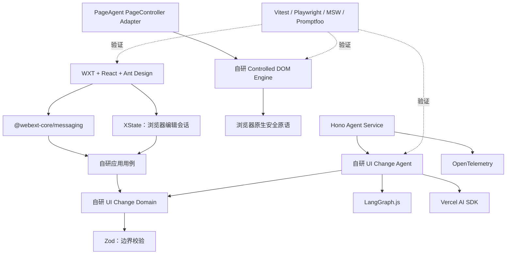

# UI 辅助需求编写插件：分层开源复用调研

> 调研日期：2026-07-22  
> 目标：优先复用成熟开源能力，同时避免框架重叠、边界失控和为 Demo 引入过重基础设施。

## 1. 结论

推荐采用“开源基础设施 + 自研业务内核”的组合，而不是寻找一个项目整体二次开发。

可以直接复用的部分主要是：插件工程、跨上下文消息、浏览器会话状态机、Agent Runtime、模型适配、服务端接口、协议校验、测试和可观测标准。必须保留自研的部分主要是：UI Change Specification、选区范围策略、组件模板适配、受控 DOM 事务、逆操作和页面版本校验。

最终建议分为四类：

- **直接采用**：能力边界清晰，能显著减少重复工作。
- **先做 PoC 再接入**：价值明确，但与目标页面或包体积有关。
- **按条件启用**：只有触发特定需求时才值得增加依赖。
- **只借鉴或不采用**：目标不同、能力重叠或会扩大安全边界。

## 2. 分层选型总表

| 架构层 | 开源项目或平台能力 | 决策 | 复用内容 | 不交给它的职责 |
| --- | --- | --- | --- | --- |
| 接入与展示层 | [WXT](https://github.com/wxt-dev/wxt) | 直接采用 | Manifest V3、Side Panel/Content Script/Background 入口、构建和开发流程 | 业务用例和 DOM 安全策略 |
| 接入与展示层 | [React](https://github.com/facebook/react) + [Ant Design](https://github.com/ant-design/ant-design) | 直接采用 | Side Panel UI、测试页面基础组件 | 目标页面组件识别和模板适配 |
| 插件消息层 | [@webext-core/messaging](https://github.com/aklinker1/webext-core/tree/main/packages/messaging) | 直接采用 | Side Panel、Background、Content Script 间类型安全消息；按 `tabId` 发送 | DTO 版本、运行时校验、幂等和业务路由 |
| 插件存储层 | [WXT Storage](https://wxt.dev/guide/essentials/storage.html) | 直接采用 | `storage.local/session` 封装、类型和迁移 | DOM History 和 Agent Checkpoint |
| 浏览器应用编排层 | [XState](https://github.com/statelyai/xstate) | 建议采用 | 选区、规划、确认、执行、撤销、取消等浏览器侧状态机 | 服务端 Agent Graph 和领域规则 |
| 通用 Agent 层 | [LangGraph.js](https://github.com/langchain-ai/langgraphjs) | 直接采用 | Graph、Checkpoint、Interrupt、暂停恢复、线程短期记忆 | UI 提示词、Change Spec、DOM 执行 |
| 模型运行层 | [Vercel AI SDK](https://github.com/vercel/ai) | 直接采用 | 多模型 Provider、流式调用、结构化输出 | Agent 工作流和业务策略 |
| Agent Service 接口层 | [Hono](https://github.com/honojs/hono) | 直接采用 | Web Standard HTTP、SSE、Middleware、轻量服务入口 | 业务状态和领域 DTO 定义 |
| 协议与领域边界 | [Zod](https://github.com/colinhacks/zod) | 直接采用 | API、事件、ChangePlan 的运行时校验和类型推导 | 领域行为与安全决策 |
| 页面理解适配层 | [Alibaba PageAgent PageController](https://github.com/alibaba/page-agent) | PoC 后决定 | DOM 简化、可见性、元素索引映射、React 兼容补丁 | 完整 Agent Core、点击/输入工具、脚本执行 |
| 浮层定位 | [Floating UI](https://github.com/floating-ui/floating-ui) | 按条件启用 | 新增下拉框、气泡等静态展开态的锚点定位与碰撞处理 | 选区框、组件业务语义 |
| HTML 安全 | [DOMPurify](https://github.com/cure53/DOMPurify) | 按条件启用 | 清洗来自页面模板的 HTML/MathML/SVG | CSS 白名单、URL 策略、操作范围校验 |
| 可观测性 | [OpenTelemetry JS](https://github.com/open-telemetry/opentelemetry-js) | 直接采用 API，服务端启用 SDK | Trace、Span、耗时和跨插件/服务关联 | 完整 DOM 和敏感输入采集 |
| 模型质量评估 | [Promptfoo](https://github.com/promptfoo/promptfoo) | 直接作为开发工具 | 提示词回归、模型对比、断言和越权/注入测试 | 运行时 Agent 执行 |
| API Mock | [MSW](https://github.com/mswjs/msw) | 直接作为开发工具 | 浏览器与 Node 共用 Model Gateway/Agent API Mock | DOM 行为模拟 |
| 架构治理 | [dependency-cruiser](https://github.com/sverweij/dependency-cruiser) | 直接作为 CI 工具 | 分层依赖规则、循环依赖和许可证规则 | 业务测试 |
| 单元与端到端测试 | [Vitest](https://github.com/vitest-dev/vitest) + [Playwright](https://github.com/microsoft/playwright) | 直接采用 | 单元、契约、Chrome 插件 E2E、截图断言 | 模型语义质量评估 |

## 3. 各层详细判断

### 3.1 接入与展示层

#### WXT：直接采用

WXT 已覆盖 Manifest、入口约定、开发热更新、构建和 Chrome Extension 测试基础，和 PageAgent 的技术栈也一致。没有必要自行维护 Vite 多入口和 Manifest 生成脚本。

#### @webext-core/messaging：直接采用

WXT 官方文档本身建议使用消息封装库；`@webext-core/messaging` 是轻量、类型安全的 WebExtension 消息封装，支持 Background 到指定 `tabId/frameId`。它只解决传输 API 的易用性，不替代本项目的 `protocolVersion`、Zod 校验、`turnId/planId` 幂等和错误 DTO。

不采用更重的 `trpc-chrome` 或代理服务式 RPC。插件需要显式区分查询、命令和流式 Agent 事件，透明 RPC 容易隐藏跨进程失败、Service Worker 重启和目标 Tab 已失效等事实。

#### WXT Storage：直接采用

WXT 已提供推荐的 Storage 封装，不再引入另一套浏览器存储库。它只保存插件配置、非敏感会话索引和 UI 偏好；真实 DOM History 留在 Content Script 内存，Agent Checkpoint 留在 Agent Service。

#### XState：限定在浏览器编辑会话

浏览器侧存在明确的互斥状态：`idle → selecting → selected → planning → awaiting_confirmation → executing → completed/failed`，还包含取消、页面过期、撤销和重做。XState 适合把这些转换显式化，并能做基于状态机的测试。

XState 不进入 `ui-change-domain`，也不负责服务端 Agent Loop。这样不会与 LangGraph 形成两套 Agent Runtime：LangGraph 管理模型驱动的服务端工作流，XState 管理用户和 Chrome 生命周期驱动的浏览器状态。

#### Floating UI：仅静态浮层需要时采用

如果 Demo 要在真实元素旁展示“展开的下拉框、Popover 或 Tooltip”，Floating UI 可以复用锚点定位、翻转和视口碰撞处理。普通选区高亮只需 `getBoundingClientRect` 加固定定位，不应因此引入它。

### 3.2 通用 Agent 能力层

#### LangGraph.js：作为唯一 Agent Runtime

继续采用 LangGraph.js 承担图执行、Checkpoint、Interrupt、暂停恢复和 Thread 状态。上下文裁剪和领域摘要仍由本项目通过节点与策略封装，因为通用框架无法知道哪些页面信息可以丢弃。

不再额外引入 Mastra、PageAgent Core 或 Claude Agent SDK：

- [Mastra](https://github.com/mastra-ai/mastra) 是覆盖 Agent、Workflow、Memory、Observability 和服务端能力的一体化框架，与 LangGraph、AI SDK、Hono 大面积重叠，替换成本高于收益。
- PageAgent Core 更适合单次网页自动化 ReAct Loop，不满足本方案的跨请求确认和可靠恢复边界。
- Claude Agent SDK 会引入模型和运行时绑定，当前只保留架构参考价值。

#### Vercel AI SDK：只作为 Model Runtime

AI SDK 提供 Provider 抽象和基于 Zod 的结构化输出，适合实现可替换 `ModelAdapter`。不使用它的 `ToolLoopAgent` 替代 LangGraph，也不让模型工具直接获得浏览器写权限。

`@ai-sdk/react` 暂不接入。Side Panel 的核心流不是普通聊天，而是澄清、待确认计划、执行回执等领域事件；直接渲染版本化 `AgentStreamEvent` 更清晰。未来如果协议收敛到 AI SDK UI Message，可以再评估。

### 3.3 UI 变更领域层

这一层不应寻找“通用 UI Agent Schema”直接套用。操作白名单、选区范围、删除确认和页面版本是本产品的安全契约，必须由本项目拥有。

Zod 只用于边界处解析：

- 模型输出进入领域层之前。
- 插件跨上下文消息进入应用层之前。
- Agent Service HTTP/SSE 数据进入客户端之前。

领域内部保持明确的 TypeScript 类型、值对象和策略函数，避免所有业务逻辑都堆在 Zod refinement 中。

CSS 校验首期优先复用浏览器原生 `CSS.supports()`、URL API 和属性白名单，不引入完整 CSS Parser。[CSSTree](https://github.com/csstree/csstree) 只有在后续允许复合 CSS 声明、样式表或需要 AST 级重写时才值得采用。

### 3.4 UI Change Agent 层

没有开源项目能直接复用本业务提示词、页面上下文优先级和 ChangePlan 修复规则。这里复用 LangGraph 的 Graph/Interrupt 和 AI SDK 的结构化输出，但节点、路由和提示词属于本项目。

可借鉴 PageAgent 的 History/Activity 分离和观察—执行反馈，但不复用其默认页面工具。模型只能产出 `Clarification` 或 `ChangePlan`，不能点击、输入、导航或执行 JavaScript。

### 3.5 应用编排层

服务端 Agent 用例由 LangGraph 驱动；浏览器侧用例用 XState 显式协调。二者通过版本化 DTO 和 `ExecutionReceipt` 连接，不共享框架内部状态。

不引入 Redux Toolkit、Zustand 和 XState 三套状态库。采用 XState 后，Side Panel 的轻量表单输入保留 React 本地状态，跨组件的编辑会话状态来自 XState Actor。

### 3.6 页面与 DOM 基础设施层

#### PageAgent PageController：最有价值，但必须隔离适配

PageController 的 DOM 可见性、扁平化、元素引用映射和 React 兼容能力能减少页面理解层自研。先在固定 React + Ant Design 测试页进行 PoC，验证：

- 能否从用户锚点限制到局部父容器和相邻元素。
- 元素索引在多轮 DOM 修改后是否可重新映射。
- 包体积、Content Script 注入耗时和对页面的副作用。
- 公开 API 是否足够；不足时是否需要基于 MIT 源码适配。

无论采用哪种方式，业务层只依赖 `PageObservationPort`，不传播 PageAgent 内部类型。

#### Controlled DOM Engine：保留自研

没有成熟库同时满足“只修改选中元素及本轮新增元素、操作白名单、每轮事务、精确逆操作、页面版本校验”这些约束。这里的代码量不会很大，但它决定产品安全边界，不能用通用网页自动化工具替代。

可复用的底层原语包括：

- `MutationObserver`：检测外部页面变化并更新 `pageRevision`。
- `CSS.supports()`：验证 CSS 属性值。
- `URL`：协议白名单校验。
- `structuredClone()`：复制纯数据操作记录。
- `crypto.randomUUID()`：生成会话和操作 ID。

#### DOMPurify：条件式防御

如果 ComponentTemplateAdapter 需要接收或重建 HTML 字符串，则在严格标签/属性 Allowlist 下使用 DOMPurify。若实现始终通过 `createElement`、`textContent` 和受控属性赋值构造节点，则不必引入 DOMPurify。

[rrweb](https://github.com/rrweb-io/rrweb) 适合网页录制与回放，不适合当前页面上的事务撤销/重做；首期不采用。它可在未来需要问题复现或会话回放时单独评估。

### 3.7 Agent Service 与协议层

#### Hono：直接采用

Hono 体积小、基于 Web Standards，支持 Node 和其他运行时，并提供 SSE、Middleware、Zod Validator 与类型客户端。它适合承载 Start Turn、确认、回执、取消和状态查询接口。

普通请求可使用 Hono RPC 共享输入输出类型；SSE 仍使用本项目的版本化 `AgentStreamEvent` 并在客户端做 Zod 校验，避免把 Hono 推导类型当成运行时安全保证。

不引入 NestJS 等重框架，也不叠加 tRPC。当前 Agent Service 的复杂度不需要依赖注入容器和第二套 RPC 协议。

### 3.8 可观测性层

采用 OpenTelemetry API 作为内部 `TracerPort` 标准，Agent Service 启用 Node SDK；浏览器侧首期只传播 `traceparent/traceId` 和记录必要事件，避免给插件增加完整自动埋点与导出负担。

[Langfuse](https://github.com/langfuse/langfuse) 可作为后续的 LLM Trace 查看与评估后端，但 Demo 首期不部署。先输出标准 OTel 数据，未来可以接 Langfuse 或其他兼容后端，而不让领域代码绑定某个观测产品。

### 3.9 测试与架构治理层

#### Vitest + Playwright

Vitest 负责领域、Schema、状态机和 Adapter 契约测试；Playwright 负责真实 Chrome 插件路径、DOM 结果、撤销重做和截图验收。

#### MSW

MSW 在浏览器和 Node 使用同一组 Handler 模拟 Agent API 与 Model Gateway，适合稳定复现超时、流式中断、Schema 错误和过期计划。它不能替代真实 Chrome DOM E2E。

#### Promptfoo

Promptfoo 作为开发/CI 工具维护一套固定页面上下文和用户指令数据集，断言：

- 输出符合 ChangePlan Schema。
- 不产生非白名单操作、任意 HTML/JS、导航或网络请求。
- 模糊和越界指令返回 Clarification。
- 不同模型或提示词版本在核心用例上的成功率和耗时。

#### dependency-cruiser

把技术方案中的依赖规则变成 CI 约束，例如禁止 `agent-runtime` 依赖 `ui-change-domain`、禁止领域包依赖 Chrome API、禁止循环依赖，并对第三方许可证做基础规则检查。

## 4. 建议的最终依赖边界

## 5. 首期依赖清单建议

### 生产依赖

- `wxt`、`react`、`react-dom`、`antd`
- `@webext-core/messaging`
- `xstate`、`@xstate/react`
- `@langchain/langgraph`
- `ai` 和实际选定的 Provider 包
- `hono`、`@hono/zod-validator`
- `zod`
- `@opentelemetry/api`；Agent Service 再增加最小 Node SDK 与 Exporter
- PageAgent PageController 相关包：仅在 PoC 通过后锁定版本加入
- `@floating-ui/dom`、`dompurify`：只有对应条件触发时加入

### 开发依赖

- `vitest`
- `@playwright/test`
- `msw`
- `promptfoo`
- `dependency-cruiser`

### 首期不加入

- Mastra、PageAgent Core、Claude Agent SDK Runtime
- Redux Toolkit、Zustand、tRPC、NestJS
- rrweb、CSSTree、GrapesJS、Browser Use、Stagehand Runtime
- Langfuse 自托管服务、Turborepo、数据库 ORM

## 6. 引入顺序与验收门槛

1. 先搭建 WXT、消息协议、Zod 和 dependency-cruiser，固定跨进程与分层边界。
2. 用 XState 跑通不接模型的浏览器编辑会话。
3. 对 PageAgent PageController 做独立 PoC，通过性能和兼容性门槛后再进入主分支。
4. 完成自研 Controlled DOM Engine，并用 Vitest/Playwright 验证事务与逆操作。
5. 使用 Hono、LangGraph 和 AI SDK 接通 Agent Service；用 MSW 隔离联调。
6. 用 Promptfoo 建立提示词和模型回归集，再接真实模型进行验收。
7. 最后接 OpenTelemetry Exporter；Langfuse 等后端等出现多人调试或历史分析需求后再决定。

建议为每个新依赖设置统一准入条件：解决了明确问题、比自研更省维护、许可证可接受、浏览器包体积可控、有适配层隔离、可被契约测试覆盖。若不满足其中任一项，就先不引入。

## 7. 许可证注意事项

- 当前建议的核心库以 MIT 或 Apache-2.0 为主；实际安装时仍应以锁定版本仓库中的 LICENSE 和依赖树为准。
- 修改或复制 PageAgent 源码时，保留 MIT 版权声明及其第三方归属说明。
- DOMPurify 为 Apache-2.0/MPL-2.0 双许可证，采用时选择并遵循团队可接受的许可证路径。
- dependency-cruiser 的许可证规则只能作为自动提醒，不能替代正式的开源合规审查。
- CI 应输出锁定版本的第三方依赖与许可证清单，升级依赖时重新检查。
