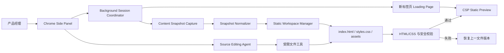
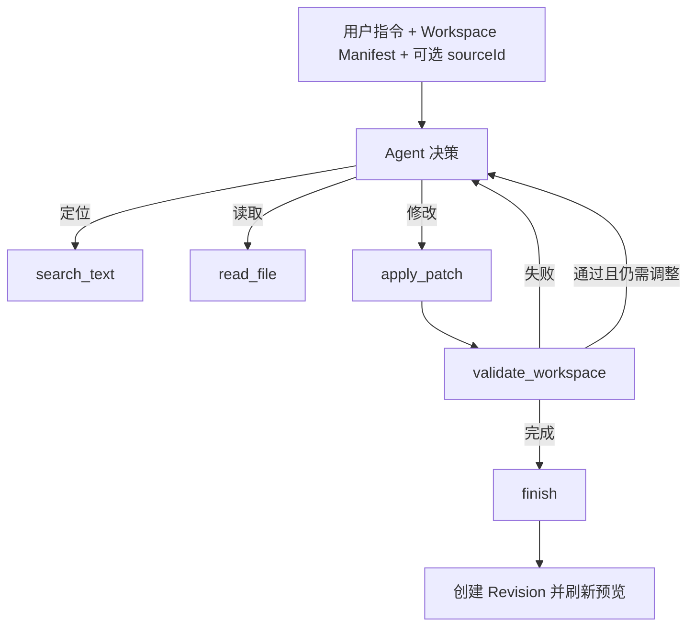
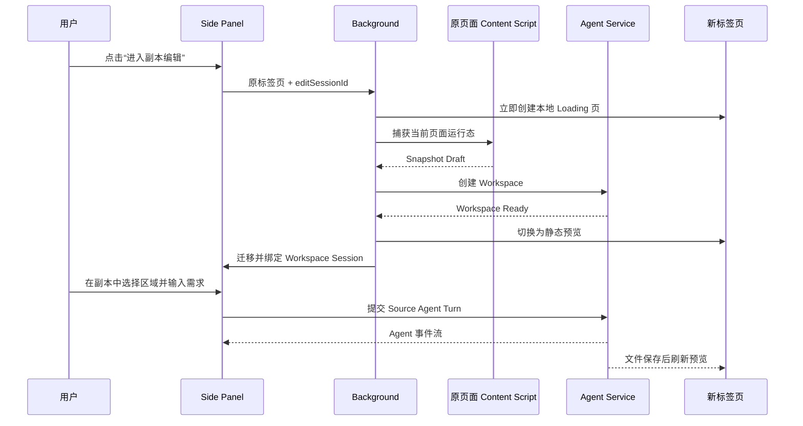
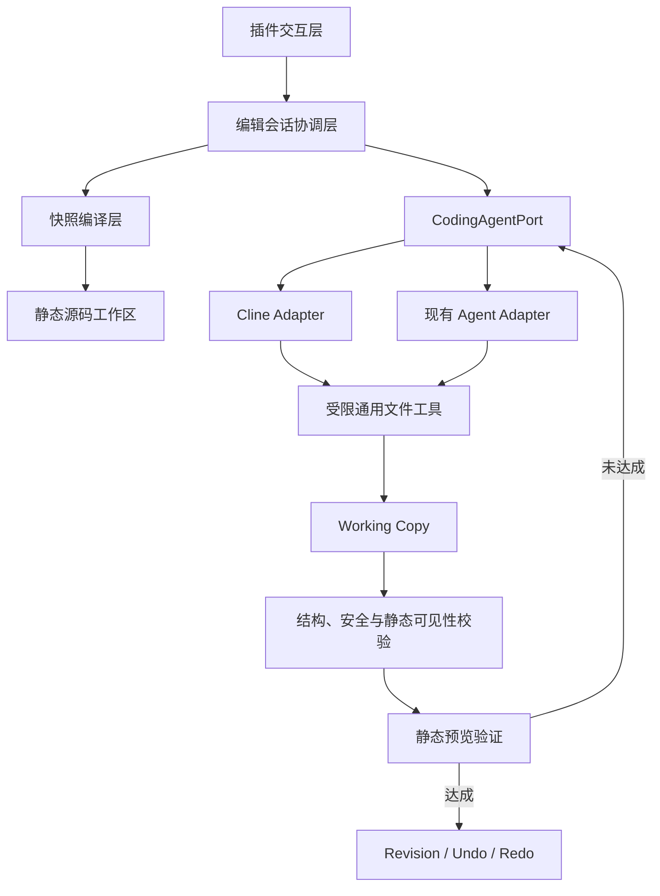
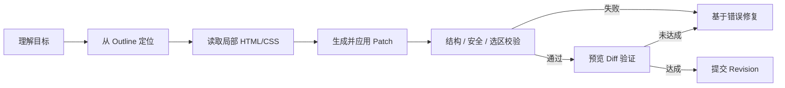

# UI 辅助需求编写插件：静态源码副本技术方案

## 1. 方案结论

产品经理在原业务页面打开插件后，先确认进入副本，不需要提前选择区域或输入需求。插件在同一 Chrome 窗口中新建标签页，展示一个由当前运行态页面生成的静态副本。用户进入副本后再选择区域并描述需求。

后续用户继续使用现有 Side Panel 对话、选区、撤销、重做和截图交互；底层不再修改页面运行时 DOM，而是由 Agent 按需读取和修改静态副本的 HTML/CSS 源码。文件保存成功后刷新预览页面。

```text
原业务页面
  → 打开插件
  → 确认进入副本
  → 新标签页显示静态副本
  → 在副本中选择区域
  → 输入需求
  → Agent 修改 HTML/CSS
  → 刷新副本页面
  → 多轮调整
  → 导出截图
```

第一阶段继续使用现有通用 Agent Runtime，验证“静态源码副本”是否能够降低复杂页面编辑难度。只有在文件检索、补丁生成、上下文管理或循环稳定性成为明确瓶颈后，才接入 Cline SDK 等开源 Coding Agent 做对照。

## 2. 目标与非目标

### 2.1 目标

1. 原页面只读，任何生成和修改都发生在独立副本中。
2. 用户无须理解保存网页、源码目录或开发服务器等技术概念。
3. 首次进入不要求用户理解原页面选区与副本创建之间的关系；选区统一发生在副本中。
4. Agent 修改静态 HTML/CSS 文件，而不是运行时 DOM。
5. 修改保存后刷新仍然存在，并支持按用户轮次撤销和重做。
6. 模型按需搜索和读取源码，不在每轮请求中发送完整 HTML。
7. 快照副本不保留原页面接口、脚本、表单提交和跨页面业务能力。
8. 只保留静态源码副本作为正式编辑路径，避免双链路增加维护和测试成本。

### 2.2 首期不包含

- 真实接口调用和表单业务提交。
- React/Vue 源项目还原或生产代码生成。
- 跨页面业务流程。
- 执行原页面 JavaScript。
- Shell、依赖安装、网络访问和任意命令。
- 多人在线协作和云端工作区。
- 完整还原动画、Canvas、视频、跨域字体和复杂伪元素。
- 自动把静态副本变更同步回原业务代码仓库。

## 3. 用户交互

### 3.1 原页面

Side Panel 首屏只要求用户确认是否进入副本：

```text
[进入副本编辑]

复制当前页面并在新标签页打开
```

用户点击后，原标签页 ID 和编辑会话 ID 交给 Background，并捕获当前已渲染页面。首屏不展示选区和需求输入，避免用户误以为会直接修改原页面。

### 3.2 跳转过程

为避免用户点击后长时间没有反馈，Background 立即创建新标签页。新标签页首先显示本地加载页面：

```text
正在创建 UI 示意

✓ 已确认编辑区域
○ 正在复制页面
○ 正在准备静态副本
○ 正在生成第一轮修改

修改不会影响原页面
```

建议只对用户展示“复制页面、准备副本、生成修改”三个阶段，不暴露 DOM 序列化、文件写入或 Agent Tool 等技术步骤。

### 3.3 副本页面

快照准备完成后，加载页在同一 URL 中切换成静态页面预览，不进行第二次明显跳转。Side Panel 继续使用原 UI，仅增加：

- “静态副本”标识；
- 原页面名称；
- “返回原页面”入口；
- 源码保存和页面刷新状态。

副本加载完成后，Side Panel 引导用户点击“选择”，再在副本页面选中目标区域。用户随后输入第一条需求，Agent 才开始修改源码。

### 3.4 后续修改

用户继续使用现有方式：

- 输入自然语言；
- 可选地重新选择副本中的元素辅助定位；
- 删除前确认；
- 撤销和重做；
- 导出当前可视区域截图。

页面点选只产生源码定位信息，不授权 Agent 直接操作 DOM。

### 3.5 返回原页面

“返回原页面”切换回原标签页，不关闭副本。再次进入副本时恢复对话和文件版本；继续编辑前可重新选择目标区域。

## 4. 总体架构



### 4.1 分层职责

| 层 | 模块 | 职责 |
| --- | --- | --- |
| 插件交互层 | Side Panel | 选择区域、输入需求、展示进度、确认、撤销重做和截图 |
| 浏览器协调层 | Background | 标签页创建、会话迁移、原页与副本绑定、Side Panel 生命周期 |
| 页面采集层 | Content Script | 获取当前运行态 DOM、表单状态、可见区域和样式 |
| 快照规范化层 | Snapshot Normalizer | 删除活动能力，把运行态页面整理为可维护 HTML/CSS |
| 工作区层 | Workspace Manager | 创建文件、读取、保存、版本管理、预览和清理 |
| 通用 Agent 层 | Agent Runtime | 模型调用、会话、循环、记忆、错误、日志和预算 |
| 源码编辑业务层 | Source Editing Agent | 搜索源码、读取片段、生成补丁、调用校验和决定完成 |
| 安全工具层 | Restricted File Tools | 将所有文件能力限制在当前 Workspace |
| 预览层 | Static Preview | 使用 CSP 渲染文件，不提供接口和脚本运行环境 |

## 5. 静态源码工作区

### 5.1 目录结构

```text
.snapshots/
└── {workspaceId}/
    ├── index.html
    ├── styles.css
    ├── assets/
    ├── workspace.json
    ├── source-map.json
    └── revisions/
        ├── 000-initial/
        ├── 001-turn/
        └── 002-turn/
```

`workspace.json` 记录：

- Workspace ID；
- 原页面 URL、标题和原标签页 ID；
- 创建时间和最后更新时间；
- 当前文件版本；
- 当前编辑会话 ID；
- 整页根容器和当前副本选区的稳定源码 ID；
- 当前预览状态；
- 当前 Agent Turn 状态。

### 5.2 工作区生命周期

首期将工作区保存在 Agent Service 的本地数据目录，不提交 Git。采用 TTL 和数量上限清理，例如：

- 最多保留最近 20 个工作区；
- 默认保留 24 小时；
- 用户可显式关闭和删除；
- 服务重启后文件仍在，但运行中的 Turn 标记为中断。

工作区不得创建在用户项目源码目录内，Agent 也不得读取其他工作区。

对话记忆必须与源码 Revision 绑定。每个成功 Turn 记录其结果 Revision，澄清轮次记录
当时所在 Revision；传给 Coding Agent 的最近对话只取当前 Revision 有效链路。Undo 后，
被撤销版本对应的对话不进入模型上下文；Redo 后重新恢复。Undo 后产生新提交时，系统
同时截断旧的源码后续版本和旧分支对话。旧 Turn 仍保留在 JSONL 日志用于审计，不因
分支切换而删除。旧版未记录 Revision 的 Workspace 在读取时通过 Revision summary
迁移，避免升级后继续携带已回滚上下文。

### 5.3 跨电脑离线迁移

当业务页面只能在另一台电脑或隔离网络中访问时，插件支持导出、导入版本化的
`.ui-snapshot.json` 文件：

```text
可访问业务页面的电脑
  → 打开插件
  → 导出快照包
  → 通过合规方式传输文件
  → 当前开发电脑打开插件
  → 导入快照包
  → 本地 Agent Service 重新校验并创建 Workspace V2
```

快照包复用 `StaticSnapshot` 协议，只增加文件格式、格式版本、导出时间和安全声明。
导入端不信任安全声明，仍使用与在线捕获相同的 Zod、HTML、CSS 和工作区边界校验，
再由 Workspace Compiler 生成 `index.html`、`snapshot.css`、`outline.json` 和
`source-map.json`。因此不在两台电脑间搬运服务端内部目录，也不会耦合工作区 ID、
历史 Revision 或 Agent 会话。

快照包明确不包含 Cookie、Local Storage、Session Storage、脚本和接口能力；会保留
页面当前可见文字以及表单控件的运行态值。导出前必须提示用户确认已脱敏，并要求使用
公司允许的渠道传输。首期文件大小上限为 15 MB，静态 HTML 仍受 10 MB、10,000 节点
的原协议限制。不在包中附带截图，避免重复数据和不必要的敏感信息扩散。

## 6. 快照生成

### 6.1 捕获范围

首期默认保存当前页面 `body` 中已经渲染出的静态内容，转换成独立可编辑根容器。这样用户进入副本后可以自由选择筛选栏、表格、表单或其他区域，不必在跳转前预测最合适的捕获边界。

捕获范围仍是当前单页运行态，不抓取跨页面路由、未渲染数据或原站其他资源。对于节点数量或序列化体积超过安全上限的页面，需要明确提示用户页面过大；后续再考虑“当前可视区域”降级选项。

### 6.2 运行态冻结

捕获当前浏览器已经渲染出的状态：

- 输入值和 placeholder；
- checkbox/radio 选中状态；
- select 当前值和可见选项；
- details 展开状态；
- 当前已经渲染出的弹层或静态状态；
- 元素可见尺寸和主要计算样式。

### 6.3 源码规范化

不能把浏览器 `Ctrl+S` 生成的原始结果直接交给 Agent。规范化器需要输出易于阅读和修改的静态源码：

1. 删除 `script`、`iframe`、`object`、`embed` 和运行时注入节点。
2. 删除所有 `on*` 事件、表单 action 和远程导航。
3. 移除 React/Vue 运行时标记和无业务价值属性。
4. 为有意义的元素写入稳定 `data-ui-source-id`。
5. 合并重复计算样式，生成可读的 CSS Class。
6. 保留原组件的结构、文字、尺寸、间距、颜色和边框。
7. 将可安全保存的图片写入 `assets`；无法保存的资源使用占位符。
8. 将交互控件转换为静态可展示结构。

最终 HTML 应以“代码 Agent 可维护”为目标，而不是像素级保存所有浏览器内部细节。

### 6.4 Source Map

预览中的每个主要元素通过 `data-ui-source-id` 与源码对应：

```html
<div data-ui-source-id="filter-order-status" class="filter-field">
```

用户在副本页面点击该元素时，Content Script 只上报：

```json
{
  "workspaceId": "...",
  "sourceId": "filter-order-status",
  "text": "订单状态",
  "tag": "div"
}
```

Agent 使用 `sourceId` 搜索相关文件，而不是接收完整 DOM。

### 6.5 受控声明式交互

静态副本可选地包含由插件固定运行时解释的声明属性，但不允许页面脚本。首期支持：

- `toggle/show/hide`：下拉框、弹窗、抽屉和折叠区域的显示隐藏；
- `set-state`：Tab、单选态和互斥内容面板切换；
- 同步 `aria-expanded`、`aria-selected`、`aria-pressed` 和 `aria-hidden`；
- 为激活控制项切换一个声明的安全 class。

```html
<button
  data-ui-agent-action="toggle"
  data-ui-agent-targets="source-20"
  aria-expanded="false">
  查看历史会话
</button>
<aside data-ui-source-id="source-20" hidden>...</aside>
```

Tab 使用安全组名和值关联控制项与面板，不接受 CSS Selector：

```html
<button data-ui-agent-action="set-state"
  data-ui-agent-state-group="order-tabs"
  data-ui-agent-state-value="detail">详情</button>
<section data-ui-agent-state-group="order-tabs"
  data-ui-agent-state-when="detail">...</section>
```

页面捕获阶段删除原页面已有的同名声明属性，只有 Workspace 中经 Agent 新增并通过校验的
配置才会生效。服务端拒绝未知动作、不存在的 sourceId、非法标识符和没有对应面板的状态。
运行时仅在本机 Workspace Preview 启用；选择区域期间，捕获阶段的选择事件优先，点击
不会误触发交互。预览 CSP 继续禁止页面脚本，固定交互逻辑运行在扩展 Content Script
隔离环境中。

## 7. Source Editing Agent

### 7.1 第一阶段复用内容

继续复用现有：

- DeepSeek 和 OpenAI-compatible 模型适配层；
- Agent 会话和最近对话记忆；
- 模型重试、超时和错误分类；
- 最多轮数与无进展保护；
- JSONL 日志和日志查看页；
- traceId、turnId 和 editSessionId；
- 用户确认和取消机制。

不复用快照模式下的：

- `SelectedContext` DOM 上下文；
- GoalSpec；
- ChangePlan；
- DOM 原子操作；
- Controlled DOM Engine；
- DOM 执行后观察。

旧的直接编辑模式继续使用这些能力。

### 7.2 受限工具

第一阶段只提供：

```text
list_files
search_text
read_file
apply_patch
validate_workspace
finish
```

工具约束：

- 所有路径必须解析到当前 Workspace 根目录内；
- 只允许 HTML、CSS、JSON 和本地静态资源；
- 单次读取和搜索结果有字符上限；
- `apply_patch` 必须匹配当前文件版本；
- 每次补丁后自动运行校验；
- 禁止 Shell、网络、依赖安装和 JavaScript 执行；
- Agent 不拥有直接刷新或操作浏览器的权限。

### 7.3 Agent Loop



建议首期预算：

- 源码编辑不设置固定的模型调用或工具调用次数上限；
- 日志持续记录实际模型调用数、工具调用数和耗时，用于观察成本；
- 相同搜索或相同失败补丁不能连续重复；
- 检测到重复无进展、非法补丁或异常时保留上一有效版本，并要求用户补充说明。

### 7.4 上下文与 token

初次请求只包含：

- 用户指令；
- Workspace 文件列表和摘要；
- 当前点击元素的 `sourceId`；
- 最近几轮变更摘要；
- 当前文件版本。

源码由 Agent 按需搜索和读取。每次只返回命中附近的有限片段，不发送整个 `index.html`。成功修改后会话记忆保存“修改了什么”和 Patch 摘要，不重复保存完整文件。

日志新增：

- 每次模型调用 prompt 字符数和 token；
- 每次工具名、参数规模和结果规模；
- 文件读取字符数；
- Patch 成功或失败原因；
- 总循环次数；
- 最终修改文件和行数；
- 从提交到预览刷新的耗时。

## 8. 文件版本、撤销与重做

每个成功用户 Turn 生成一个 Revision：

```text
Revision 0：初始静态副本
Revision 1：第一条需求
Revision 2：第二条需求
```

首期工作区文件较小，可保存完整文件快照，降低恢复复杂度；后续再评估增量 Patch。

撤销：

1. 将文件恢复到上一 Revision；
2. 运行安全校验；
3. 刷新副本页面；
4. 保留对话记录并写入“已恢复版本”事实。

重做同理。正在执行 Agent Turn 时不允许同时撤销或重做。

## 9. 新标签页与会话迁移

### 9.1 Background 会话

Background 保存：

```ts
interface WorkspaceBrowserSession {
  workspaceId: string;
  editSessionId: string;
  sourceTabId: number;
  workspaceTabId: number;
  pendingInstruction: string;
  selectedSourceId: string;
  state: 'creating' | 'ready' | 'running' | 'failed';
}
```

Side Panel 的关键会话状态不能只保存在 React 组件或 Content Script 中，否则新标签页和页面刷新会丢失。

### 9.2 跳转时序



### 9.3 新标签页与新窗口

首期推荐同一 Chrome 窗口的新标签页：

- Side Panel 更容易保持连续；
- 原页面仍在相邻标签页；
- 用户可快速返回；
- 不需要管理第二个窗口的位置和大小；
- 浏览器对自动打开 Side Panel 的限制更少。

如后续确认必须使用独立窗口，只替换 Background 的打开方式，Workspace、Session 和预览架构不变。需要额外验证 Side Panel 是否能可靠自动打开；失败时必须在加载页提供“打开助手”入口。

## 10. 预览刷新

预览 URL 保持稳定：

```text
http://127.0.0.1:8787/workspaces/{workspaceId}/preview
```

每次文件保存成功后：

1. Workspace Revision 增加；
2. Background 或预览页收到版本事件；
3. iframe/页面重新加载相同 URL，并附加 revision 查询参数避免缓存；
4. 根据 `sourceId` 恢复选区和滚动位置；
5. 短暂标记修改区域。

对用户展示“正在保存、正在刷新、已完成”即可，不展示构建过程。

## 11. 安全设计

### 11.1 文件系统

- Workspace 路径由服务端生成，客户端不能提供绝对路径。
- 每个文件操作先做 `realpath` 与根目录校验。
- 禁止 `..`、符号链接逃逸和隐藏文件写入。
- Agent Service 进程使用普通用户权限。
- API Key 不写入 Workspace。

### 11.2 源码内容

校验器拒绝：

- `script`；
- `iframe`、`object`、`embed`；
- `on*` 事件；
- `javascript:` URL；
- HTTP/HTTPS 接口和远程资源；
- 表单 action；
- meta refresh；
- CSS 中的非本地 URL；
- 超过大小和节点限制的文件。

除安全校验外，Working Copy 在 `validate_workspace` 和 `commit` 前执行静态可见性检查。
检查以 Revision 0 的原始快照为基线，识别本会话新增的明确零可见风险，例如绝对定位
元素完全落在直接父容器的 `overflow:hidden/clip` 裁剪区域之外。命中后本轮不得形成
Revision，错误需要返回元素 sourceId、裁剪祖先、方向和关键尺寸，供 Coding Agent 修复。

`inspect_element` 输出中的文本字段命名为 `domText`，只代表文字存在于源码，不再使用
容易误导模型的 `visibleText`。静态检查负责拦截确定性布局错误；遮挡、响应式重排、颜色
对比度等必须依赖后续浏览器渲染验证，不能仅凭 HTML/CSS 语法校验宣称完成。

### 11.3 预览 CSP

```text
default-src 'none'
style-src 'self' 'unsafe-inline'
img-src 'self' data: blob:
font-src 'self' data:
connect-src 'none'
script-src 'none'
form-action 'none'
frame-src 'none'
object-src 'none'
base-uri 'none'
```

预览页不能访问 Agent Service API；对话和文件工具由扩展 Side Panel 访问独立 API。

## 12. 服务接口草案

### 创建 Workspace

```text
POST /v1/workspaces
```

请求包含规范化前的整页 Snapshot Draft 和原页面元数据。响应包含 `workspaceId`、状态和预览 URL。

### 查询状态

```text
GET /v1/workspaces/{workspaceId}
```

返回创建阶段、当前 Revision、运行中 Turn 和错误。

### Agent Turn

```text
POST /v1/workspaces/{workspaceId}/turns
GET  /v1/workspaces/{workspaceId}/turns/{turnId}/events
```

首期可使用现有请求响应模式；如需实时展示工具步骤，再增加 SSE。

### 撤销和重做

```text
POST /v1/workspaces/{workspaceId}/undo
POST /v1/workspaces/{workspaceId}/redo
```

### 预览

```text
GET /workspaces/{workspaceId}/preview
GET /workspaces/{workspaceId}/assets/{asset}
```

## 13. 状态机

### 创建过程

```text
idle
→ capturing
→ normalizing
→ creatingWorkspace
→ previewReady
→ runningFirstTurn
→ ready
```

任一步失败进入 `createFailed`，保留用户指令并允许重新尝试。

### 编辑过程

```text
ready
→ locatingSource
→ readingFiles
→ applyingPatch
→ validating
→ savingRevision
→ refreshingPreview
→ ready
```

失败时恢复上一有效 Revision，进入 `turnFailed`，用户可以重新尝试或补充需求。

## 14. 第一阶段实施范围

### M1：交互与 Workspace 骨架

- 将 Side Panel 首屏改为“进入副本编辑”，首次不展示选区和需求输入。
- 创建新标签页 Loading 页。
- 建立 Background Workspace Session。
- 创建本地 Workspace 目录和稳定预览 URL。
- 支持返回原页面。

### M2：源码快照

- 运行态表单状态冻结。
- HTML 安全清洗。
- CSS 提取和重复样式合并。
- `data-ui-source-id` 注入。
- 输出 `index.html`、`styles.css` 和 manifest。

### M3：自有 Source Editing Agent

- 在现有 Agent Runtime 上增加 Source Editing 业务 Agent。
- 实现六个受限文件工具。
- 接入 DeepSeek。
- 实现工具循环、无进展保护和日志。
- 文件保存后刷新预览并恢复位置。

### M4：版本与人工验证

- 按用户 Turn 保存 Revision。
- 接入撤销、重做和恢复初始。
- 使用 S01、S02、S04、S05 人工验证。
- 记录静态副本模式的成功率、token、耗时和失败类型，作为后续迭代基线。

## 15. 验收标准

### 15.1 跳转体验

- 用户只点击一次即可从原页面进入副本。
- 用户无需在原页面选择区域或输入第一条需求。
- 新标签页立即出现加载反馈，不出现长时间白屏。
- 副本准备完成后引导用户在副本中选择区域并输入需求。
- 可以一键返回原页面。

### 15.2 源码编辑

- Agent 的最终修改落在 HTML/CSS 文件中。
- 刷新预览后修改仍然存在。
- 日志中不再出现完整 `SelectedContext` 或 DOM `elementFacts`。
- 模型通过搜索和局部读取获得必要源码。
- 单轮失败不会留下部分文件修改。

### 15.3 安全

- 原页面不被修改。
- 副本不发送原业务接口请求。
- Agent 不能访问 Workspace 外文件。
- Agent 不能执行 Shell、网络请求和 JavaScript。
- 所有成功 Revision 均通过 HTML/CSS 和安全校验。

### 15.4 能力验证

第一阶段至少验证：

- S01：在筛选区精确增加两个字段。
- S02：复制表格行并插入第一行。
- S04：复用标签和按钮结构。
- S05：生成下拉框展开的静态状态。

每条记录：

- 首次是否成功；
- 用户补充次数；
- 模型调用次数；
- 工具调用次数；
- 读取源码字符数；
- prompt token；
- 总耗时；
- Patch 失败次数；
- 最终视觉结果；
- 与旧 DOM 模式的差异。

## 16. 是否切换开源 Coding Agent

第一阶段结束后按失败原因决策：

| 现象 | 后续动作 |
| --- | --- |
| 静态源码本身混乱或样式缺失 | 优化 Snapshot Normalizer |
| Agent 经常找不到对应源码 | 优化 Source Map、搜索和文件摘要 |
| Agent 找到源码但补丁频繁失败 | 用 Cline SDK 做相同工作区对照 |
| Agent 出现重复读取和无进展循环 | 对比成熟 Coding Agent 的上下文和 Loop |
| token 主要消耗在完整文件读取 | 优化读取范围和摘要，不立即换 Agent |
| 自有 Agent 已稳定完成核心用例 | 暂不引入新的 Agent 依赖 |

推荐的开源对照顺序为 Cline SDK、OpenHands Agent SDK、Aider。任何替换都通过 `CodingAgentPort` 适配，不能让 Workspace 和插件 UI 直接依赖某个第三方 Agent。

### 16.1 2026-07-31 决策：进入通用源码 Agent 重构

人工验证已经满足切换条件，不再继续通过新增场景专用 Tool 扩展自有 Source Editing Agent：

- 新场景仍需要新增 `moveElement`、`cloneElement` 等高层操作才能稳定完成；
- 模型会用删除重建模拟移动，导致布局上下文和样式丢失；
- 快照中的计算样式全部内联在单行 HTML 中，搜索结果和 Patch 上下文噪音过大；
- 后续对话只保存自然语言总结，不能可靠引用上一轮新增或修改的源码对象；
- HTML 安全校验通过不代表结构正确或视觉结果正确；
- Agent 缺少成熟 Coding Agent 已具备的上下文裁剪、Patch 恢复、无进展检测和检查修复循环。

`moveElement`、`cloneElement` 等现有能力保留用于旧工作区兼容和回归，不再作为能力扩展的主要方向。新架构以“固定的通用文件能力 + 可维护源码工作区 + 验证闭环”为核心。

### 16.2 开源内核选择

| 候选 | 优点 | 主要代价 | 结论 |
| --- | --- | --- | --- |
| [Cline SDK](https://github.com/cline/cline) | TypeScript/Node.js，与现有服务同栈；提供程序化 SDK、自定义 Tool、生命周期 Hook、Checkpoint 和 OpenAI-compatible 模型支持；Apache-2.0 | 必须禁用 Shell、网络和工作区外文件能力；SDK 接口需要做隔离验证 | **第一推荐，先做适配 POC** |
| [OpenHands Software Agent SDK](https://github.com/OpenHands/software-agent-sdk) | Agent、Conversation、Tool、Workspace 和 Agent Server 边界清晰；MIT | 主体为 Python，需要新增独立服务和部署链路 | 第二推荐，作为效果对照 |
| [Claude Agent SDK](https://github.com/anthropics/claude-agent-sdk-typescript) | Coding Agent Loop 和上下文能力成熟 | 与 Anthropic 模型和认证体系绑定，不符合当前 DeepSeek 可替换模型层 | 暂不作为主方案 |
| [mini-SWE-agent](https://github.com/SWE-agent/mini-swe-agent) | Loop 极简、轨迹容易理解、MIT | 主要依赖 Bash，不符合本项目禁止 Shell 的安全边界 | 只参考 Loop 和轨迹设计 |

采用 Cline SDK 不等于把 Cline 的完整终端能力开放给页面。接入必须满足：

1. Cline 只能看到当前静态 Workspace。
2. 只注册只读搜索、局部读取、Patch、校验、完成和请求澄清能力。
3. 禁用 Shell、浏览器、网络、MCP、依赖安装和任意文件访问。
4. 所有写入先进入 Working Copy，校验通过后才能形成 Revision。
5. 插件、Workspace、日志和预览只依赖 `CodingAgentPort`，不得直接依赖 Cline 类型。

### 16.3 新分层架构



| 层 | 通用职责 | UI 需求业务职责 |
| --- | --- | --- |
| 插件交互层 | 对话、进度、确认、撤销重做 | 选区提示、需求示意文案、截图导出 |
| 编辑会话协调层 | Turn、取消、错误恢复、事件流 | 原页面与副本页面的绑定 |
| 快照编译层 | HTML 格式化、CSS 去重、资源本地化、Source Map | 冻结当前 UI 状态、裁剪脚本和业务接口 |
| 工作区层 | 文件、Working Copy、Revision、锁和清理 | 静态预览入口 |
| Coding Agent Port | 消息、工具调用、轨迹、完成状态 | 注入 UI 修改规则和安全边界 |
| Coding Agent Adapter | 上下文管理、Loop、记忆、无进展恢复 | 无 |
| 受限文件工具层 | 搜索、读取、Patch、校验 | 限定 HTML/CSS/JSON 和当前选区授权 |
| 验证层 | 语法、结构、安全、Diff | 选区约束、视觉变化和需求达成判断 |

业务层不能再新增“订单行”“筛选项”“危险按钮”等操作概念。不同页面需求由 Coding Agent 使用同一组文件能力组合完成。

### 16.4 Workspace V2

当前一个超大单行 `index.html` 调整为：

```text
workspace/
├── index.html
├── snapshot.css
├── outline.json
├── source-map.json
├── manifest.json
├── assets/
└── revisions/
```

- `index.html`：格式化后的语义结构，不再重复保存长计算样式。
- `snapshot.css`：将重复计算样式按稳定 class 去重；相同组件复用同一规则。
- `outline.json`：只包含节点 ID、标签、角色、短文本、层级和组件指纹，供 Agent 低成本定位。
- `source-map.json`：维护预览节点、HTML 位置和 CSS 规则映射。
- `manifest.json`：记录当前 Revision、选区授权、最近 Patch 和会话事实。

上下文采用渐进式加载：

1. 首次只发送指令、当前选区路径、页面 Outline 摘要和最近结构化变更。
2. Agent 根据需要搜索和读取局部 HTML/CSS。
3. 修改完成后只保存 Patch、受影响 sourceId、验证结果和用户可读总结。
4. 后续指代优先读取结构化变更记录，不依赖模型从自然语言总结中猜测。

### 16.5 通用执行闭环



Agent 的基础工具稳定为：

```text
list_files
search_text
read_file
inspect_element
read_style_rule
replace_text
apply_patch
replace_in_element
move_element
clone_element
validate_workspace
finish
clarify
```

`read_style_rule` 根据 `inspect_element` 返回的稳定 class 一次读取完整 CSS 规则，避免按字符连续切片。`move_element` 和 `clone_element` 是与业务无关的结构编辑原语，按 sourceId 保留完整节点、子树和样式，禁止用大段文本替换模拟移动或复制。`apply_patch` 是受控的原子 Patch，不是任意文件写入：只允许修改 `index.html` 和 `snapshot.css`，支持唯一原文替换，以及在文件开头、末尾或唯一锚点前后插入。全部编辑完成后统一执行 HTML/CSS 和安全校验，失败不形成 Revision。这些都不是“订单行”“筛选项”等场景工具。不再为每个 UI 场景增加业务高层工具。DOM 解析、HTML 格式化、CSS 去重和安全判断属于 Workspace/Validator 的确定性基础设施，不由模型实现。

### 16.6 迁移阶段

1. **M0：冻结旧 Agent**
   - 修复阻断性错误，保留现有回归；
   - 不再新增场景专用能力。
2. **M1：Workspace V2**
   - 拆分 `index.html` 与 `snapshot.css`；
   - 生成 `outline.json`、Source Map 和结构化变更记录；
   - 保持现有插件交互和预览 URL 不变。
3. **M2：CodingAgentPort**
   - 定义与供应商无关的 Turn、事件、Tool 和 Checkpoint 契约；
   - Agent Service 通过 `CodingAgentPort` 调用唯一的 Cline SDK 运行时。
   - **状态：已完成。** 日志保存 Adapter ID、统一步骤轨迹和最终 Checkpoint。
4. **M3：Cline Adapter POC**
   - 只开放受限文件工具；
   - 继续使用当前 DeepSeek 配置；
   - 使用未知测试用例验证通用能力。
   - **状态：已完成工程接入并设为唯一运行时。** 使用 `@dabaoabc/ui-agent-sdk@0.2.0` 提供的独立 `Agent`，只注册 `CodingWorkspaceTools` 的受限桥接；支持统一步骤日志、Checkpoint、受控原子 Patch、重复失败换策略提示、`finish` 提交和 `clarify`/异常回滚。Side Panel 通过独立进度投影展示可审计操作摘要，不展示模型隐式推理。
5. **M4：验证闭环**
   - 增加结构、选区、Diff 和静态预览验证；
   - Agent 可根据验证失败自动修复一次以上。
6. **M5：统一运行时**
   - 依据成功率、token、耗时和安全测试完成 Cline SDK 验证；
   - 删除旧实现和运行时切换开关，避免测试环境与生产路径不一致。

### 16.7 重构验收标准

- 使用至少 10 条开发期间未见过的新场景，不允许为单条用例修改 Prompt 或新增 Tool。
- 首轮成功率不低于 70%，一次用户纠正后的完成率不低于 90%。
- “样式与现有元素一致”必须复用 HTML/CSS 结构，不允许只复制 class 名。
- 后续指令能准确引用上一轮新增或修改的元素，不重复生成。
- 模型输入不再包含完整单行 HTML；简单文案修改只读取目标局部。
- 所有失败 Turn 不污染已提交 Revision。
- Agent 无法访问 Workspace 外文件，无法执行 Shell、网络请求或脚本。
- 日志能够还原每次读取、Patch、校验、修复和最终 Diff。

## 17. 待确认

本轮实现已经采用以下默认决策：

1. 首期保存当前页面已经渲染出的 `body`，进入副本后再选择编辑区域。
2. 使用同一 Chrome 窗口的新标签页，不创建独立窗口。
3. 第一阶段将安全清洗后的结构和计算样式合并在 `index.html`，后续再拆分 `styles.css` 和本地图片资源。
4. 原有直接 DOM 编辑模式已移除，静态源码副本是唯一正式编辑入口。

仍需在人工验证后决定：

1. Workspace 的默认保留时长、数量上限和用户删除入口。
2. 是否增加“当前可视区域”和“完整页面”两种捕获范围。
3. 是否把图片安全下载到本地 `assets`，而不是继续使用占位或可内联资源。
