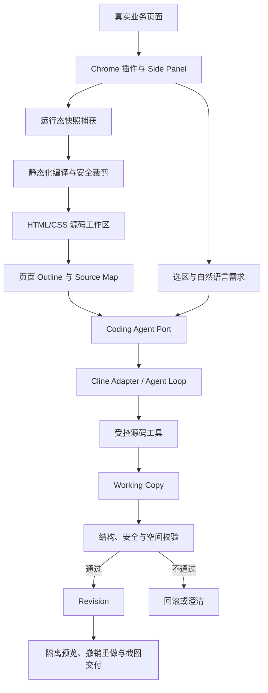

# 从真实页面到可编辑需求原型：UI 需求助手技术实践

## 分享定位

**面向对象：** 产品研发、前端、AI 应用、工程效能及平台团队  
**建议时长：** 30～45 分钟  
**分享目标：** 介绍如何将任意网页转换为安全、可编辑、可回退的静态原型，并让通用 Coding Agent 在受控边界内完成复杂 UI 修改。

## 一、我们做了什么

UI 需求助手是一款运行在 Chrome Side Panel 中的 AI 页面示意工具。

产品经理打开现有业务页面后，可以一键生成隔离副本，在副本中选中目标区域，并用自然语言描述修改要求，例如：

> 在订单状态右侧、查询按钮左侧增加“订单来源”和“负责人”两个筛选项，宽度与现有筛选项保持一致。

系统会理解当前页面结构和用户意图，在副本中完成 HTML/CSS 修改。用户可以继续对话、重新选区、撤销、重做、恢复初始版本，并最终导出截图用于需求评审。

它解决的不是“让 AI 写一段 HTML”，而是下面这条完整链路：

```text
真实业务页面
  → 冻结当前页面状态
  → 生成安全静态副本
  → 理解用户选区与自然语言需求
  → 受控修改页面源码
  → 校验并提交版本
  → 持续调整与交付
```

在已验证的真实案例中，一项原本约需 0.5 人日完成的 UI 示意，使用工具约 10 分钟即可形成可沟通结果。

## 二、为什么这个问题比想象中复杂

乍看之下，这个需求似乎只是三个步骤：读取 DOM、把需求交给大模型、执行模型生成的修改。

实际落地后，我们发现其中至少包含五个彼此独立的问题：

1. **页面获取：** 如何保留用户此刻看到的页面，而不是只拿到初始 HTML。
2. **页面理解：** DOM 节点不等于业务语义，模型需要理解区域、组件、相邻关系和视觉样式。
3. **稳定编辑：** React/Vue 可能重新渲染，运行时 DOM 修改容易丢失，也难以形成可靠版本。
4. **Agent 控制：** 模型需要足够的页面操作能力，但不能获得 Shell、任意网络和任意文件权限。
5. **结果验证：** HTML/CSS 语法正确，不代表元素位置、可见性和样式一定正确。

这些问题决定了系统不能只是“浏览器插件 + 大模型接口”，而需要页面编译、源码工作区、Agent Runtime、受控工具、版本事务、安全校验和可观测性共同组成闭环。

## 三、一次关键的技术路线调整

### 1. 第一条路线：直接修改当前页面 DOM

早期方案是在用户正在浏览的页面中选择元素，由模型输出结构化 DOM 操作，再由插件执行。

这条路线适合快速验证，但随着场景变复杂，逐渐暴露出几个结构性限制：

- 每轮都要向模型发送较多 DOM 和样式信息，Token 消耗较高；
- DOM 层级只能表达结构，难以稳定承载复杂的文件搜索和局部修改；
- React/Vue 重新渲染后，运行时改动可能被覆盖；
- 多轮修改、撤销重做和上下文分支管理复杂；
- 为每个新场景增加高层操作，容易走向 Case by Case。

### 2. 当前路线：将页面编译成静态源码副本

我们的核心诉求只是生成需求示意，不需要真实接口和复杂业务交互。因此可以冻结用户当前看到的页面，移除它的业务执行能力，再把它转换成一个独立的 HTML/CSS 工作区。

这样，问题就从“在任意前端框架的运行时中修改 DOM”，变成了“让 Coding Agent 编辑一组受控的静态源码文件”。

这次调整带来了三个重要变化：

- **编辑对象稳定：** Agent 修改的是工作区源码，不再与原页面框架的运行时状态竞争；
- **上下文可检索：** 页面变成可搜索、可局部读取、可生成 Patch 的文件；
- **版本边界清晰：** 每轮有效修改都可以提交为 Revision，失败则整体回滚。

需要强调的是，静态副本不是浏览器截图，也不是简单保存一份 DOM。它是一份经过运行态冻结、安全裁剪、源码规范化和语义索引后的可编辑页面资产。

## 四、整体架构



### 分层职责

**1. 插件交互层**

负责 Chrome Side Panel、页面授权、进入副本、元素选择、对话输入、实时进度、撤销重做和截图导出。

**2. 快照捕获层**

读取浏览器中已经渲染的页面，冻结输入值、勾选状态、展开状态、已打开弹窗和主要计算样式。

**3. 快照编译层**

移除脚本、事件、接口、表单提交和远程导航，把页面整理成可维护的 HTML/CSS，同时生成页面结构和源码映射。

**4. 工作区层**

负责静态源码文件、Working Copy、Revision、撤销重做、预览、历史副本和工作区生命周期。

**5. Agent Runtime 层**

负责模型调用、上下文管理、循环执行、工具调度、错误恢复和收敛控制。当前通过 Adapter 复用 Cline SDK 的通用 Coding Agent 能力。

**6. UI 业务层**

负责页面语义、选区锚点、空间关系、修改意图、澄清规则和 UI 编辑约束。

**7. 受控工具与验证层**

负责搜索、局部读取、结构编辑、Patch、安全检查、空间校验和版本提交。所有确定性边界都在这一层执行，不交给模型自由决定。

**8. 可观测层**

记录模型调用、工具轨迹、耗时、校验结果、最终 Diff 和 Revision，支持复杂场景复盘和能力评测。

## 五、静态副本是怎样生成的

### 1. 捕获的是运行态，而不是初始源码

很多业务页面的数据和弹窗是在 JavaScript 执行后才出现的。如果只保存服务器返回的初始 HTML，往往得不到用户当前看到的状态。

因此插件捕获的是浏览器已经完成渲染后的页面，包括：

- 当前 DOM 结构；
- 输入框当前值；
- 单选、多选和开关状态；
- 当前展开或显示的内容；
- 已打开的弹窗和遮罩；
- 主要可见样式和布局信息。

### 2. 保留外观，主动移除业务能力

静态副本的目标是表达需求，而不是复制业务系统。编译阶段会移除或禁用：

- `script`、`iframe` 和内联事件；
- 表单提交和真实页面导航；
- 接口请求和不受控远程资源；
- Cookie、LocalStorage、SessionStorage 等登录态信息；
- React/Vue 运行时标记和无关临时属性。

预览页再通过 CSP 禁止脚本、网络请求、表单提交和页面跳转，形成双层安全边界。

### 3. 生成可维护源码与页面索引

每个工作区主要包含：

```text
workspace/
  index.html        格式化后的页面结构
  snapshot.css      去重后的可见样式
  outline.json      页面区域与主要元素摘要
  source-map.json   页面元素与源码位置映射
  manifest.json     Revision、选区和会话状态
```

其中 `sourceId` 是贯穿页面、源码、选区和 Agent 工具的稳定标识。用户在预览页点选元素后，Agent 可以通过同一个 `sourceId` 定位到对应结构和样式，而不依赖脆弱的 CSS Selector 或固定 DOM 层级。

## 六、Agent 如何理解和修改页面

### 1. 通用 Runtime 与业务能力分离

我们没有让业务代码自己实现完整的 Agent Loop，也没有直接开放一个通用 Coding Agent 的全部能力。

架构中间定义了 `CodingAgentPort`：

- 上层插件、工作区和日志只依赖统一接口；
- 下层可以接入 Cline SDK 或其他 Coding Agent；
- UI 语义、受控工具和安全校验独立于具体 Agent 实现。

复用开源 Agent 的是通用能力：模型调用、Loop、上下文、工具调度、Checkpoint 和错误处理。项目自身建设的是页面编译、UI 语义、受控源码工具、Revision 和安全验证。

### 2. 渐进式上下文

整页 HTML 和 CSS 可能非常大。如果每轮把完整页面发送给模型，不但 Token 成本高，模型还容易被无关结构干扰。

因此首轮只提供：

- 用户当前需求；
- 最近有效对话；
- 当前选区及其语义信息；
- 页面 Outline；
- 工作区和 Revision 状态。

随后由 Agent 根据任务逐步调用搜索、元素检查、局部源码读取和样式规则读取工具。只有真正相关的内容才进入上下文。

这个策略的本质不是简单截断，而是让 Agent 像开发者阅读陌生项目一样：先看目录，再搜索，再局部阅读，最后修改。

### 3. 工具是通用原语，不是业务 Case

我们曾经考虑过“新增筛选项”“新增订单行”这类高层工具，但很快会遇到不可扩展问题：页面场景永远列举不完。

当前工具围绕通用源码操作设计：

- 搜索页面元素和文本；
- 检查元素结构、属性和关联样式；
- 读取局部 HTML/CSS 和完整样式规则；
- 修改文本、属性和样式；
- 插入、删除、移动、克隆和重排结构；
- 应用受控原子 Patch；
- 校验工作区和空间范围；
- 提交、完成或请求澄清。

“新增一行订单”由模型根据实际页面结构拆解为克隆现有行、修改单元格内容、插入目标位置等原子操作。业务代码不需要认识“订单”这个概念。

### 4. 意图路由与需求澄清

同一个输入框既支持普通问答，也支持页面修改。系统结合当前输入、最近对话、页面和选区状态判断用户意图：

- 普通咨询进入问答链路，不开放写工具；
- 明确的页面修改进入源码 Agent；
- 目标、位置或参考样式存在关键歧义时，返回澄清问题；
- 用户补充信息后，沿同一 Revision 和对话分支继续执行。

这里的原则是：会显著影响结果的条件由模型澄清，协议、安全、权限和版本边界由确定性代码控制。

## 七、空间位置为什么是最难的问题之一

用户经常使用“右边”“下面”“放到底部”“和旁边保持一致”等视觉语言，而源码中的 `before/after` 只表示 DOM 顺序，不一定等于视觉位置。

例如：

- Flex 容器可能设置 `row-reverse`；
- Grid 的视觉顺序可能由网格区域决定；
- 绝对定位元素不参与普通文档流；
- 元素可能位于滚动容器、弹窗或裁切区域；
- “页面底部”与“选中模块底部”是不同范围。

当前策略是：

1. 用户未指定全局位置时，以当前选区或最近语义容器作为默认锚点；
2. 涉及相邻组件时，扩展到最近公共父容器；
3. 用户明确说“页面顶部、页面底部、悬浮、固定位置”时，才允许扩大到全局范围；
4. 修改前由 Agent 读取实际布局和样式，不由业务代码根据关键词猜布局；
5. 提交前执行空间归属和静态可见性校验。

这套机制解决的是“修改范围”与“明显不可见”问题。要进一步保证视觉位置、遮挡、溢出和对齐完全正确，仍需要真实浏览器几何验证形成闭环，这是后续的重要演进方向。

## 八、Revision：页面版本与对话记忆必须一致

每个成功的用户修改 Turn 都生成一个 Revision：

```text
Revision 0：初始静态副本
Revision 1：第一次修改
Revision 2：第二次修改
Revision 3：第三次修改
```

Agent 先在 Working Copy 中完成所有操作，只有通过 HTML/CSS、安全和空间校验后，才提交新 Revision。任一步失败，本轮修改整体回滚，不让半成品污染当前页面。

这里还有一个容易被忽略的问题：撤销页面版本时，对话上下文也必须回到对应分支。

假设 Revision 2 新增了一个按钮，Revision 3 又修改了按钮颜色。用户撤销到 Revision 1 后，下一轮对话不能继续告诉模型“页面中已经有这个按钮”。因此每条对话都会绑定当时的 Revision，传给 Agent 的历史只取当前有效版本链路。

这使源码状态、用户看到的页面和模型记忆始终保持一致。

## 九、安全边界

Agent 的能力越强，越需要明确说明它不能做什么。

当前安全设计包含：

- 插件使用 `activeTab` 临时授权，不申请 `<all_urls>` 长期权限；
- 原业务页面只读，所有修改发生在隔离副本；
- 捕获阶段移除脚本、事件、接口、表单提交和敏感存储；
- Agent 只能访问当前 Workspace 中允许编辑的文件；
- 文件路径经过真实路径校验，禁止目录逃逸和符号链接绕过；
- 不向 Agent 开放 Shell、任意网络、浏览器控制和任意文件系统；
- Patch 只允许修改受控 HTML/CSS 文件；
- 校验通过后才能形成 Revision；
- 预览页通过 CSP 再次禁用脚本、网络和导航；
- 操作日志脱敏，不记录 API Key、Authorization、Cookie 和密码等凭证。

远程部署模式还可以使用安装级身份隔离不同浏览器用户的工作区；进入正式规模化使用后，应接入公司统一身份认证、租户权限和数据生命周期管理。

## 十、可观测性：不要让用户只看到 Loading

复杂页面修改可能包含多次搜索、读取、编辑和校验。如果界面只显示 Loading，用户无法判断系统是否仍在工作，也不利于研发定位失败原因。

Side Panel 会展示可审计的执行摘要，例如：

```text
正在理解需求
正在定位目标元素
正在读取页面结构
正在分析关联样式
正在应用页面修改
正在校验页面
已提交 Revision
```

这里展示的是系统操作摘要，不是模型的隐式逐字推理过程。

服务端日志进一步记录：

- 用户指令与有效对话上下文；
- 使用的 Agent Adapter 和模型；
- 每次工具调用及其结果；
- 模型调用数、工具调用数和总耗时；
- 工作区校验结果；
- Revision、最终 Diff 和失败原因。

这套日志既用于线上问题定位，也用于回归测试、挑战场景评测和 Agent 能力优化。

## 十一、我们踩过的典型坑

### 1. DOM 可读不等于页面可理解

只给模型 DOM 节点，不能自动得到组件语义、视觉相邻关系和页面状态。页面理解需要 Outline、稳定标识、样式规则、源码映射和空间信息协同完成。

### 2. 语法校验通过不等于结果正确

HTML 合法、CSS 可解析，只能证明页面能打开。元素仍可能放错容器、被裁切、不可见或与原样式不一致，因此需要继续建设结构、空间和真实渲染验证。

### 3. 大段文本替换不适合结构编辑

使用大段 `replace_text` 模拟移动或复制，容易受到格式、空白和上下文变化影响。结构操作更适合使用 `move_element`、`clone_element` 等按稳定标识工作的原语。

### 4. 工具越多不代表 Agent 越强

为每类 UI 场景增加专用工具，会把业务知识固化在代码中。少量稳定、可组合、可验证的通用原语，反而更容易覆盖新页面形态。

### 5. 模型调用上限不能只做硬截断

复杂任务需要足够的探索空间，但无限循环同样不可接受。系统需要识别重复读取、连续失败和无进展状态，并在接近预算时引导 Agent 转入校验、完成或澄清。

### 6. 页面回滚必须同步上下文回滚

只恢复源码、不恢复对话，会让模型基于已经不存在的元素继续推理。Revision 与会话分支必须是同一个状态模型。

### 7. 快照还原是独立的工程问题

跨设备导入后出现居中偏移、文本换行和分页错位，通常与视口尺寸、字体、资源、计算样式和响应式规则有关，不能依赖单个页面的 CSS 修正规则解决。

## 十二、哪些能力可以复用

这套方案并不只适用于“产品经理修改页面”。其通用底座包括：

- 运行态网页静态化编译；
- 安全的 HTML/CSS 工作区；
- 页面 Outline、Source Map 和稳定元素标识；
- 渐进式页面上下文；
- 受控 Coding Agent Port；
- 结构化源码编辑原语；
- Revision、撤销重做和上下文分支；
- 隔离预览、安全校验、日志和评测。

在此基础上可以扩展：

- 网页源码或截图转可编辑原型；
- 设计评审中的页面方案对比；
- 可访问性和视觉规范整改；
- 页面重构与企业组件迁移；
- 需求变更说明自动生成；
- 原型、需求文档与研发任务关联。

## 十三、推荐现场演示路径

建议用 8～10 分钟完成 Demo，不要从安装和配置开始讲。

### Demo 1：简单修改，证明链路完整

1. 打开真实或测试页面；
2. 点击“进入副本编辑”；
3. 选择按钮，输入“把提交订单改成提交审核”；
4. 展示修改结果、Revision 和撤销重做。

### Demo 2：复杂修改，证明 Agent 能理解页面

1. 选择一个表单或筛选区域；
2. 输入包含位置、组件、选项和样式约束的需求；
3. 展示 Agent 的定位、读取、编辑和校验摘要；
4. 展示修改后页面与原页面风格的一致性。

### Demo 3：模糊需求，证明系统会协作澄清

1. 输入一个会显著影响结果、但位置或范围不清晰的需求；
2. 展示 Agent 返回的澄清问题；
3. 补充条件并继续执行；
4. 打开日志页展示完整轨迹。

## 十四、下一步规划

### 1. 建立真实浏览器验证闭环

在源码校验之后增加浏览器几何验证，检查元素相对位置、重叠、裁切、溢出、可见性和样式一致性，并把验证结果反馈给 Agent 自动修正。

### 2. 从页面示意走向需求资产

用户确认某个 Revision 后，将其定稿为原型，并同步沉淀变更点、影响范围、业务规则、待确认项和验收说明。

### 3. 接入企业需求流程

将原型与公司现有需求文档、特性和评审流程关联，使页面示意从一次性沟通材料变成可追溯的正式需求资产。

## 十五、总结

UI 需求助手的核心并不是让大模型直接控制网页，而是建立一个可理解、可编辑、可验证、可回退的静态页面工作区，并让通用 Coding Agent 在明确的工具和安全边界内工作。

这项实践带给我们的三个核心认识是：

1. **页面必须先成为稳定资产，Agent 才能持续编辑。**
2. **模型负责语义与决策，确定性系统负责权限、状态和校验。**
3. **真正可落地的 Agent 能力来自“理解—执行—验证—版本”的完整闭环。**

## 附录：可用于现场讨论的问题

1. 静态副本与真实前端源码之间，是否需要建立双向映射？
2. 企业组件库应以源码、视觉规则还是 Agent Skill 的形式接入？
3. 哪些视觉问题适合确定性检测，哪些应该交给多模态模型判断？
4. 原型定稿后，如何与需求文档、研发任务和测试验收建立一致的版本关系？
5. 在公司内部落地时，页面数据、模型服务和工作区应采用怎样的权限与留存策略？
