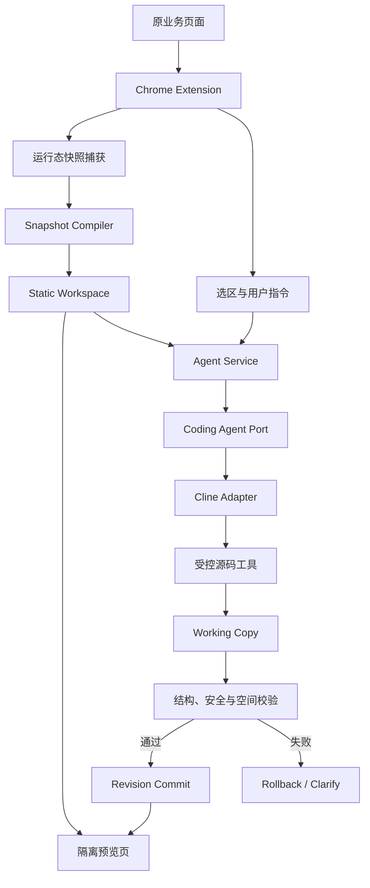

# UI 需求助手技术实现专题分享

## 一、分享范围

本文聚焦 UI 需求助手当前静态源码副本方案的技术实现，主要说明以下内容：

1. 系统分层及模块边界；
2. 运行态页面捕获与静态化编译；
3. 静态源码工作区与版本事务；
4. Coding Agent Runtime 与业务能力接入；
5. 渐进式上下文与受控源码工具；
6. 意图识别、需求澄清与空间约束；
7. 安全校验、预览隔离与可观测性；
8. 当前技术边界及后续建设方向。

本文不再展开项目背景、用户场景及产品操作流程。

## 二、总体架构

系统由 Chrome 插件、Agent Service、静态源码工作区和 Coding Agent Runtime 四个主要运行单元组成。



各层职责如下：

### 2.1 插件交互层

基于 WXT、React 和 Chrome MV3 Side Panel 实现，负责：

- `activeTab` 临时授权；
- 原页面快照采集；
- 副本页面创建和标签页绑定；
- 元素选择与高亮；
- 用户对话、进度展示和澄清交互；
- 撤销、重做、恢复初始版本和截图导出。

### 2.2 Agent Service

基于 Hono 提供 HTTP 服务，负责：

- 工作区创建、读取、修改和清理；
- 模型及 Coding Agent Adapter 调用；
- Turn 状态管理；
- 受控工具注册与执行；
- Revision 管理；
- 日志、进度和健康检查接口。

### 2.3 静态源码工作区

每个页面副本对应一个独立 Workspace。Workspace 保存规范化后的 HTML/CSS、页面索引、当前选区、Revision 和会话状态，是页面预览、Agent 编辑和版本恢复的统一事实来源。

### 2.4 Coding Agent Runtime

当前通过 Adapter 接入 Cline SDK，复用其模型调用、Agent Loop、上下文管理、工具调度、Checkpoint 和异常处理能力。

插件、工作区和业务逻辑不直接依赖 Cline 类型，而是统一依赖 `CodingAgentPort`，以保持 Runtime 的可替换性。

## 三、运行态页面捕获

### 3.1 捕获对象

系统捕获浏览器已经完成渲染的页面状态，而非服务器返回的初始 HTML。捕获内容包括：

- 当前 DOM 结构；
- 输入框、文本域和选择控件的当前值；
- 单选、多选和开关状态；
- 当前显示或展开的区域；
- 已打开的弹窗与遮罩；
- 元素的主要计算样式；
- 当前视口及页面尺寸信息。

采用运行态捕获的原因是，业务页面中的数据、组件状态和弹窗通常在 JavaScript 执行后生成，初始 HTML 无法完整反映用户当前所见页面。

### 3.2 状态冻结

动态状态需要转换为可由静态 HTML 表达的状态。例如：

- 将输入框当前值写回 `value` 属性；
- 将勾选状态写回 `checked`；
- 将选择结果写回 `selected`；
- 将当前可见状态固化为结构或样式；
- 将已打开弹窗及遮罩保留在快照中。

冻结后的页面只表达当前视觉状态，不继续承载原页面的业务状态机。

### 3.3 样式采集

页面还原不能只依赖 DOM 和原始样式表。实际可见样式可能同时受到以下因素影响：

- 全局样式；
- 组件库样式；
- CSS Modules 或运行时生成类名；
- 继承、层叠和媒体查询；
- 行内样式；
- 浏览器默认样式。

捕获阶段读取主要计算样式，并在编译阶段进行归并与去重，形成可独立预览的 `snapshot.css`。

## 四、静态化编译

### 4.1 编译目标

Snapshot Compiler 将运行态页面转换为以下形式：

```text
运行态 DOM + 当前控件状态 + 计算样式
  → 安全裁剪
  → HTML 规范化
  → CSS 提取与去重
  → 稳定元素标识
  → 页面 Outline
  → Source Map
  → 可编辑静态工作区
```

编译结果需要同时满足三个条件：

1. 保留当前页面的主要结构和视觉效果；
2. 移除真实业务执行能力；
3. 形成适合 Coding Agent 检索和修改的源码。

### 4.2 安全裁剪

编译阶段移除或禁用以下内容：

- `script` 和 `iframe`；
- `onclick` 等内联事件属性；
- 表单 `action` 和真实提交行为；
- HTTP/HTTPS 页面导航；
- 不受控远程资源；
- Cookie、LocalStorage 和 SessionStorage；
- React/Vue 运行时标记；
- 不需要保留的框架临时属性。

静态副本的目标是页面示意，因此不保留接口调用、业务提交和跨页面流程。

### 4.3 HTML/CSS 规范化

直接序列化的 DOM 通常包含大量单行内联样式、临时属性和冗余结构，不适合 Agent 检索与 Patch。

规范化阶段主要执行：

- HTML 格式化；
- 可见样式提取；
- 重复 CSS 声明去重；
- 资源引用规范化；
- 元素稳定标识注入；
- 无效或危险属性删除；
- 页面元信息补充。

最终将结构和样式拆分为可维护的 `index.html` 与 `snapshot.css`。

### 4.4 页面 Outline

`outline.json` 用于向 Agent 提供页面结构摘要，主要包含：

- 页面主要区域；
- 容器层级；
- 元素类型与可见文本；
- 稳定 `sourceId`；
- 关键属性；
- 局部父子关系。

Agent 首次处理任务时优先读取 Outline，而非完整 HTML，从而降低上下文噪声。

### 4.5 Source Map

`source-map.json` 建立预览元素与源码之间的映射。用户在副本页面选择元素后，插件提交稳定的 `sourceId`，服务端可以据此定位：

- 对应 HTML 节点；
- 所在源码区域；
- 关联 CSS 规则；
- 父容器及相邻元素；
- 当前授权编辑范围。

稳定标识避免依赖动态类名、CSS Selector 和固定 DOM 层级。

## 五、静态源码工作区

### 5.1 工作区结构

典型 Workspace 包含：

```text
workspace/
  index.html
  snapshot.css
  outline.json
  source-map.json
  manifest.json
  revisions/
  assets/
```

其中：

- `index.html`：规范化页面结构；
- `snapshot.css`：页面可见样式；
- `outline.json`：页面语义结构摘要；
- `source-map.json`：元素与源码映射；
- `manifest.json`：当前 Revision、选区、来源页面和会话状态；
- `revisions/`：已提交版本；
- `assets/`：允许本地化保存的静态资源。

### 5.2 Working Copy

Agent 不直接修改当前有效 Revision。每轮 Turn 开始时，系统从当前 Revision 创建 Working Copy，所有工具操作首先作用于 Working Copy。

完成编辑后依次执行：

1. HTML/CSS 解析；
2. 文件范围校验；
3. 危险内容校验；
4. 结构完整性校验；
5. 空间范围与静态可见性校验；
6. Revision 提交。

任一环节失败，Working Copy 被放弃，当前有效 Revision 保持不变。

### 5.3 Revision 模型

每个成功的页面修改 Turn 形成一个 Revision：

```text
Revision 0  初始静态副本
Revision 1  第一次有效修改
Revision 2  第二次有效修改
Revision 3  第三次有效修改
```

Revision 当前保存完整文件快照。该方式占用一定存储空间，但恢复逻辑简单，适合当前页面工作区规模。后续可根据工作区体积评估增量 Patch。

### 5.4 撤销、重做与对话分支

页面状态与模型上下文必须绑定到同一 Revision。

每条用户消息、澄清轮次和 Agent 结果均记录对应 Revision。执行 Undo 后，后续 Agent 上下文只读取目标 Revision 所在的有效对话链，不继续引用已被撤销版本中的页面事实。

旧 Turn 仍保留在审计日志中，但不会再次进入当前 Agent 上下文。

## 六、Agent Runtime 分层

### 6.1 CodingAgentPort

`CodingAgentPort` 是业务层与通用 Agent Runtime 之间的抽象边界，主要负责：

- 输入用户消息与工作区上下文；
- 注册允许使用的工具；
- 接收工具调用轨迹；
- 投影用户可见进度；
- 返回完成、澄清或失败状态；
- 输出最终 Checkpoint。

该抽象使插件 UI、工作区和日志不依赖特定开源 Agent。

### 6.2 Cline Adapter

Cline Adapter 负责将项目定义的上下文和工具映射到 Cline SDK，包括：

- 创建独立 Agent 实例；
- 注入系统约束和当前任务；
- 注册 `CodingWorkspaceTools`；
- 接收模型及工具生命周期事件；
- 处理完成、澄清、异常和中止；
- 生成统一步骤轨迹与 Checkpoint。

Cline 的 Shell、浏览器、任意网络和任意文件能力均未注册到当前 Agent。

### 6.3 通用层与业务层边界

通用 Agent Runtime 负责：

- 模型调用；
- Agent Loop；
- 工具调度；
- 上下文和消息管理；
- 重试、异常和收敛控制。

UI 业务层负责：

- 页面结构和样式语义；
- 选区及空间锚点；
- 页面修改规则；
- 需求澄清；
- 受控工具定义；
- 安全、版本和验证边界。

该边界保证更换模型或 Agent Runtime 时，无需重写页面工作区和业务协议。

## 七、渐进式上下文

### 7.1 初始上下文

每轮任务不会直接向模型发送完整页面。初始上下文主要包含：

- 当前用户指令；
- 当前 Revision 的有效历史对话；
- 当前选区与语义信息；
- 页面 Outline；
- 工作区文件清单；
- 当前 Turn 的工具和安全约束。

### 7.2 按需读取

Agent 根据任务逐步调用：

1. 页面元素或文本搜索；
2. 元素结构检查；
3. 局部 HTML 读取；
4. 关联样式规则读取；
5. 父容器与相邻结构读取；
6. 修改与校验。

该过程与开发者阅读陌生代码库的方式一致：先获取目录，再搜索目标，随后读取最小必要上下文。

### 7.3 上下文预算与收敛

系统记录模型调用数、工具调用数和重复操作。当出现连续读取相同区域、重复 Patch 失败或长时间无进展时，向 Agent 提供换策略提示。

接近迭代预算时，Runtime 限制继续扩展上下文，引导 Agent 转入以下状态之一：

- 执行校验并完成；
- 请求用户澄清；
- 明确返回失败。

该机制用于控制无效循环，不以固定业务场景限制 Agent 能力。

## 八、受控源码工具

### 8.1 工具设计原则

工具按通用源码原语设计，不为“新增订单行”“新增筛选项”等具体业务场景提供专用能力。

复杂需求由模型结合当前页面结构拆解为若干可组合操作。例如，“复制第一行并插入表格底部”可以拆解为：

1. 定位目标行；
2. 克隆完整节点及关联样式；
3. 修改克隆节点中的内容；
4. 插入指定容器；
5. 校验结构和位置；
6. 提交 Revision。

### 8.2 只读工具

主要只读能力包括：

- 搜索页面文本和元素；
- 按 `sourceId` 检查元素；
- 读取局部 HTML/CSS；
- 读取完整样式规则；
- 获取页面 Outline；
- 获取当前 Revision 和授权范围。

### 8.3 编辑工具

主要编辑能力包括：

- 精确文本替换；
- 属性和样式修改；
- 元素插入与删除；
- `move_element`；
- `clone_element`；
- 结构重排；
- 受控原子 `apply_patch`。

`move_element` 和 `clone_element` 按稳定 `sourceId` 操作，可保留完整节点、子树和关联样式，避免通过大段文本替换模拟结构移动。

### 8.4 Patch 边界

`apply_patch` 不是任意文件写入能力。当前限制包括：

- 仅允许修改工作区中的 `index.html` 和 `snapshot.css`；
- 不允许访问工作区外路径；
- 支持唯一原文替换；
- 支持在唯一锚点前后插入；
- 支持文件开头或末尾插入；
- 一组相关修改按原子事务执行；
- 校验失败不形成 Revision。

## 九、意图识别与需求澄清

### 9.1 意图分类

系统的统一输入入口支持三类处理结果：

1. **普通问答：** 返回说明或建议，不注册页面写工具；
2. **页面修改：** 进入 Coding Agent 执行链路；
3. **关键歧义：** 返回澄清问题，暂不修改源码。

意图判断结合当前消息、最近对话、工作区状态和选区状态，不依赖固定关键词分支。

### 9.2 澄清条件

当以下信息缺失且会显著改变结果时，Agent 应请求用户澄清：

- 目标元素无法唯一确定；
- 用户指定的位置存在多个合理解释；
- 修改范围可能从局部扩大到全局；
- 参考样式或组件来源不明确；
- 删除或覆盖操作可能影响多个区域。

对于不影响核心结果的细节，Agent 可以依据当前页面结构和样式做合理选择，避免不必要的对话中断。

### 9.3 修改计划

进入写操作前，Agent 形成结构化修改意图，至少包含：

- 目标元素；
- 预期修改；
- 插入或移动位置；
- 参考样式来源；
- 影响范围；
- 需要满足的视觉约束。

该计划用于约束后续工具调用和提交校验，不由业务代码通过自然语言正则推断固定布局策略。

## 十、空间语义与编辑范围

### 10.1 默认锚点

当用户没有明确指定全局容器时，新增内容默认围绕当前选中元素或其最近语义容器定位。

涉及多个相邻元素时，编辑范围可以扩展到这些元素的最近公共父容器。

只有用户明确指定“页面顶部”“页面底部”“浏览器视口”“全局悬浮”等位置时，才允许将修改范围扩大到全局。

### 10.2 布局上下文

Agent 在决定插入位置前，需要读取目标容器的实际结构和样式，包括：

- 普通文档流；
- Flex 方向和对齐方式；
- Grid 列与区域；
- 定位上下文；
- 滚动与裁切容器；
- 相邻组件结构和复用样式。

确定性代码不使用固定祖先层级、固定容器高度或自然语言关键词映射具体 DOM 位置。

### 10.3 空间校验

提交前执行以下静态检查：

- 新增元素是否位于授权的语义容器；
- 局部需求是否错误使用全局固定定位；
- 元素是否存在明确零尺寸；
- 是否被祖先裁切；
- 是否存在明显移出可见区域的定位值；
- 选区与新增结构是否仍有可解释的空间关系。

当前校验能够识别明确的空间越界和不可见风险，但不能完整替代真实浏览器几何验证。

## 十一、校验与提交

### 11.1 校验层次

每轮写操作完成后依次进行：

1. **语法校验：** HTML 和 CSS 是否可解析；
2. **文件校验：** 是否仅修改授权文件；
3. **安全校验：** 是否引入脚本、事件、远程请求和危险协议；
4. **结构校验：** 关键节点和页面结构是否完整；
5. **空间校验：** 修改是否位于授权范围并具有基本可见性；
6. **Diff 校验：** 实际变更是否与本轮声明范围一致。

### 11.2 提交协议

只有在以下条件同时满足时才能提交 Revision：

- Agent 明确调用完成工具；
- 工作区存在有效变更；
- 所有确定性校验通过；
- 当前 Working Copy 与预期 Revision 基线一致；
- 本轮未进入澄清或失败状态。

提交后更新 Workspace Manifest，并通知预览页刷新到新 Revision。

### 11.3 真实渲染验证边界

静态分析无法完整判断以下问题：

- 元素实际相对位置；
- 遮挡和重叠；
- 文本换行；
- 滚动区域溢出；
- 字体差异；
- 响应式布局变化；
- 最终视觉风格一致性。

因此，真实浏览器几何验证是后续验证闭环的重点建设方向。其结果应作为可观测事实反馈给模型，而不是由业务代码直接修正特定页面样式。

## 十二、预览与会话绑定

### 12.1 副本预览

Workspace 通过独立预览地址加载。预览页只读取当前有效 Revision，不直接访问原业务系统。

Revision 更新后，Side Panel 或 Background 通知预览页刷新，页面重新加载最新 HTML/CSS。

### 12.2 标签页与会话

Background 维护原页面、副本页面和 Workspace 之间的绑定关系，包括：

- 来源标签页；
- 副本标签页；
- Workspace ID；
- 当前会话；
- 当前 Revision；
- Side Panel Port 状态。

插件重新加载、页面切换或 Side Panel 重连时，系统根据当前标签页地址和持久化会话恢复绑定。

### 12.3 静态交互

副本不执行原页面 JavaScript。对于 Tab、下拉、弹窗等需求示意，仅支持声明式静态交互：

- 通过受控属性关联控制项与目标面板；
- 通过安全 class 切换显示状态；
- 不接受任意 CSS Selector；
- 不执行用户脚本；
- 不调用真实业务接口。

该能力用于展示有限的 UI 状态，不用于还原完整业务交互逻辑。

## 十三、安全设计

### 13.1 浏览器授权

插件使用 `activeTab` 获取用户主动授权的当前页面，不申请 `<all_urls>` 长期权限。

Chrome 保护页面、扩展商店及其他禁止注入的页面不在支持范围内。

### 13.2 原页面隔离

原页面在捕获后保持只读。Agent 仅能修改 Agent Service 中的静态 Workspace，不能向原标签页写回代码或状态。

### 13.3 文件系统隔离

所有工作区文件访问均执行：

- Workspace 根目录限制；
- `realpath` 校验；
- 上级目录逃逸检查；
- 符号链接绕过检查；
- 文件类型白名单；
- 文件体积限制。

### 13.4 Agent 能力隔离

当前 Agent 不具备：

- Shell；
- 任意网络访问；
- 浏览器控制；
- 工作区外文件访问；
- 原业务接口调用；
- 任意脚本执行。

模型接口是 Runtime 自身的受控依赖，不作为 Agent 可调用的通用网络工具开放。

### 13.5 预览 CSP

预览页面通过 Content Security Policy 禁止：

- 脚本执行；
- 接口请求；
- 表单提交；
- 页面导航；
- 不受控外部资源加载。

即使编译或编辑阶段出现遗漏，预览层仍提供第二道限制。

### 13.6 用户隔离

远程部署模式支持安装级身份。插件首次连接服务时领取服务端签名身份，Workspace、Revision、历史副本和回收站均按身份及租户隔离。

安装身份适用于受控内部试点，不等同于正式员工身份。规模化部署时应接入公司统一身份认证和权限体系。

## 十四、可观测性

### 14.1 用户侧进度

Side Panel 展示经过投影的操作摘要，例如：

```text
理解需求
定位目标元素
读取页面结构
分析关联样式
应用页面修改
校验工作区
提交 Revision
```

上述内容是系统操作轨迹，不是模型隐式逐字推理过程。

### 14.2 服务端日志

每个 Agent Turn 记录：

- 用户指令和有效历史对话；
- Workspace、选区和 Revision；
- 模型及 Adapter；
- 模型调用次数；
- 工具调用及结果；
- Checkpoint；
- 校验状态；
- 最终 Diff；
- 总耗时和失败原因。

日志不记录 API Key、Authorization、Token、Cookie 和密码等凭证字段。

### 14.3 日志用途

日志主要用于：

- Agent 失败定位；
- 上下文和工具调用分析；
- Token 与耗时优化；
- 固定回归集验证；
- 复杂挑战场景复盘；
- 不同模型或 Runtime 的效果对比。

## 十五、工程模块划分

当前仓库结构如下：

```text
apps/extension
  Chrome MV3 插件
  页面捕获、选区、会话绑定、Side Panel、快照包

apps/agent-service
  Hono 服务
  Workspace、编译、校验、Revision、进度和日志

packages/agent-runtime
  CodingAgentPort
  Cline Adapter
  通用 Agent Runtime 与受控工具桥接

packages/contracts
  DTO、协议版本和 Zod Schema
```

模块依赖遵循以下方向：

```text
Extension ──────→ Contracts
Agent Service ──→ Contracts + Agent Runtime
Agent Runtime ──→ Contracts

Extension 不直接依赖 Agent Runtime
Agent Runtime 不直接依赖插件 UI
Workspace 不直接依赖 Cline SDK 类型
```

工程中使用依赖检查约束模块边界，避免 Adapter 或业务实现向上层泄漏。

## 十六、测试与验证

### 16.1 自动化测试

自动化验证覆盖：

- 快照协议和 Schema；
- HTML 安全清洗；
- CSS 处理；
- 工作区路径边界；
- 受控源码工具；
- Revision、撤销和重做；
- 会话与 Revision 上下文；
- Agent Adapter；
- 服务接口；
- 架构依赖规则。

### 16.2 人工场景验证

人工验证重点覆盖：

- 文案、按钮和基础样式修改；
- 表单项、下拉框和表格结构；
- 元素移动、克隆和删除；
- 普通流、Flex、Grid、定位和滚动容器；
- 多轮修改；
- 模糊需求澄清；
- 撤销后的上下文一致性；
- 复杂真实页面快照还原。

### 16.3 验证原则

测试应验证通用不变量，而不是复刻某个业务页面的 DOM 或文案。例如：

- 修改不得越出授权工作区；
- 失败 Turn 不得污染有效 Revision；
- Undo 后上下文不得引用已撤销元素；
- 局部修改不得无依据地使用全局固定定位；
- 新增结构必须处于可解释的语义容器；
- Agent 不得获得未注册能力。

## 十七、当前边界与后续方向

### 17.1 当前边界

- 以静态 UI 示意为目标，不还原完整业务逻辑；
- 不保证复杂动画、Canvas、视频和所有伪元素完整保留；
- 跨域字体和资源可能存在还原差异；
- 声明式交互仅覆盖有限展示状态；
- 静态空间校验不能替代真实浏览器视觉验证；
- 安装身份适用于内部试点，尚未替代公司统一认证。

### 17.2 后续技术方向

1. **真实浏览器验证闭环：** 增加位置、重叠、裁切、溢出和样式一致性检测，并将事实反馈给 Agent 迭代。
2. **页面资源与字体还原：** 完善安全资源本地化、字体处理和跨视口一致性。
3. **企业组件能力：** 接入企业组件规范、设计 Token 和组件检索，提升页面风格一致性。
4. **需求资产化：** 将确认后的 Revision 与变更说明、需求文档和研发任务建立版本关联。
5. **企业级身份与治理：** 接入统一认证、权限、租户、数据留存和审计体系。

## 十八、技术结论

UI 需求助手的技术核心可以归纳为三点：

1. 将不可控的运行态网页转换为稳定、隔离、可维护的静态源码工作区；
2. 通过渐进式上下文和通用受控工具，使 Coding Agent 具备页面理解与源码编辑能力；
3. 通过 Working Copy、确定性校验和 Revision，将模型操作纳入可回滚、可审计的工程事务。

整体设计遵循以下职责边界：

> 大模型负责语义理解、歧义判断和页面相关的修改决策；确定性系统负责协议、安全、权限、状态、校验和版本提交。
