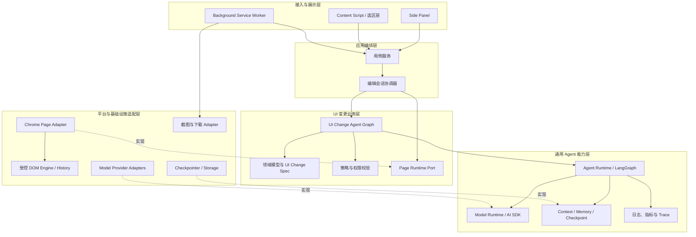
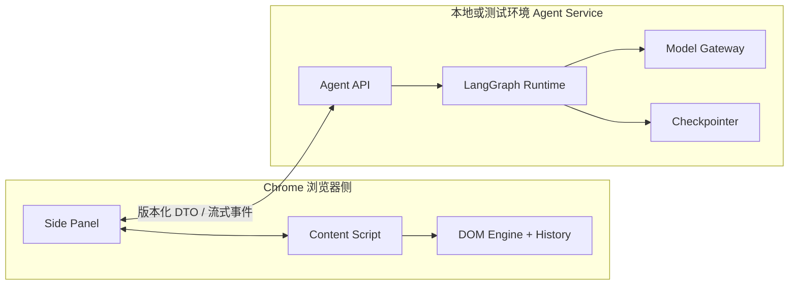
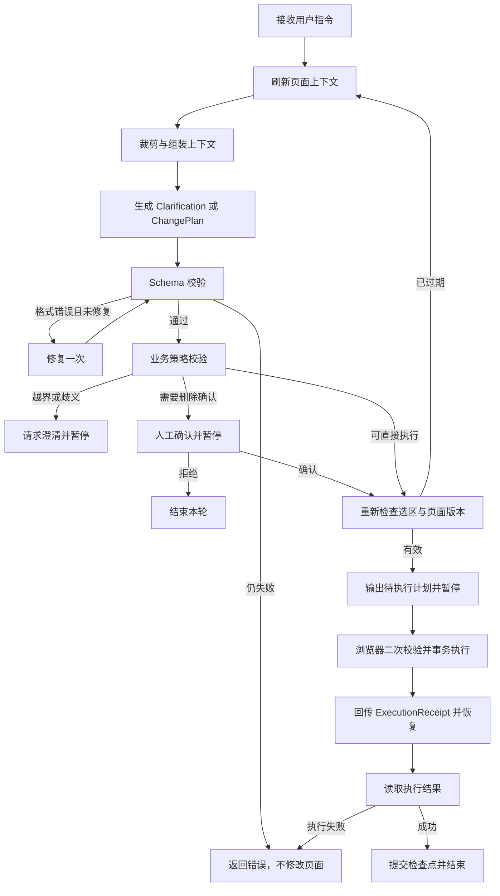

# UI 辅助需求编写插件 Demo 技术方案

> 历史方案：本文描述已移除的当前页面直接 DOM 编辑链路，仅供设计决策追溯。

## 1. 方案结论

采用“Chrome 插件 + 通用 Agent Runtime + 专用 UI Change Agent + 受控 DOM 编辑内核”的架构。

Agent 只负责理解用户意图，并把业务需求拆解为通用 DOM 原子操作；页面信息采集、权限校验、DOM 修改、删除确认、撤销重做和截图均由插件控制。执行协议不为“订单行”“卡片”“筛选栏”等业务概念逐项增加操作，而是通过局部 DOM 树、复制/插入/修改等原子能力组合完成。首期不引入完整 Browser Agent、整页 Page Semantic AST 或 GrapesJS 编辑器。

整体遵循“成熟插件框架 + 开源 Agent Runtime + 复用 PageAgent 页面理解能力 + 自研 UI 业务层和受控编辑内核”的路线。通用的上下文管理、循环、检查点、记忆和人工中断交给成熟 Runtime；页面抽取和元素映射优先评估 Alibaba PageAgent；本项目只维护 UI 需求变更领域特有的模型、规则和执行能力。

## 2. 推荐技术栈

| 模块 | 推荐方案 |
| --- | --- |
| 插件框架 | WXT + React + TypeScript |
| Chrome 规范 | Manifest V3 |
| 操作界面 | Chrome Side Panel |
| 测试页面 | React + Vite + Ant Design |
| 模型调用 | 独立 Model Gateway |
| 模型抽象 | Vercel AI SDK + 自定义 ModelAdapter |
| Agent Runtime | LangGraph.js |
| Agent 状态持久化 | LangGraph Checkpointer；Demo 首期使用内存实现 |
| 页面理解基础 | 优先评估 `@page-agent/page-controller` 及其 DOM 模块 |
| 结构校验 | Zod |
| 浏览器编辑会话 | XState + `@xstate/react`；局部表单使用 React 状态 |
| 插件跨上下文消息 | `@webext-core/messaging` + Zod DTO 校验 |
| 插件配置存储 | WXT Storage |
| Agent Service | Hono + SSE + Zod Validator |
| 可观测标准 | OpenTelemetry API；首期服务端启用 SDK |
| 单元测试 | Vitest |
| 插件端到端测试 | Playwright |
| API Mock | MSW |
| 模型与提示词评估 | Promptfoo |
| 分层依赖治理 | dependency-cruiser |
| 截图 | `chrome.tabs.captureVisibleTab` |

参考资料：

- [WXT](https://wxt.dev/)
- [Chrome Side Panel API](https://developer.chrome.com/docs/extensions/reference/api/sidePanel)
- [Chrome Tabs API](https://developer.chrome.com/docs/extensions/reference/api/tabs)
- [Vercel AI SDK](https://vercel.com/docs/ai-sdk)
- [LangGraph.js](https://github.com/langchain-ai/langgraphjs)
- [LangGraph Persistence](https://docs.langchain.com/oss/javascript/langgraph/persistence)
- [Zod](https://zod.dev/)
- [Nanobrowser](https://github.com/nanobrowser/nanobrowser)
- [Alibaba PageAgent](https://github.com/alibaba/page-agent)
- [PageAgent PageController](https://github.com/alibaba/page-agent/blob/main/packages/page-controller/src/PageController.ts)
- [WebExt Core Messaging](https://github.com/aklinker1/webext-core/tree/main/packages/messaging)
- [XState](https://github.com/statelyai/xstate)
- [Hono](https://github.com/honojs/hono)
- [OpenTelemetry JS](https://github.com/open-telemetry/opentelemetry-js)
- [Promptfoo](https://github.com/promptfoo/promptfoo)
- [MSW](https://github.com/mswjs/msw)
- [dependency-cruiser](https://github.com/sverweij/dependency-cruiser)
- [Claude Agent SDK](https://code.claude.com/docs/en/agent-sdk/overview)（架构参考，不作为首期核心依赖）

逐层开源项目的选型、适配边界和不采用理由见《[分层开源复用调研](./UI辅助需求编写插件_分层开源复用调研.md)》。

## 3. 总体架构



图中的虚线表示外层 Adapter 对内层 Port 的实现。业务层只依赖抽象，不直接依赖 Chrome API、具体模型供应商或数据库。

## 4. 分层架构与职责边界

### 4.1 通用 Agent 能力层

该层与“修改 UI”无关，应当能被其他 Agent 项目复用。核心实现基于 LangGraph.js，不自行重写通用循环和状态持久化。

包含：

- `AgentRuntime`：图执行、条件路由、循环预算、取消、超时和错误传播。
- `ContextManager`：上下文预算、消息裁剪、摘要和当前轮上下文组装。
- `MemoryManager`：线程级短期记忆、检查点、暂停、恢复和历史查询。
- `HumanInterrupt`：在删除确认、澄清等场景暂停图，并在用户反馈后从检查点继续。
- `ModelRuntime`：统一模型调用、结构化输出、流式事件、重试和模型切换。
- `ToolRuntime`：工具注册、输入输出 Schema、调用超时、幂等键和执行结果封装。
- `RuntimePolicy`：最大步骤数、最大修复次数、Token 预算和总耗时预算。
- `Observability`：`traceId`、步骤耗时、Token 用量、模型错误和状态迁移记录。

该层禁止依赖：

- DOM、CSS 和 Chrome API。
- UI Change Specification。
- 按钮、下拉框等业务组件概念。
- 当前产品的提示词和安全规则。

### 4.2 UI 变更领域层

该层表达产品的核心业务规则，是本项目最重要、最稳定的自研部分。

包含：

- `SelectedContext`：局部页面上下文领域模型。
- `ElementRef`：会话级页面元素引用。
- `UIChangePlan`：一轮用户意图形成的变更计划。
- `UIChangeOperation`：添加、修改、移动、删除和设置静态状态。
- `ComponentType`：按钮、文本、链接、单选、多选、下拉框和输入框。
- `ScopePolicy`：只允许修改选中元素及本轮新增元素。
- `StylePolicy`：允许修改的 CSS 属性和值域。
- `ConfirmationPolicy`：删除已有元素必须确认。
- `PageRevision`：识别计划生成后页面或选区是否已变化。

领域层定义 `PageRuntimePort`、`ModelPort`、`CheckpointPort` 等接口，但不实现 Chrome、模型或存储细节。

### 4.3 UI Change Agent 层

该层把通用 Agent Runtime 与 UI 业务域组装起来，属于业务 Agent，而不是通用基础设施。

包含：

- Agent Graph 节点及条件路由。
- UI 需求澄清提示词。
- 页面上下文组装和压缩策略。
- ChangePlan 生成提示词及结构化输出约束。
- Schema 校验失败后的修复提示词。
- 执行结果观察和下一轮状态更新。
- UI 领域相关的对话摘要。

该层可以调用通用 Runtime，但不能绕过领域策略直接操作页面。

### 4.4 应用编排层

该层按用户操作组织业务用例，不包含模型提示词或底层 DOM 细节。

主要用例：

- `StartSelection`：开始选择页面元素。
- `SelectTarget`：建立当前编辑目标和选区版本。
- `SubmitInstruction`：提交自然语言指令并启动 Agent Turn。
- `ConfirmPendingPlan`：确认或拒绝待执行删除计划。
- `UndoTurn`、`RedoTurn`：撤销或重做一个用户轮次。
- `SwitchTarget`：结束当前选区并切换目标。
- `ExportVisibleScreenshot`：导出当前可视区域截图。
- `ResetEditSession`：恢复当前页面会话的初始状态。

应用层负责 `tabId + editSessionId` 到 Agent Thread、DOM History 和当前选区的映射。

### 4.5 接入与展示层

该层只负责输入输出和浏览器入口：

- Side Panel：对话、选区摘要、确认、撤销、重做和导出 UI。
- Content Script Entry：接收页面事件，调用应用层用例。
- Background Service Worker Entry：消息路由、截图和模型网关调用入口。
- 插件消息协议：请求、响应、流式 Agent 事件和错误 DTO。

展示层不能自行决定一个 DOM 操作是否安全，也不能直接拼装模型提示词。

### 4.6 平台与基础设施适配层

该层实现内层定义的 Port：

- `ChromePageAdapter`：元素选取、上下文采集和页面版本检测；优先基于 PageAgent PageController 的 DOM 抽取、元素映射和 React 兼容能力适配。
- `ControlledDomEngine`：执行白名单操作及生成逆操作。
- `ComponentTemplateAdapter`：识别和复用测试页面组件模板。
- `ChromeScreenshotAdapter`：调用 `captureVisibleTab` 和下载 API。
- `VercelModelAdapter`：通过 AI SDK 调用具体模型。
- `LangGraphCheckpointerAdapter`：首期内存保存，后续可替换 SQLite/Postgres。
- `ChromeSessionStorageAdapter`：保存插件 UI 配置和非敏感会话信息。

### 4.7 Shared Kernel 边界

Shared Kernel 只放真正跨层且无业务语义的内容：

- ID、时间、结果和通用错误类型。
- 日志和 Trace 接口。
- 取消信号、重试配置和分页等基础类型。

禁止把暂时不知道放在哪里的代码放入 Shared Kernel，避免其逐渐变成无边界的公共包。

### 4.8 依赖规则

必须遵守以下规则：

1. 通用 Agent 能力层不能依赖 UI 业务层。
2. UI Change Agent 可以依赖通用 Agent 能力层和 UI 领域层。
3. 应用层依赖业务接口，不依赖具体 Chrome 或模型实现。
4. Chrome、模型和存储 Adapter 可以依赖内层接口，内层不能反向依赖 Adapter。
5. Side Panel 和 Content Script 只能通过应用用例修改状态。
6. DOM Engine 是页面事实来源；Agent Memory 不能替代实际 DOM 状态。
7. 跨进程通信只能使用版本化 DTO，不传递 DOM Node、函数或 Runtime 内部对象。

### 4.9 物理工程拆分

建议采用 pnpm workspace，将系统拆分为：

- `apps/extension`：WXT 插件入口、Side Panel、Content Script 和 Background。
- `apps/demo-page`：固定测试页面。
- `apps/agent-service`：Agent Runtime、会话、检查点和模型调用服务入口。
- `packages/shared-kernel`：最小公共类型和可观测接口。
- `packages/agent-runtime`：LangGraph 封装、Context、Memory、Loop 和 Interrupt。
- `packages/model-runtime`：ModelPort、AI SDK Adapter 和模型配置。
- `packages/ui-change-domain`：SelectedContext、Change Spec、策略和领域错误。
- `packages/ui-change-agent`：Agent Graph、节点、路由和领域提示词。
- `packages/ui-change-application`：用例服务和编辑会话协调器。
- `packages/chrome-page-adapter`：选区、基于 PageAgent 适配的上下文提取、DOM Engine、历史和截图适配。
- `packages/ui-change-contracts`：Side Panel、Background、Content Script 和 Gateway 间的版本化 DTO。

物理包不要求首日全部独立发布，但依赖方向必须从第一版开始保持，防止后续拆包时产生循环依赖。

### 4.10 部署边界

系统分为浏览器侧和服务侧，Agent Service 不直接连接或控制用户页面。



关键约束：

- 浏览器侧持有真实 DOM、元素引用和撤销重做历史。
- 服务侧持有 Agent Thread、对话记忆、计划和检查点。
- Agent Service 只返回结构化 ChangePlan，不能直接调用 Chrome API。
- 浏览器执行后返回 `ExecutionReceipt`，Agent Graph 再从检查点恢复并更新记忆。
- 服务侧保存的页面上下文是快照，执行前必须由浏览器校验 `selectionVersion` 和 `pageRevision`。

## 5. 插件模块设计

### 5.1 Side Panel

负责：

- 启动或退出元素选择。
- 显示当前选中元素摘要。
- 展示多轮对话。
- 展示 Agent 对需求的理解和执行结果。
- 提供撤销、重做、恢复初始状态。
- 对删除已有元素进行确认。
- 触发截图导出。

Side Panel 与网页并排存在，适合用户一边查看修改结果，一边继续输入调整指令。

浏览器编辑会话使用 XState 管理 `idle`、`selecting`、`selected`、`planning`、`awaiting_confirmation`、`executing`、`undoing/redoing` 和失败状态。XState 只管理浏览器生命周期与用户交互，不承担服务端 Agent Graph；普通输入框等局部状态继续使用 React 状态。

### 5.2 Content Script

负责：

- 鼠标悬停高亮。
- 点击选择元素并阻止测试页原有点击行为。
- 为元素分配当前会话内的临时引用 ID。
- 提取局部 DOM、相邻元素及可见样式。
- 执行通过校验的结构化操作。
- 管理当前页面的操作历史。
- 在截图前隐藏选区框等插件辅助 UI。

高亮层使用 Shadow DOM 隔离样式，避免测试页面 CSS 污染插件界面。

### 5.3 Background Service Worker

负责：

- Side Panel 与 Content Script 之间的消息转发。
- 调用 Agent Service。
- 维护按标签页隔离的浏览器侧会话映射。
- 调用 Chrome 截图和下载 API。
- 处理插件生命周期。

Side Panel、Background 和 Content Script 的消息传输使用 `@webext-core/messaging`。消息类型仍由 `ui-change-contracts` 定义，并在每个接收边界使用 Zod 做运行时校验；类型安全封装不能替代协议版本、来源校验和幂等控制。

插件配置和非敏感 UI 偏好使用 WXT Storage；DOM History 不写入 Storage，Agent Checkpoint 也不存放在浏览器中。

## 6. 页面上下文模型

首期不构建完整 Page Semantic AST，只生成围绕选区的 `SelectedContext`。

| 信息 | 内容 |
| --- | --- |
| 页面 | 标题、URL、视口尺寸 |
| 选中元素 | 临时 ID、标签、角色、文本、属性、位置和尺寸 |
| 父容器 | 布局方式、方向、对齐、间距 |
| 相邻元素 | 类型、文本、相对位置、基础样式 |
| 可见样式 | 字体、颜色、背景、边框、尺寸、间距、display/flex/grid |
| 组件线索 | ARIA role、标签类型、类名、`data-*` 标记 |
| 编辑状态 | 本轮新增元素、历史操作摘要 |

不发送：

- 整页 DOM。
- 脚本内容。
- 网络请求信息。
- 隐藏业务数据。
- React/Vue 内部状态。
- 与选区无关的页面内容。

### 6.1 PageAgent 页面理解适配

PageAgent 的 PageController 已提供 DOM 扁平化、可交互元素识别、元素索引到真实 DOM 引用映射、简化 HTML、可见区域判断和 React 输入兼容处理。首期优先复用或适配这些底层能力，不直接采用其完整 Browser Agent。

适配后的提取链路：

```text
PageAgent DOM 基础能力
    ├─ DOM 可见性和顶层元素过滤
    ├─ DOM 扁平化与简化输出
    ├─ 元素索引和真实引用映射
    └─ React 页面兼容处理
                ↓
本项目 Local Context Extractor
    ├─ 用户选中的锚点元素
    ├─ 父容器和相邻元素
    ├─ Computed Style 白名单
    ├─ 组件模板线索
    ├─ selectionVersion
    └─ pageRevision
```

不直接采用 PageController 默认的“整页或整视口可交互元素列表”作为 SelectedContext，因为它不能完整表达局部布局、非交互文本、相邻结构和可见样式。

实现方式按以下顺序评估：

1. 直接依赖公开的 `@page-agent/page-controller` API，并在外层补充局部上下文提取。
2. 如果公开 API 无法暴露所需的局部 DOM 信息，基于 MIT 许可证对其 DOM 子模块进行源码级适配，并保留版权声明。
3. 如果升级稳定性或包体积不满足要求，仅借鉴算法和测试用例，自行实现兼容接口。

### 6.2 上下文优先级

ContextManager 按以下优先级分配上下文预算：

1. 系统安全规则和 UI Change Specification Schema。
2. 用户当前指令。
3. 当前选区的最新 SelectedContext。
4. 当前页面版本、待确认计划和最近执行结果。
5. 最近若干轮完整消息。
6. 更早对话的结构化摘要。

当上下文超过预算时，优先裁剪相邻元素数量、非关键样式和早期原始消息，不能裁剪当前指令、安全策略和当前页面状态。

### 6.3 三类状态分离

| 状态 | 保存内容 | 事实来源 |
| --- | --- | --- |
| Agent Working State | 当前指令、候选计划、校验错误、循环计数 | Agent Runtime |
| Conversation Memory | 最近消息、历史摘要、用户已确认偏好 | Checkpointer |
| Page Artifact State | 当前 DOM、元素引用、操作历史、页面版本 | Chrome Page Adapter |

Agent Memory 中“某元素已经修改”的文本不能证明页面修改成功。每轮规划前必须重新读取 Page Artifact State，并以 DOM Engine 的执行回执更新 Agent 状态。

### 6.4 首期记忆范围

- 使用 `tabId + editSessionId` 作为 Agent Thread 标识。
- 选区改变时递增 `selectionVersion`，旧计划自动失效。
- 保留当前会话的短期记忆，不做跨页面长期记忆。
- 早期对话超过阈值后生成结构化摘要，原始消息可从活动上下文中移除。
- 页面刷新或标签页关闭后，Page Artifact State 和 Agent Thread 一并结束。

## 7. 专用 UI Change Agent

首期 Agent 是运行在 LangGraph.js 上的领域状态图，不是可以自由操作浏览器的通用 ReAct Agent。循环、记忆、检查点和人工中断由通用 Runtime 提供，节点内容和路由规则由 UI Change Agent 定义。

借鉴 PageAgent 将持久化 `History Event` 与仅供界面展示的临时 `Activity Event` 分离：ChangePlan、执行回执和澄清结果进入 Agent Thread；“正在分析”“正在校验”等过程状态只流式展示，不写入长期上下文。

每轮输入包括：

- 用户当前指令。
- 最近对话历史。
- 当前选中区域上下文。
- 已执行变更摘要。
- 允许使用的组件和操作白名单。
- UI Change Specification Schema。

模型规划节点只能输出两类业务结果：

1. `Clarification`：指令模糊、越界或信息不足，请求用户补充。
2. `ChangePlan`：包含解释摘要和结构化操作列表。

### 7.1 Agent Graph



### 7.2 Loop 预算

首期不允许无限循环：

- 每个用户轮次最多生成一次初始计划。
- Schema 修复最多一次。
- 页面版本过期最多重新规划一次。
- 模型调用、页面执行和整轮任务分别设置超时。
- 用户可以在任何非原子执行阶段取消当前轮次。
- 超过预算后进入失败终态，不继续让模型自行尝试。

### 7.3 Human-in-the-loop

删除已有元素时，Agent Graph 生成持久化检查点并返回待确认计划。用户确认时必须同时提交 `planId`、`selectionVersion` 和 `pageRevision`；若页面已经变化，原确认不能直接用于新页面状态，需要重新规划或再次确认。

### 7.4 幂等与并发控制

- 每轮使用唯一 `turnId`，每个计划使用唯一 `planId`，每个操作使用唯一 `operationId`。
- DOM Engine 记录已执行的 `operationId`，避免消息重发造成重复插入。
- 同一标签页同一时间只允许一个 Agent Turn 进入执行阶段。
- 新选区建立后，旧选区上的待执行计划立即失效。
- 撤销和重做期间不接受新的页面写操作，完成后再刷新上下文。

### 7.5 状态终态

一个 Agent Turn 必须以以下状态之一结束：

- `completed`：计划已成功执行并观察到结果。
- `needs_clarification`：等待用户补充信息。
- `awaiting_confirmation`：等待删除确认。
- `awaiting_execution`：计划已生成，等待浏览器执行及回执。
- `rejected`：用户拒绝待确认计划。
- `cancelled`：用户主动取消。
- `failed`：模型、校验、过期重试或 DOM 执行失败。

首期不采用多 Agent。一个专门的、有明确工具边界的 Agent 已足够验证核心价值，也更容易调试。

## 8. UI Change Specification

### 8.1 设计原则

- 业务语义留在 Agent 规划层，例如“新增订单行”由 Agent 解释和拆解。
- 执行层只提供少量稳定、可组合、可校验、可逆的 DOM 原子操作。
- 不把每一种页面结构扩展为新的业务操作类型。
- `addComponent` 可以作为常见组件的便捷宏保留，但不是底层能力边界。

### 8.2 通用原子操作

| 操作 | 说明 |
| --- | --- |
| `cloneSubtree` | 复制选区内已有 DOM 子树并插入到受控位置，返回计划内临时引用 |
| `insertNodeTree` | 根据受控节点描述创建有限深度的新节点树；无可复用模板时使用，第二阶段实现 |
| `addComponent` | 常见基础组件的便捷宏，内部转换为受控节点创建操作 |
| `updateContent` | 修改已有节点或计划内新节点的文本内容 |
| `updateAttribute` | 修改白名单属性；第二阶段实现 |
| `updateStyle` | 修改白名单内的基础样式 |
| `moveElement` | 调整选区内或计划内新增元素的相对位置 |
| `removeElement` | 删除选中元素或本轮新增元素 |
| `setVisualState` | 展示下拉展开、选中、禁用等静态状态 |

第一阶段优先打通 `cloneSubtree + updateContent`，覆盖表格行、列表项、卡片和重复表单项等具有现成页面模板的场景。

### 8.3 局部 DOM 树与节点寻址

每轮从当前精确选中节点提取受控的局部 DOM 树；表格单元格、列表项等场景可向上扩展到最近的结构容器。如果用户选中的是表格或列表外层容器，页面理解层额外提取最多 3 个 `reusableTrees` 代表性重复结构，并优先保留最后一个数据行或列表项，避免通用包装节点耗尽深度和节点预算。节点包含稳定临时 ID、标签、角色、可见文本、安全属性摘要和子节点。局部树及可复用树用于读取、复制和选择插入锚点；直接修改已有 DOM 仍限于精确选中节点，本轮新增树和计划内结果。默认限制：

- 最大深度 5 层。
- 最大 80 个元素节点。
- 单节点文本最多 300 字符。
- 不发送脚本、事件处理器、不可见大文本、表单敏感值和整页 DOM。

计划既可以通过 `nodeId` 引用当前局部 DOM 节点，也可以通过 `resultRef + path` 引用同一计划中刚复制或创建的节点。例如先复制一行，再通过子节点路径更新各单元格。执行器按操作顺序解析临时引用，不允许引用尚未产生的结果。

每个变更计划必须包含：

- 操作目标的临时引用。
- 操作类型。
- 操作参数。
- 对用户意图的简短解释。
- 是否需要用户确认。
- 预期页面结果。

操作协议禁止包含：

- JavaScript 代码。
- 事件处理器字符串。
- 任意 HTML。
- CSS `url()`、表达式和外部资源。
- `javascript:`、`data:` 等链接协议。
- 网络请求。
- 页面导航。
- 真实表单提交。

## 9. 操作范围校验

执行器依次检查：

1. 操作类型是否在白名单。
2. 读取源、插入锚点和修改目标是否属于当前选区局部树或本轮新增节点。
3. 计划内引用是否已由前序操作产生，子节点路径是否有效。
4. 新节点是否只插入选区局部树的受控相邻或内部位置。
5. 标签、属性、URL、样式和值是否合法。
6. 克隆子树是否经过脚本、事件属性、重复 ID 和插件标记清理。
7. 删除已有元素是否已获得确认。
8. 操作数量、文本长度、节点总量和嵌套深度是否超过限制。

选区局部树以外的父容器仅允许作为插入、移动和恢复锚点，不能修改其内容或样式。

## 10. 页面样式复用

固定测试页采用“自动识别 + 受控组件目录”的混合方案。

复用优先级：

1. 选区内部或附近存在可复用结构时，优先通过 `cloneSubtree` 克隆其经过清理的 DOM 模板和类名。
2. 测试页面组件带有 `data-ui-component` 等语义标记时，从页面组件目录中选取模板。
3. 没有同类组件时，使用测试页预先注册的基础组件模板。
4. 只允许在白名单范围内覆盖文本、尺寸、间距和视觉状态。

这样既能呈现“自动复用页面风格”的效果，也避免让模型任意猜测复杂 HTML。

测试页面建议模拟一个典型 PC 后台列表页，包含：

- 顶部导航。
- 搜索和筛选区域。
- 操作按钮区。
- 数据表格。
- 状态文本及链接。
- 基础表单组件。
- Ant Design 组件样式。

## 11. 撤销与重做

操作历史以“每轮用户指令”为一个事务，而不是每个 DOM 原子操作为一步。

执行前记录逆向信息：

- 添加元素：记录新节点引用，逆操作为删除。
- 克隆子树：记录克隆根节点、插入父节点和相邻锚点，逆操作为移除整棵克隆树。
- 修改内容或样式：记录修改前的精确值。
- 移动元素：记录原父节点和原相邻位置。
- 删除元素：保存节点副本、父节点和插入锚点。
- 静态状态变化：保存修改前的状态属性和辅助节点。

历史只保存在当前标签页会话中；刷新、关闭页面后清空，符合 Demo 范围。

## 12. 截图导出

采用 Chrome 原生 `captureVisibleTab`，覆盖已确认的“当前浏览器可视区域”。

截图流程：

1. 暂时隐藏元素高亮框和插件注入的提示层。
2. 等待一次浏览器绘制。
3. 截取当前可视区域。
4. 恢复辅助 UI。
5. 下载 PNG 文件。

Side Panel 不作为需求截图内容。默认文件名可使用“页面名称 + 时间”。

## 13. Agent Service 与模型网关

为了避免把长期 API Key 打包进插件，LangGraph Runtime 和模型调用统一运行在本地或测试环境的 Agent Service。Model Gateway 是 Agent Service 内部的通用模型适配模块。

Agent Service 对浏览器提供：

- 启动一个 Agent Turn。
- 订阅流式状态事件。
- 提交澄清答案。
- 确认或拒绝待确认计划。
- 提交浏览器执行回执。
- 取消当前 Turn。
- 查询当前 Thread 状态。

Agent Service 使用 Hono 实现 HTTP 和 SSE 接口。普通请求可通过 Hono RPC 共享静态类型，流式事件继续使用版本化 `AgentStreamEvent`；服务端和浏览器端都必须进行 Zod 运行时校验。

统一接口包括：

- 模型名称。
- 消息列表。
- 页面局部上下文。
- 输出 Schema。
- 超时和重试配置。

Model Gateway 内部提供可替换的 `ModelAdapter`：

- OpenAI 兼容接口。
- 公司内部模型接口。
- 其他第三方模型。
- 后续本地模型。

Vercel AI SDK 用于减少多供应商接入和结构化输出的重复工作，但 UI Change Specification 和安全校验仍由本项目维护。

### 13.1 跨进程协议

核心 DTO 包括：

- `StartTurnRequest`
- `AgentStreamEvent`
- `ClarificationRequest`
- `PendingChangePlan`
- `ConfirmationDecision`
- `ExecutionReceipt`
- `AgentErrorResponse`

所有 DTO 必须带有 `protocolVersion`、`editSessionId`、`turnId` 和 `traceId`。涉及页面写入的消息还必须携带 `planId`、`selectionVersion` 和 `pageRevision`。

### 13.2 错误分类

错误必须被归类，避免前端只收到统一的“Agent 执行失败”：

- `MODEL_ERROR`：模型调用、限流或超时。
- `SCHEMA_ERROR`：结构化结果格式不合法。
- `POLICY_ERROR`：操作越界或违反安全规则。
- `STALE_CONTEXT`：选区或页面版本已经变化。
- `EXECUTION_ERROR`：DOM Engine 无法完成事务。
- `CHECKPOINT_ERROR`：暂停、恢复或持久化失败。
- `USER_REJECTED`：用户拒绝待确认计划。
- `CANCELLED`：用户主动取消。

### 13.3 可观测性

每轮记录以下结构化指标：

- Agent 状态迁移和节点耗时。
- 模型名称、请求次数、Token 用量和响应耗时。
- Schema 修复次数和失败原因。
- ChangePlan 操作数量及策略拒绝原因。
- 浏览器执行耗时和 ExecutionReceipt。
- Checkpoint 创建、暂停、恢复和失败情况。

默认日志不记录完整 DOM、用户输入值或模型密钥。调试模式如需记录局部上下文，应显式开启并进行长度限制。

实现上采用 OpenTelemetry API 作为通用 Trace 接口，Agent Service 启用最小 Node SDK；浏览器侧首期只传播 `traceId/traceparent` 和记录必要事件。Langfuse 可作为后续可选的 LLM Trace 后端，Demo 首期不部署，以免把业务层绑定到单一观测产品。

## 14. Chrome 权限建议

遵循最小权限原则，首期仅申请：

- `activeTab`：用户点击插件时临时授权当前普通 HTTP/HTTPS 标签页，并通过 `scripting.executeScript` 动态注入；不依赖固定域名白名单，也不申请 `<all_urls>` 长期权限。
- `scripting`
- `sidePanel`
- `storage`
- `downloads`

测试阶段仅允许本地地址和明确配置的测试环境域名，不默认申请全站永久访问权限。

## 15. 开源复用策略

### 15.1 直接作为依赖

- WXT：插件基础设施，MIT。
- LangGraph.js：Agent Loop、Context、Memory、Checkpoint 和 Human-in-the-loop，MIT。
- Vercel AI SDK：模型抽象和结构化生成。
- Zod：协议校验。
- `@webext-core/messaging`：插件跨上下文类型安全消息。
- WXT Storage：插件配置和非敏感 UI 状态存储。
- XState：浏览器侧编辑会话状态机。
- Hono：Agent Service HTTP、SSE 和 Middleware。
- OpenTelemetry API：跨浏览器与服务端 Trace 标准。
- React、Vite、Ant Design：Side Panel 和测试页面。
- Playwright：端到端测试。

开发和 CI 直接采用：

- MSW：复用浏览器与 Node 的 Agent API/Model Gateway Mock。
- Promptfoo：提示词回归、模型比较、Schema 与越权输出评估。
- dependency-cruiser：把分层依赖规则、循环依赖和许可证规则固化到 CI。

### 15.2 PageAgent 复用决策

Alibaba PageAgent 与本项目同样采用 TypeScript、WXT、React，并将 `core`、`llms`、`page-controller`、`ui` 和 `extension` 分包，MIT 许可证允许修改和商用。其定位是通过自然语言点击、输入、选择和滚动页面，和本项目“受控修改 UI 示意”的最终目标不同，因此采用分模块决策。

| PageAgent 模块 | 决策 | 用途 |
| --- | --- | --- |
| `page-controller/dom` | 优先技术验证，倾向源码级适配 | DOM 扁平化、可见性、元素引用和简化输出 |
| `PageController` | 部分复用或封装 | 作为 ChromePageAdapter 的页面观察基础 |
| React patches | 验证后选择性复用 | 提高 React 测试页的元素行为兼容性 |
| mask/highlight | 选择性复用 | 选区高亮和执行期间视觉反馈 |
| `core` | 只借鉴 | History/Activity 分离、取消、Hook 和 Tool Registry |
| `llms` | 不采用 | 避免与 Vercel AI SDK 形成两套模型抽象 |
| `ui`、`extension` | 参考实现 | WXT 结构、Side Panel 和消息通信 |
| 默认页面操作 tools | 不采用 | 点击和提交可能触发真实业务副作用 |
| JavaScript 执行工具 | 明确禁用且不编译进产物 | 与安全边界冲突 |
| MCP、多页面控制 | 首期不采用 | 超出单页静态示意范围 |

PageAgent 不替代 LangGraph.js。其 Agent Core 是面向单个网页自动化任务的内存 ReAct Loop，不提供本方案需要的持久化 Checkpoint、跨请求 Human Interrupt、上下文压缩和可靠恢复。

如果复制或修改 PageAgent 源码，必须在相关源文件和第三方声明中保留其 MIT 版权信息，同时保留它对 Browser Use 派生代码的原始归属说明。

### 15.3 重点借鉴

- Nanobrowser：模型适配、Agent 会话、插件消息和多轮状态；Apache-2.0。
- Stagehand：结构化提取、操作预览和失败恢复思想。
- Claude Code / Claude Agent SDK：Context、Session、Hook、权限和检查点设计；受 Anthropic 商业条款约束，只作架构参考。
- PageAgent Core：History/Activity 事件分离、AbortController 取消、Tool Registry 和观察—执行反馈设计。

### 15.4 首期不接入

- Browser Use、Stagehand 运行时。
- Claude Agent SDK Runtime，避免绑定 Claude 模型和专有运行组件。
- GrapesJS。
- Penpot。
- Screenshot-to-Code。
- 完整 Page Semantic AST。
- Mastra：与 LangGraph、AI SDK、Hono 的职责大面积重叠。
- rrweb：定位是会话录制回放，不能替代当前 DOM 事务撤销。
- CSSTree：首期使用属性白名单和浏览器原生 `CSS.supports()` 即可。
- `@ai-sdk/react`：当前 UI 消息包含确认、回执等领域状态，先直接消费版本化事件。
- Langfuse 服务：先输出 OpenTelemetry 数据，出现多人调试和历史分析需求后再评估。
- Turborepo：Demo 使用 pnpm workspace 已足够。

条件式依赖：

- Floating UI：仅在新增下拉、Popover 等静态浮层需要锚点定位与碰撞处理时引入。
- DOMPurify：仅在组件模板需要接收或重建 HTML 字符串时引入；若始终通过 DOM API 构造节点则不需要。

## 16. 测试方案

### 16.1 单元测试

- 所有结构化操作 Schema。
- CSS 和 URL 安全校验。
- 目标范围校验。
- 每类操作的正向和逆向执行。
- 多步撤销、重做。
- 删除确认状态机。
- Agent Graph 条件路由和循环预算。
- Context 裁剪、摘要和选区版本失效。
- Checkpoint 暂停与恢复。
- PageAgent DOM 适配器的可见性、元素引用和局部结构提取。
- PageAgent 版本升级后的兼容契约测试。

### 16.2 集成测试

- Side Panel 与 Content Script 消息通信。
- 选区切换。
- 上下文提取。
- Agent 响应校验和失败重试。
- 按标签页隔离编辑会话。
- 删除确认后从检查点恢复。
- 重复消息、过期计划和并发 Turn 的处理。
- PageAgent DOM 基础输出到 SelectedContext 的转换。
- PageAgent 抽取层与自研 DOM Engine 之间的引用一致性。
- 使用 MSW 模拟 Agent API 的流式中断、超时、Schema 错误和过期计划。
- XState 浏览器会话与 LangGraph Agent Thread 的状态映射不发生越权跳转。

### 16.3 模型与提示词评估

使用 Promptfoo 维护固定页面上下文和用户指令数据集，至少断言：

- 输出符合 Clarification 或 ChangePlan Schema。
- 不生成任意 HTML、JavaScript、导航、网络请求或非白名单操作。
- 模糊和越界指令不修改页面并返回澄清。
- 不同模型和提示词版本在核心用例上的成功率、延迟和修复次数。

### 16.4 端到端验收

覆盖至少以下场景：

1. 在搜索框右侧添加下拉筛选项。
2. 修改已有按钮文案和颜色。
3. 添加一组多选项。
4. 展示下拉框展开状态。
5. 连续三轮调整同一新增组件。
6. 删除已有元素并进行确认。
7. 连续撤销和重做。
8. 模糊或越界指令不修改页面。
9. 导出正确的可视区域截图。

## 17. 实施阶段建议

### 阶段零：契约和架构骨架

先固定包边界、依赖规则、UI Change Specification、跨进程 DTO、Agent 状态和错误分类，并用架构测试阻止反向依赖和循环依赖。

具体使用 `@webext-core/messaging`、Zod 和 dependency-cruiser 固化通信与依赖边界；浏览器编辑会话使用 XState 建模。Hono 仅负责 Agent Service 接口，不把服务框架类型传播到领域包。

同步完成 PageAgent 技术验证：

- 在固定 React 测试页运行 `@page-agent/page-controller`。
- 检查 DOM 简化结果、元素引用稳定性、React 兼容性和包体积。
- 验证能否基于用户选区生成父容器、相邻元素和 Computed Style。
- 比较“直接依赖”“源码级适配”“仅借鉴算法”三种方案。
- 根据验证结果形成 ADR，确定后续升级和许可证维护方式。

### 阶段一：确定性编辑内核

先不接模型，使用固定的结构化操作验证选区、添加、修改、删除、样式复用、撤销和重做。

### 阶段二：通用 Agent Runtime

接入 LangGraph.js，实现 Thread、Checkpoint、Context、Memory、Interrupt、循环预算和 Agent Service API；使用固定测试节点验证暂停、恢复和回执链路。

### 阶段三：专用 UI Change Agent

在通用 Runtime 上实现 UI Change Agent Graph，接入模型适配层，实现自然语言到 UI Change Specification，并完成澄清、修复、确认和页面版本失效流程。

### 阶段四：完整闭环

加入 Side Panel 多轮对话、删除确认、截图导出和会话状态。

### 阶段五：验收与收敛

完成代表性用例、异常流程、视觉一致性和响应时间测试。

建议单轮操作在正常网络下 15 秒内返回；最终数值需要结合选定模型确定。

## 18. 主要风险与应对

| 风险 | 应对措施 |
| --- | --- |
| React 重新渲染覆盖 DOM 修改 | 首期测试页避免编辑后触发业务重渲染，不承诺重渲染后保持 |
| 页面样式难以准确复用 | 使用固定测试页组件目录和语义标记降低不确定性 |
| 模型生成错误目标 | 使用会话级元素引用，禁止模型自行生成 CSS Selector 定位 |
| 多轮上下文漂移 | 每轮以当前实际 DOM 状态为准，不只依赖聊天记录 |
| 删除后恢复不完整 | 删除前保存节点、父节点、插入锚点和必要属性 |
| Agent 范围持续膨胀 | 保持单 Agent、固定操作集和无任意工具执行 |
| API Key 暴露 | 通过 Model Gateway 调用，不把长期密钥打包进插件 |
| Agent Memory 与 DOM 状态不一致 | DOM 为事实来源，每轮刷新上下文并依赖 ExecutionReceipt 更新记忆 |
| Agent Service 与插件协议漂移 | DTO 带版本号，在 contracts 包中进行双端契约测试 |
| LangGraph 侵入业务模型 | 通过 AgentRuntime 封装和领域状态映射隔离框架类型 |
| 待确认计划在页面变化后被误执行 | 同时校验 planId、selectionVersion 和 pageRevision |
| PageAgent 公开 API 无法满足局部上下文 | 优先做技术验证，必要时只适配其 MIT DOM 子模块 |
| PageAgent 升级导致内部结构变化 | 通过适配层和契约测试隔离，不让业务层直接依赖内部类型 |
| PageAgent 默认工具触发真实业务行为 | 不注册默认点击、输入、导航和脚本工具，只复用页面观察能力 |
| 第三方代码归属遗漏 | 保留 PageAgent 和 Browser Use 的 MIT 版权及第三方声明 |
| 同时引入多套状态和 Agent 框架 | LangGraph 只管服务端 Agent；XState 只管浏览器编辑会话；不引入 Mastra、Redux/Zustand 或第二套 Agent Runtime |
| 类型安全消息被误当成运行时安全 | 所有插件消息和 Agent API 数据仍在接收端执行 Zod 校验 |
| 开源依赖不断膨胀 | 每个依赖必须有明确职责、适配层和验收门槛；Floating UI、DOMPurify 等按条件引入 |

## 19. 实现前待定项

- 最终使用的模型、服务商和鉴权方式。
- 测试环境 Model Gateway 的部署方式。
- Agent Service 首期采用纯内存 Checkpointer，还是使用 SQLite 保留调试检查点。
- 单轮响应时间的正式验收阈值。
- Ant Design 是否作为最终测试页组件库，或替换为团队已有组件库。
- PageAgent 采用直接依赖、源码级适配，还是只借鉴 DOM 算法。
- PageAgent DOM 模块对最终插件包体积和目标页面兼容性的影响。
- 是否需要在 Demo 首期展示静态浮层；决定是否引入 Floating UI。
- ComponentTemplateAdapter 是否需要处理 HTML 字符串；决定是否引入 DOMPurify。
